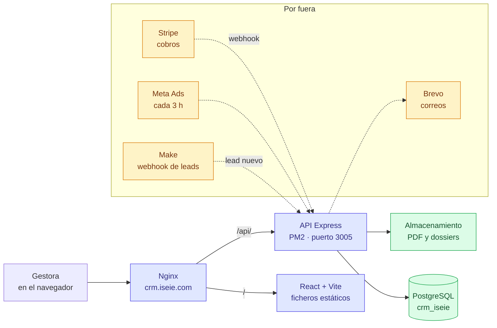
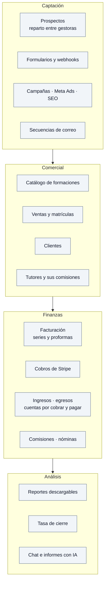
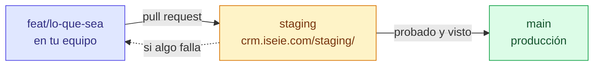

# CRM ISEIE

CRM interno de ISEIE: prospectos, ventas, facturación, comisiones y publicidad.
**En producción** en https://crm.iseie.com — lo usan las gestoras todos los días.

Tiene un **CRM hermano**, [`CRM`](https://github.com/diego-landaeta/CRM)
(MultiCRM, con nueve proyectos dentro). Mismas funciones, otra marca: **lo que se
hace en uno se hace en el otro** — ver
[`docs/PARIDAD-ENTRE-CRMS.md`](docs/PARIDAD-ENTRE-CRMS.md).

## Dónde está

| Rama | Entorno | Dirección | Base de datos | PM2 |
|---|---|---|---|---|
| `main` | Producción | https://crm.iseie.com | `crm_iseie` | `crm-iseie-api` :3005 |
| `staging` | Pruebas | https://crm.iseie.com/staging/ | `crm_iseie_staging` | `crm-iseie-api-staging` :3006 |
| `feat/*` | Desarrollo | en tu equipo | desechable, en Docker | — |

> **El servidor es compartido.** En esa máquina viven ocho sitios de terceros que
> no son nuestros. Nada de `pm2 restart all` ni `pm2 save` a ciegas: se toca solo
> lo que lleva `crm-iseie` en el nombre. Y tras crear una app en PM2, **`pm2 save`**
> — si no, desaparece en el siguiente reinicio.

**Nada de datos reales en tu equipo.** El entorno local levanta su propia base en
Docker con datos de mentira, y los tests se niegan a arrancar si `DATABASE_URL`
apunta a un servidor de verdad.

---

## Cómo está montado



**Sin ORM.** Consultas SQL directas con `pg`. Validación de lo que entra con Zod.

El reparto de leads entre gestoras **lo hace Make en el webhook**, no el
round-robin del CRM: un lead sin gestora suele ser carga masiva, no un fallo.

---

## Qué hace



Estado real de cada pieza en
**[`docs/ESTADO-Y-PENDIENTES.md`](docs/ESTADO-Y-PENDIENTES.md)**, con diagramas.

**Modo BETA**: en producción se enseñan solo las pantallas de
`frontend/src/shared/config/betaConfig.ts`. Lo que no está ahí sale como
**PRÓX.** y no se puede pulsar. Al añadir una pantalla nueva hay que meterla en
esa lista o parecerá que no funciona.

---

## Empezar en tu equipo

Hacen falta **Node 20 o superior**, **Docker** y **git**. Ni acceso al servidor,
ni credenciales de producción.

```bash
git clone https://github.com/diego-landaeta/CRM-ISEIE.git
cd CRM-ISEIE

# 1 · la base de datos, en Docker, con datos de mentira
cd backend
npm install
npm run db:arriba      # levanta PostgreSQL
npm run db:preparar    # aplica las 109 migraciones y siembra datos

# 2 · la API
npm run dev            # http://localhost:3001

# 3 · el frontal, en otra terminal
cd ../frontend
npm install
npm run dev            # http://localhost:5173
```

Para tirarlo todo y volver a empezar:
`npm run db:abajo && npm run db:arriba && npm run db:preparar`.

---

## Cómo se trabaja



- Rama por tarea, **pull request a `staging`**. A `main` no se va directo si toca
  dinero, sesiones o el esquema de la base.
- **Migraciones**: un fichero nuevo en `backend/migrations/`, numerado. **No se
  ejecuta SQL a mano en el servidor** — las aplica quien despliega.
- **Commits en español**, con prefijo: `feat:`, `fix:`, `refactor:`, `docs:`,
  `chore:`, `test:`.
- Nunca se sube `.env`, `node_modules/` ni `dist/`.

---

## Cómo está repartido el código

Un directorio por dominio. Dentro va todo lo suyo: rutas, controlador, servicio,
modelo y validación.

```
backend/
  src/
    modules/          40 módulos: leads, conversions, invoices, tutores...
      <dominio>/
        index.js            exporta { prefix, router }
        <dominio>.routes.js
        <dominio>.controller.js
        <dominio>.service.js
        <dominio>.model.js
        <dominio>.validation.js
    shared/           configuración, middleware, utilidades
    jobs/             tareas programadas (Meta, Stripe, recordatorios)
    app.js
  migrations/         109 ficheros SQL, en orden. La verdad del esquema

frontend/
  src/
    modules/          36 módulos, en espejo con el backend
      <dominio>/
        api/ hooks/ components/ pages/
    shared/           componentes comunes, cliente de API, utilidades
    contexts/         sesión y proyecto activo
```

A diferencia del CRM hermano, **aquí no hay paquetes de módulos**: `app.js` monta
todos los del array `MODULES`, sin condiciones.

---

## Reglas que no se negocian

- **El dinero sale de los cobros** (`conversion_payments`), no del campo
  `importe_pagado` de la venta: aquí declara 209.930 € de más.
- **Contraseñas** con bcrypt de coste 12. Sesión de 15 minutos, renovación de 30
  días en cookie `httpOnly`.
- **Cada gestora ve lo suyo.** El recorte se hace en el controlador, con el
  identificador de la sesión, nunca con lo que llegue por la URL.
- **Para retirar a una gestora**: `is_available = false`. **Nunca `active = false`**
  — eso reparte sus leads entre las demás.
- **Redondeo en SQL** con `ROUND(...,2)`, no con `toFixed` de JavaScript.
- Al ampliar valores de estado, mirar si la columna es un **ENUM** de PostgreSQL:
  buscar solo restricciones `CHECK` no basta, y eso ya rompió las conversiones
  una vez.

---

## Documentación

| Documento | Para qué |
|---|---|
| [`docs/ESTADO-Y-PENDIENTES.md`](docs/ESTADO-Y-PENDIENTES.md) | Qué hay hecho, qué falta y quién lo lleva. **Empieza aquí** |
| [`docs/README.md`](docs/README.md) | Esquema de base de datos, endpoints y despliegue |
| [`docs/PARIDAD-ENTRE-CRMS.md`](docs/PARIDAD-ENTRE-CRMS.md) | Qué se copia del CRM hermano y qué no |
| [`docs/DIFERENCIAS-CRM-HERMANO.md`](docs/DIFERENCIAS-CRM-HERMANO.md) | Dónde divergen de verdad los dos repositorios |
| [`docs/00-indice-migraciones.md`](docs/00-indice-migraciones.md) | Qué hizo cada migración |
| [`docs/tutores-pendiente.md`](docs/tutores-pendiente.md) | El módulo de tutores, en detalle |
| [`CLAUDE.md`](CLAUDE.md) | Convenciones, para trabajar con Claude Code |

---

## Quién es quién

| | |
|---|---|
| **Manuel Casas** | Propietario · superadmin |
| **Diego** | Desarrollo, base de datos y despliegues |
| **Daniela** | Supervisión comercial |
| **Carlos** | Dirección comercial · pide y valida los informes |

Repositorio **privado**.
