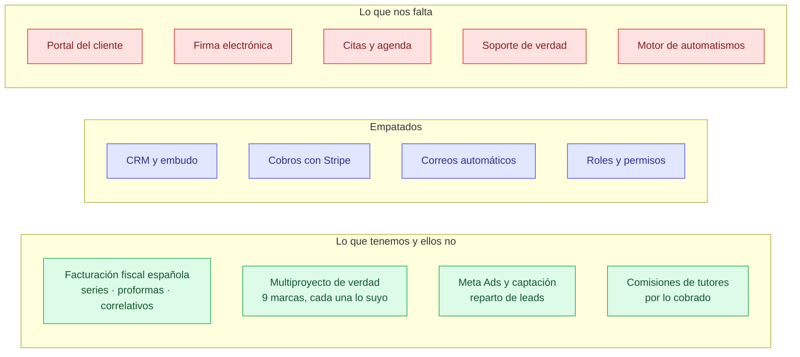
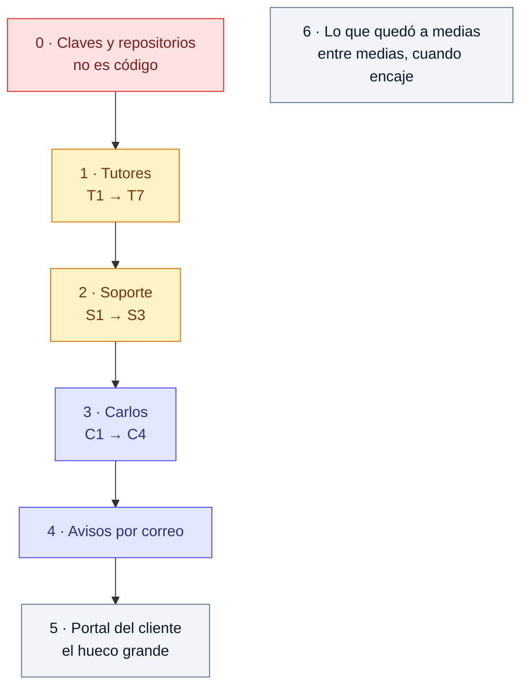

# Nuestro CRM frente a SuiteDash

SuiteDash es una plataforma «todo en uno» —portal de cliente, CRM, facturación,
proyectos, firma, LMS y automatizaciones— que usamos como espejo para saber qué
nos falta y qué no necesitamos.

**No se trata de copiarla.** La mitad de lo suyo no encaja con cómo se vende
formación, y hay cosas nuestras que ellos no hacen. Esto sirve para tener una
lista honesta, no para perseguir funciones.

---

## Vista rápida

---

## Módulo a módulo

| SuiteDash | Nosotros | Veredicto | ¿Nos hace falta? |
|---|---|---|---|
| **Automated CRM** · embudo de oportunidades | Prospectos, estados, reparto entre gestoras, duplicados | **Igual o mejor** — ellos no reparten leads ni detectan duplicados | — |
| **Billing + Packages** · facturación | Series por sociedad, proformas, correlativos sin huecos, cuotas | **Muy por delante.** Nada suyo cumple facturación española | — |
| **Payments + Subscriptions** | Stripe con webhook, asociación de cobros, cuotas | **Igual** | — |
| **Support Tickets** · buzones y helpdesk | Pantalla hecha, **sin backend**: se guarda en el navegador | **A medias, y engaña** | **Sí, urgente** |
| **Client Portal** · portal blanco para el cliente | El alumno no entra a ningún sitio | **No lo tenemos** | **Sí** — es lo más grande que falta |
| **Contracts & eSignature** | Documentos y certificados en PDF, sin firma | **No lo tenemos** | Sí, para matrículas |
| **Appointment Scheduling** · agenda y reservas | Recordatorios, sin agenda ni reservas | **No lo tenemos** | Sí, si hay sesiones con alumnos |
| **Digital Dynamic Proposals** | Presupuesto y factura al convertir | **A medias** — sin aprobación del cliente | Con el portal |
| **File Exchange** · intercambio con el cliente | Dossiers y certificados internos | **A medias** | Con el portal |
| **Project & Task Management** | No hay tareas ni proyectos internos | **No lo tenemos** | **No.** Aquí se venden cursos, no proyectos |
| **Learning Management (LMS)** | Los cursos viven en WordPress | **Fuera de alcance** | **No.** Ya está resuelto fuera |
| **Digital Marketing** · secuencias | Secuencias de correo, plantillas, Brevo | **Igual** | — |
| **Workflow Automation** · 38 acciones y disparadores | Siete tareas programadas, cada una a medida | **Muy por detrás** | Sí, más adelante |
| **FLOWs** · recoger datos del cliente por pasos | Formularios sueltos | **No lo tenemos** | Con el portal |
| **EXTREME White Label** · marca y app propia | Marca por proyecto en el CRM | **No aplica** | No: es de uso interno |
| **Interactive Community** | — | — | No |
| **Roles y permisos** | Superadmin, admin, gestor, tutor, soporte | **Igual** | — |

---

## Lo que este espejo deja claro

**El agujero grande es el cliente.** SuiteDash gira alrededor de un portal donde
el cliente entra, ve sus facturas, firma, sube papeles y pide ayuda. En nuestro
CRM **el alumno no entra a ninguna parte**: todo pasa por la gestora, por correo
o por WhatsApp. Portal, firma, intercambio de ficheros y propuestas aprobables
son **la misma pieza**, no cuatro.

**Nuestros automatismos están cableados.** Ellos tienen disparadores y acciones
que se combinan sin programar. Nosotros escribimos una tarea nueva cada vez. No
urge, pero cada aviso que pidas cuesta código.

**Y hay cosas suyas que no debemos copiar**: gestión de proyectos y tareas, LMS y
comunidad. Aquí se vende formación, y los cursos ya viven en WordPress.

---

## La lista, cuadrada

Tamaños orientativos, para ordenar, no para comprometer fechas.
**Tutores va primero** por decisión del owner.

### Bloque 1 · Tutores — terminar lo empezado

| # | Qué | Por qué | Tamaño | Depende de |
|---|---|---|---|---|
| T1 | Atar al catálogo las 7 ventas con cobros de agosto | Sin eso el tutor no cobra por ellas | Corto | Crear 4 cursos que faltan |
| T2 | Job de reconciliación: crear las comisiones de verdad | Hoy `tutor_commissions` está vacía y nadie escribe | Medio | T1 |
| T3 | Liquidar: estado, marcar pagadas en lote, quién y cuándo | Es la pantalla que pedía el documento | Medio | T2 |
| T4 | Panel de cobros sin formación identificada | Un agujero tapado parece un cuadre | Corto | T2 |
| T5 | Reembolsos: `payment_id` en devoluciones y contra-asiento | Hoy revertir es imposible | Largo | T2 |
| T6 | Validar que el curso sea del proyecto del tutor | No se comprueba; acepta cursos de otra marca | Corto | — |
| T7 | Recortar la API para el rol tutor | El recorte es solo de pantalla | Medio | — |

### Bloque 2 · Soporte — lo que hoy engaña

| # | Qué | Por qué | Tamaño | Depende de |
|---|---|---|---|---|
| S1 | Backend de tickets: tabla, endpoints, estados | 836 líneas de pantalla sin nada detrás | Medio | — |
| S2 | Envío por Brevo al destino, con adjuntos | Si no, nadie se entera de que hay un ticket | Corto | S1 |
| S3 | Métricas: cuánto se tarda en responder y en cerrar | Es lo que se pidió desde el principio | Corto | S1 |

### Bloque 3 · Carlos — que se crea los números

| # | Qué | Por qué | Tamaño | Depende de |
|---|---|---|---|---|
| C1 | Tasa de cierre en el panel, y quitar la vieja | Hoy conviven cinco definiciones distintas | Corto | Ya calculada |
| C2 | «¿De dónde sale?» con los sumandos pulsables | Es lo que pide para creérselo | Medio | C1 |
| C3 | Baremo por tramos, sin puntuar el mes abierto | Un mes a medias siempre sale bajo | Medio | C2 |
| C4 | Proceso comercial y «qué toca hoy con este lead» | El estado se deriva, no se guarda | Largo | C3 |

### Bloque 4 · Avisos por correo

| # | Qué | Tamaño |
|---|---|---|
| A1 | Resumen del día para gestora y administración | Medio |
| A2 | Aviso de lead sin contactar a los 30 minutos | Corto |
| A3 | Resumen semanal para dirección | Corto |
| A4 | Plan de mañana | Corto |

### Bloque 5 · Portal del cliente — el hueco grande

| # | Qué | Tamaño | Depende de |
|---|---|---|---|
| P1 | Acceso del alumno: entrar y ver lo suyo | Largo | Recorte por rol (T7) |
| P2 | Sus facturas y su plan de cuotas | Medio | P1 |
| P3 | Subir documentación (DNI, titulación) | Medio | P1 |
| P4 | Firma electrónica de la matrícula | Largo | P1 |
| P5 | Abrir un ticket desde el portal | Corto | P1 + S1 |

### Bloque 6 · Lo que quedó a medias

| # | Qué | Tamaño |
|---|---|---|
| M1 | Filtros en Clientes y Matrículas, como Prospectos | Medio |
| M2 | Asociar a una venta las proformas ya creadas | Corto |
| M3 | Menú de Finanzas: fusionar Ventas e Ingresos | Corto |
| M4 | Documento al convertir: validar y subir a producción | Corto |
| M5 | Certificados de matrícula con los textos del producto | Medio |
| M6 | WhatsApp: decidir si sigue adelante tras probar la sala | — |

### Bloque 0 · Antes que todo lo anterior

| # | Qué | Quién |
|---|---|---|
| R1 | Repositorios en privado | Diego |
| R2 | Rotar Stripe, Brevo, root del VPS, tokens | Diego |
| R3 | Stripe en los proyectos IA | Ángel |

---

## En un diagrama

---

## Fuentes

- [Features de SuiteDash](https://suitedash.com/features/)
- [Las 100 funciones principales](https://suitedash.com/top-100-features-list/)
- [Automatizaciones (FLOWs)](https://help.suitedash.com/article/384-automations-flows)
- [LMS](https://suitedash.com/features/learning-management-system-lms/)

Estado real de cada pieza en [`ESTADO-Y-PENDIENTES.md`](ESTADO-Y-PENDIENTES.md).
