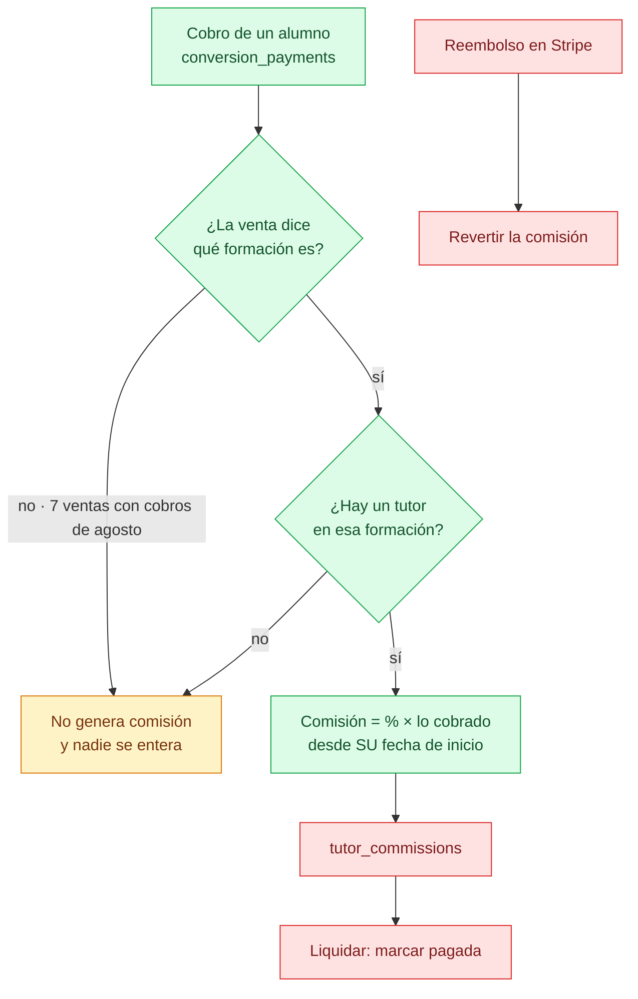
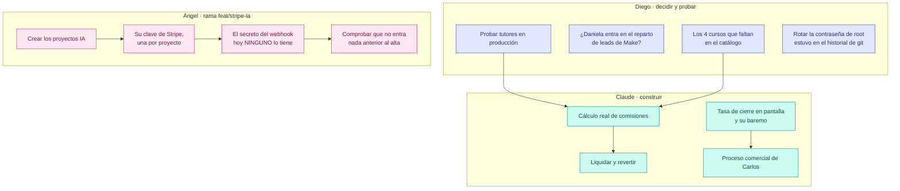
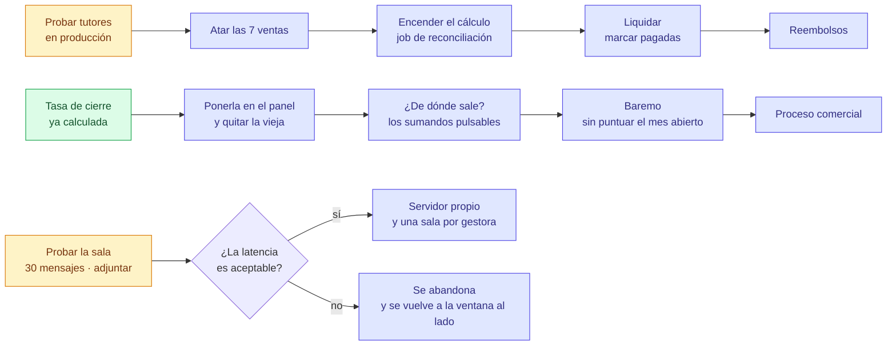
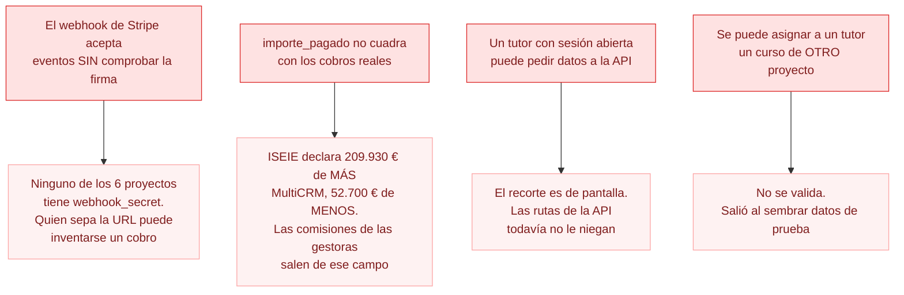

# Estado y pendientes

Al 12 de agosto de 2026. Los diagramas se dibujan solos en GitHub.

Dos CRMs con **paridad absoluta**: lo que se hace en uno se hace en el otro,
salvo la marca y las rutas.

| | MultiCRM | ISEIE |
|---|---|---|
| Producción | `360crm.tech/crm/` | `crm.iseie.com` |
| Pruebas | `360crm.tech/testeo/` | `crm.iseie.com/staging/` |
| Proyectos | 9 | 1 |

---

## Dónde está cada cosa

```mermaid
flowchart LR
  subgraph PROD["🟢 En producción · los dos CRMs"]
    direction TB
    P1["Tutores<br/>alta · cursos · simulación"]
    P2["Facturación<br/>series · proformas · cuotas"]
    P3["Prospectos · Ventas<br/>Clientes · Matrículas"]
    P4["Stripe<br/>cobros y asociación"]
    P5["Meta Ads<br/>sincronización cada 3 h"]
  end

  subgraph STAG["🟡 Solo en pruebas"]
    direction TB
    S1["WhatsApp<br/>salas · plantillas · equipo"]
    S2["Tasa de cierre<br/>una sola definición"]
    S3["Stripe: factura desde<br/>el alta del proyecto"]
  end

  subgraph FALTA["🔴 Sin construir"]
    direction TB
    F1["Cálculo real<br/>de comisiones"]
    F2["Liquidar<br/>marcar como pagadas"]
    F3["Reembolsos<br/>revertir comisión"]
    F4["Proceso comercial<br/>qué toca hoy"]
  end

  STAG -->|"validar y subir"| PROD
  FALTA -->|"construir"| STAG

  classDef verde fill:#dcfce7,stroke:#16a34a,color:#14532d
  classDef ambar fill:#fef3c7,stroke:#d97706,color:#78350f
  classDef rojo fill:#fee2e2,stroke:#dc2626,color:#7f1d1d
  class P1,P2,P3,P4,P5 verde
  class S1,S2,S3 ambar
  class F1,F2,F3,F4 rojo
```

WhatsApp viaja en el mismo build que todo lo demás, pero **no se enseña en
producción**: `VITE_MODULOS_APAGADOS=whatsapp`. Se enciende quitando esa línea
y recompilando.

---

## Tutores · por qué todavía no paga

Está en producción y funciona, pero **es una simulación**. El dinero no existe
hasta que se cierre el camino entero:

**Verde** existe y está probado. **Rojo** no está escrito: `tutor_commissions`
es una tabla vacía en la que nadie escribe nunca, no hay forma de marcar una
comisión como pagada, y revertir por reembolso es imposible hoy porque
`conversion_refunds` no guarda a qué pago corresponde.

### Lo que hay que atar a mano

Como los tutores empiezan en agosto, **el histórico da igual**. Solo importan
las ventas que reciben cobros desde el 1 de agosto:

| | Ventas a atar | Dinero | De ellas, con nombre que casa con el catálogo |
|---|---|---|---|
| ISEIE | 6 | 1.347,34 € | 3 |
| MultiCRM | 1 | 133,33 € | 0 |

Las otras cuatro nombran cursos que **no existen en el catálogo**: «Apostilla de
la HAYA» (×2), «Máster trasplante capilar» y «Diplomado en Neurociencia
Aplicada». O se crean o se quedan fuera.

---

## Quién hace qué

---

## En qué orden, y qué depende de qué

---

## Lo que muerde si no se mira

---

## La cola larga

Cosas medidas y anotadas, ninguna urgente:

| Qué | Cuánto |
|---|---|
| Cargos de Stripe de 2026 sin enlazar | 501 · 152.098 € |
| Más cargos enlazables por importe y fecha | 241 |
| Teléfonos que `normalizePhone` estropea | 188 |
| Leads de CETLAT con su programa sin cruzar | 382 |
| Segundas cuotas registradas como venta nueva | por barrer |
| Proformas de ICTESS que consumen número de serie | por revisar |
| Tests que fallan por datos de ejemplo | 10 de 180 |

---

## Documentos relacionados

- [`tutores-pendiente.md`](tutores-pendiente.md) — el detalle del módulo
- [`tarea-stripe-proyectos-ia.md`](tarea-stripe-proyectos-ia.md) — la tarea de Ángel
- [`PARIDAD-ENTRE-CRMS.md`](PARIDAD-ENTRE-CRMS.md) — qué se copia y qué no
