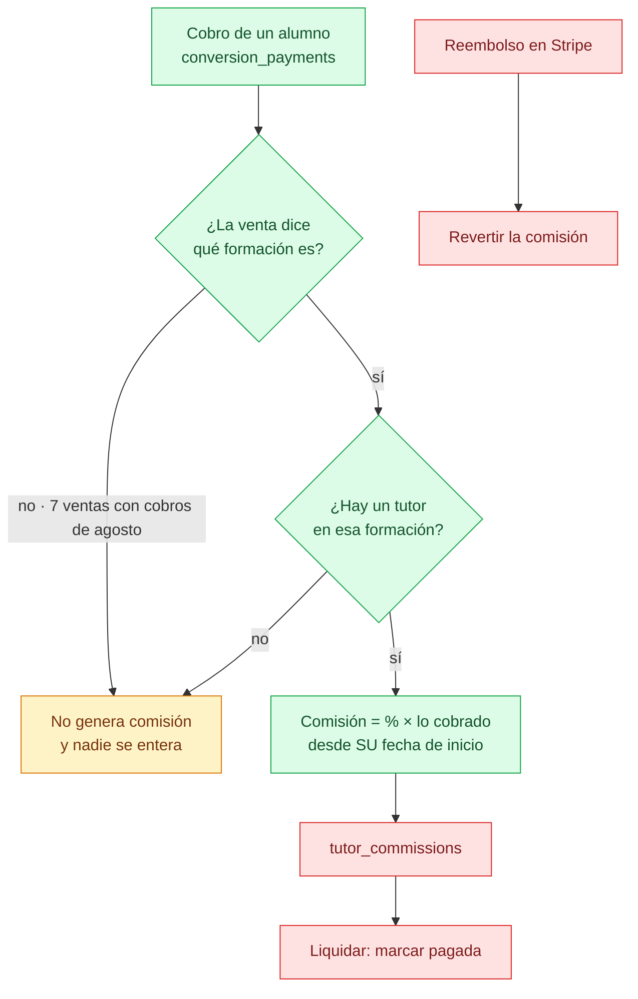
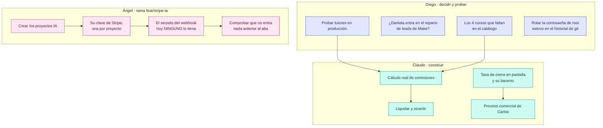
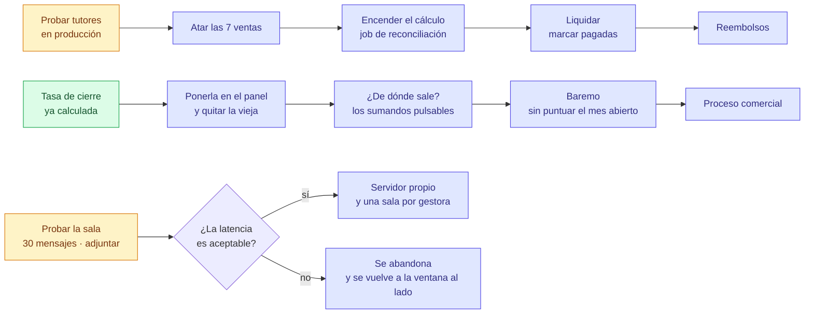
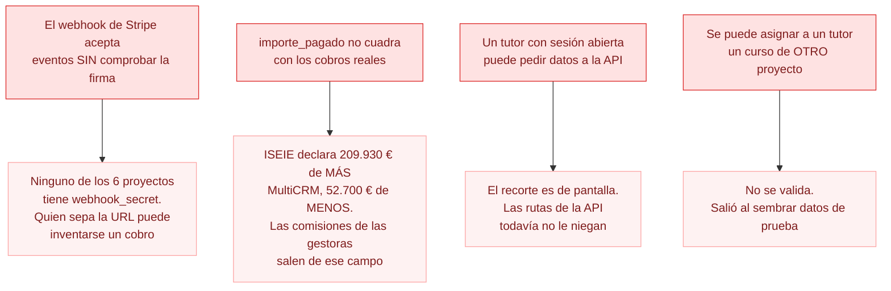
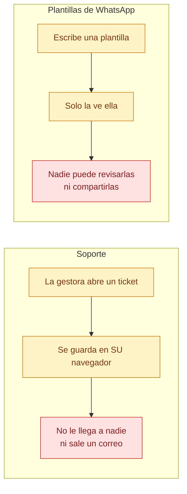
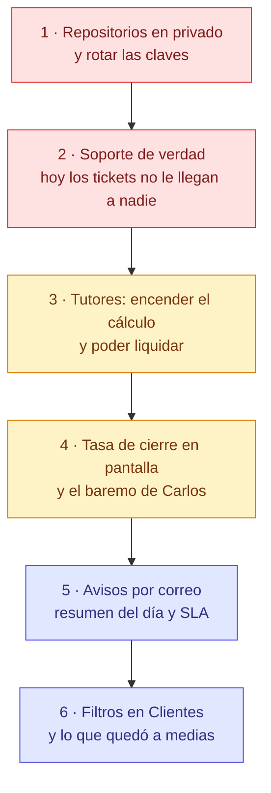

# Estado y pendientes

Al 12 de agosto de 2026. Los diagramas se dibujan solos en GitHub.

Dos CRMs con **paridad absoluta**: lo que se hace en uno se hace en el otro,
salvo la marca y las rutas.

| | MultiCRM | ISEIE |
|---|---|---|
| Producción | `360crm.tech/crm/` | `crm.iseie.com` |
| Pruebas | `360crm.tech/testeo/` | `crm.iseie.com/staging/` |
| Proyectos | 9 | 1 |

---

## Dónde está cada cosa

```mermaid
flowchart LR
  subgraph PROD["🟢 En producción · los dos CRMs"]
    direction TB
    P1["Tutores<br/>alta · cursos · simulación"]
    P2["Facturación<br/>series · proformas · cuotas"]
    P3["Prospectos · Ventas<br/>Clientes · Matrículas"]
    P4["Stripe<br/>cobros y asociación"]
    P5["Meta Ads<br/>sincronización cada 3 h"]
  end

  subgraph STAG["🟡 Solo en pruebas"]
    direction TB
    S1["WhatsApp<br/>salas · plantillas · equipo"]
    S2["Tasa de cierre<br/>una sola definición"]
    S3["Stripe: factura desde<br/>el alta del proyecto"]
  end

  subgraph FALTA["🔴 Sin construir"]
    direction TB
    F1["Cálculo real<br/>de comisiones"]
    F2["Liquidar<br/>marcar como pagadas"]
    F3["Reembolsos<br/>revertir comisión"]
    F4["Proceso comercial<br/>qué toca hoy"]
  end

  STAG -->|"validar y subir"| PROD
  FALTA -->|"construir"| STAG

  classDef verde fill:#dcfce7,stroke:#16a34a,color:#14532d
  classDef ambar fill:#fef3c7,stroke:#d97706,color:#78350f
  classDef rojo fill:#fee2e2,stroke:#dc2626,color:#7f1d1d
  class P1,P2,P3,P4,P5 verde
  class S1,S2,S3 ambar
  class F1,F2,F3,F4 rojo
```



WhatsApp viaja en el mismo build que todo lo demás, pero **no se enseña en
producción**: `VITE_MODULOS_APAGADOS=whatsapp`. Se enciende quitando esa línea
y recompilando.

---

## Tutores · por qué todavía no paga

Está en producción y funciona, pero **es una simulación**. El dinero no existe
hasta que se cierre el camino entero:



**Verde** existe y está probado. **Rojo** no está escrito: `tutor_commissions`
es una tabla vacía en la que nadie escribe nunca, no hay forma de marcar una
comisión como pagada, y revertir por reembolso es imposible hoy porque
`conversion_refunds` no guarda a qué pago corresponde.

### Lo que hay que atar a mano

Como los tutores empiezan en agosto, **el histórico da igual**. Solo importan
las ventas que reciben cobros desde el 1 de agosto:

| | Ventas a atar | Dinero | De ellas, con nombre que casa con el catálogo |
|---|---|---|---|
| ISEIE | 6 | 1.347,34 € | 3 |
| MultiCRM | 1 | 133,33 € | 0 |

Las otras cuatro nombran cursos que **no existen en el catálogo**: «Apostilla de
la HAYA» (×2), «Máster trasplante capilar» y «Diplomado en Neurociencia
Aplicada». O se crean o se quedan fuera.

---

## Quién hace qué



---

## En qué orden, y qué depende de qué



---

## Lo que muerde si no se mira



---

## Media pantalla: lo que se ve pero no funciona

Son las peores, porque **nadie las reporta como error**: se usan, parece que van,
y no hacen nada. Todas comparten la misma causa — el frontal guarda en el
navegador de cada persona porque el backend no existe.



**Soporte** tiene 836 líneas de pantalla —formulario, lanzador, listado— y
**ningún módulo en el backend**. Su propio código lo dice: «cuando exista
`/api/tickets`…». Falta: tabla, endpoints, envío por Brevo al correo de destino,
adjuntos, y las métricas de cuánto se tarda en responder y en cerrar.

Las **plantillas de WhatsApp** ya están resueltas en la migración 122, pero esa
migración **no se ha aplicado en producción** porque WhatsApp está en espera.

---

## Automatismos de correo · nada de esto existe

Hay siete tareas programadas —Meta, Stripe, WooCommerce, secuencias,
recordatorios…— pero **ninguna de aviso interno**:

| Qué | A quién | Cuándo |
|---|---|---|
| Resumen del día | Gestora y administración | Al cerrar el día |
| Resumen semanal | Dirección | Lunes |
| Aviso de lead sin contactar | Gestora | A los 30 minutos |
| Plan de mañana | Gestora | Por la noche |

Se apoyan en Brevo, que ya está montado en los dos CRMs.

---

## Lo que quedó a medias

| Qué | Estado real |
|---|---|
| **Filtros en Clientes y Matrículas** | Prospectos guarda sus filtros en la URL; Clientes y Matrículas **no tienen ninguno**. Hay que replicar el juego entero |
| **Proformas: asociar a una venta ya creada** | Se puede elegir al emitir; falta el botón para las que ya existen |
| **Menú de Finanzas** | Plan aprobado y sin ejecutar: fusionar Ventas e Ingresos, y Conversiones como pestaña de Análisis |
| **Documento al convertir** | En pruebas de ISEIE; falta validarlo y subirlo a producción en los dos |
| **Modo BETA de ISEIE** | Aplicar el mismo corte al menú cuando se conecte WordPress |
| **Certificados de matrícula** | Usar los textos importados de los productos (módulos, profesores, horas) para el PDF |

---

## La cola larga

Medido, anotado y sin urgencia:

| Qué | Cuánto |
|---|---|
| Cargos de Stripe de 2026 sin enlazar | 501 · 152.098 € |
| Más cargos enlazables por importe y fecha | 241 |
| Teléfonos que `normalizePhone` estropea | 188 |
| Leads de CETLAT con su programa sin cruzar | 382 |
| Segundas cuotas registradas como venta nueva | por barrer |
| Proformas de ICTESS que consumen número de serie | por revisar |
| Tests que fallan por datos de ejemplo | 10 de 180 |
| Carlos no entra desde su WiFi fija | probar por IP directa |

---

## Por dónde seguir

Ordenado por lo que más duele, no por lo que más cuesta:



**Por qué en ese orden.** Lo primero no es negociable y no es código. Lo segundo
es lo único que hoy **engaña a quien lo usa**: una gestora escribe un ticket,
ve que se guarda, y no llega a ningún sitio. Lo tercero mueve dinero. Lo demás
mejora, pero nada de lo que hay hoy miente.

---

## Documentos relacionados

- [`tutores-pendiente.md`](tutores-pendiente.md) — el detalle del módulo
- [`tarea-stripe-proyectos-ia.md`](tarea-stripe-proyectos-ia.md) — la tarea de Ángel
- [`PARIDAD-ENTRE-CRMS.md`](PARIDAD-ENTRE-CRMS.md) — qué se copia y qué no

---

## Dónde nos quedamos · 21 de agosto, noche

**En producción, funcionando:** WhatsApp unificado con el panel del admin,
historial de ventas del tutor, rutas en español con redirección, el menú nuevo,
los profesores de Psiko dados de alta con sus comisiones de agosto, y tres
ventas duplicadas de ISEIE cuadradas.

**En pruebas, esperando visto bueno:** el trabajo de Fabián (#31) y el de Ángel
(#45), fusionados sin conflictos. `/testeo` tiene además su propio WhatsApp, con
sesiones `testeo-uN` que no pueden tocar las de producción.

**Esperando a Diego:**
- Las migraciones **129 y 130** en producción. Aplicadas solo en pruebas.
- Las peticiones de cambios **#51** (Ángel) y **#52** (nuestra) contra `main`.
- Qué se hace con `main`, que en MultiCRM quedó adelantada y en ISEIE no.

**Corrige Ángel, no nosotros** — todo anotado en la #45: el aviso que nombra
variables de entorno, el recorrido que llega tarde y no salta pasos, la imagen
que se manda sin vista previa, la nota de voz sin aviso de envío y con la
duración equivocada.

**Lo nuestro, por orden:** recuperar contraseña (#37), Soporte de verdad (#38),
tasa de cierre de Carlos (#39), filtros en Clientes (#40) y la limpieza de datos
(#41, #42).

---

---

## WhatsApp en produccion — 21/08/2026

Lo que se probaba en pruebas ya corre en **los dos CRMs en produccion**: el chat
con las conversaciones dentro del CRM, una sesion por gestora, el admin viendo y
enlazando la de cada una, plantillas compartidas, notas de voz, responder a un
mensaje concreto, el recorrido guiado y la pagina de ayuda.

**El freno de escribir a desconocidos viene apagado.** Decision de Diego. Queda
apuntado en el registro quien escribe a un numero que no es prospecto, pero no se
impide: cuando el CRM se negaba, la gestora escribia desde su movil igual — sin
registro, sin plantilla y sin los topes de ritmo.

### Lo que hubo que arreglar para poder subirlo

Lo que corria en pruebas **no estaba en ninguna rama entera**: era el trabajo de
Angel con tres cambios nuestros copiados a mano encima. Al juntarlo salieron dos
cosas:

- **El freno tenia dos nombres con significados opuestos** —el suyo encendia, el
  nuestro apagaba—. Queda uno solo, `WA_BLOQUEO_DESCONOCIDOS`, apagado. Si algun
  `.env` conserva el viejo `WA_EXIGIR_CONSENTIMIENTO`, el servidor lo ignora y lo
  avisa al arrancar en vez de obedecerlo en silencio.
- **Una funcion rota en los dos entornos de pruebas.** `chat.controller.js`
  llamaba a `ultimoLatido`, que `chat.service.js` ya no exportaba: lo pise al
  copiar ese fichero suelto. `/api/whatsapp/sincronizacion` —lo que pregunta si
  sigue entrando historial— reventaba. Arreglado en los cuatro entornos.

Esa es la moraleja: **copiar ficheros sueltos a un servidor rompe cosas en
silencio**. Lo que se sube, se sube desde una rama.

### Como quedo cada sitio

| | Migraciones 129 y 130 | Modulo | Frontal |
|---|---|---|---|
| MultiCRM produccion | aplicadas | 11 ficheros | publicado, ayuda incluida |
| ISEIE produccion | aplicadas | 11 ficheros | publicado, ayuda incluida |
| MultiCRM pruebas | ya estaban | al dia | sin tocar |
| ISEIE pruebas | pendiente | al dia | sin tocar |

Copias de seguridad antes de tocar: `crm_prod_db` 9,6 MB y `crm_iseie` 7,7 MB en
`/var/backups/crm/`. Las conversaciones que ya habia siguen ahi, y la sesion
conectada de ISEIE (`crm-u16`) aguanto el reinicio.

### El atasco de Evolution en ISEIE — 21/08/2026

Sintoma: se enlazo el numero de una gestora, se veia «conectado», y no salia ni
entraba nada. El CRM decia «enviado» y el mensaje no llegaba a ningun sitio.

**Evolution llevaba parado desde las 09:06 de esa manana.** Su propia base no
guardo ni un mensaje en todo el dia. La traza:

    await _o.emit -> retryWebhookRequest -> AxiosError: timeout of 60000ms
    url: http://172.17.0.1:3005/api/whatsapp/webhook

Evolution **espera** a que su aviso llegue antes de seguir con el evento. Como el
aviso no llegaba, cada uno se comia 60 segundos y luego reintentaba: 109 en 12
minutos. La cola entera parada. Por eso no salian los mensajes ni entraban los
que escribian.

**La causa: ufw esta activo en esta maquina** —en la de MultiCRM no— y cortaba
lo que venia del contenedor. Y el detalle que costo encontrar: **el contenedor no
esta en `docker0` (172.17.0.1) sino en su propia red de compose,
`whatsapp_default` (172.18.0.0/16, puente `br-7ff3422bc513`)**. La primera regla
se puso sobre docker0 y no sirvio de nada.

La regla buena, por subred y no por nombre de puente —si se recrea la red, el
puente cambia de nombre y la regla dejaria de valer sin que nadie se entere—:

    ufw allow from 172.16.0.0/12 to any port 3005 proto tcp

Solo abre el puerto del CRM a la red privada de docker. No expone nada a
internet, no toca los 8 sitios de terceros de la maquina y se deshace con
`ufw delete`. No hizo falta reiniciar el contenedor ni volver a enlazar ningun
numero.

En cuanto entro, la cola se vacio sola: Evolution paso de las 09:06 a la hora
real y el CRM de 4 mensajes a 35.

**Como reconocerlo la proxima vez:** si el numero sale «conectado» pero no se
mueve nada, mirar `docker logs crm-whatsapp | grep 'timeout of 60000ms'`. Si hay
tiempos agotados, el problema no es WhatsApp ni el CRM: es que Evolution no
alcanza al CRM.

### Evolution tiene que guardar los mensajes — 24/08/2026

Los dos contenedores venian con `DATABASE_SAVE_DATA_NEW_MESSAGE: "false"` y
`DATABASE_SAVE_MESSAGE_UPDATE: "false"`. Suena razonable —el CRM ya guarda su
copia, para que duplicar— hasta que alguien pulsa **«Descargar audio»**: el CRM le
pide el fichero a Evolution por el identificador del mensaje y Evolution contesta
`Message not found`, porque nunca lo guardo. De ahi el «este archivo ya no se
puede recuperar».

Y lo segundo, menos visible: sin `SAVE_MESSAGE_UPDATE` **los tics no avanzan
nunca**. Los acuses de WhatsApp llegan, pero Evolution no puede emparejarlos con
un mensaje que no tiene, asi que todo se queda en un tic aunque este entregado.

Las dos encendidas en los dos servidores. Recrear el contenedor **no desenlaza
nada**: la sesion vive en su base de datos y vuelve sola en unos segundos —
comprobado dos veces, con una gestora trabajando.

### Los sintomas que confunden

Merece la pena tenerlos juntos, porque los tres se parecen y son cosas distintas:

| Lo que se ve | Que es |
|---|---|
| «Conectado» pero no se mueve nada | Evolution no alcanza al CRM. Mirar los tiempos agotados |
| Un tic que nunca avanza | Evolution no guarda las actualizaciones |
| «El archivo ya no se puede recuperar» | Evolution no guarda los mensajes |
| El chat con el nombre de la gestora | `pushName` guardado en un mensaje que sale |

Ninguno es que WhatsApp haya tumbado el numero, que es lo primero que uno teme.

### Las rutas del frontal contra las del servidor — 24/08/2026

Tres veces el mismo fallo en un dia: al pasar las rutas a español se renombraron
las llamadas del frontal y **no** los prefijos del servidor. Pantallas enteras
pidiendo a una direccion que no contestaba, sin que nadie lo notara hasta que
alguien abria esa pantalla.

| Modulo | El frontal pide | El servidor servia |
|---|---|---|
| Informes | `/api/informes` | `/api/reports` |
| Ventas | `/api/ventas` | `/api/sales` |
| Secuencias de email | `/api/secuencias-email` | `/api/email-sequences` |
| Mensajes (MultiCRM) | `/api/mensajes` | `/api/messages` |

Los cuatro pasan a su nombre en español y **conservan el viejo con `alias`**, que
no cuesta nada y evita romper integraciones o pestañas abiertas.

**Para que no haya una quinta vez:** `scripts/auditoria_rutas.py`. Saca los
prefijos y rutas de cada modulo del servidor, las llamadas del frontal con su
fichero y su linea, y las cruza. Se corre sin tocar ningun servidor:

    python scripts/auditoria_rutas.py

Antes de esto: **21 llamadas huerfanas en MultiCRM y 14 en ISEIE**. Despues:
ninguna en los dos. Conviene pasarlo antes de cada despliegue grande, y
obligatoriamente despues de renombrar cualquier ruta.

Ojo con leerlo mal: se compara **por prefijo**, no por camino exacto. Una llamada
como `/leads/${id}` llega al analisis como `/api/leads`, asi que lo que se
detecta es que el servidor no tenga NADA colgando de ahi — que es justo el fallo
del renombrado.

### Lo que falta

- **ISEIE pruebas no tiene Evolution configurado** en su `.env`, asi que alli el
  WhatsApp no se puede probar. Si se quiere, hay que darle su propio prefijo de
  sesion y su webhook, como se hizo con MultiCRM pruebas.
- **Lo de Angel de la tarea #45** sigue como estaba: el aviso de configuracion
  que se le ensena a la gestora, la vista previa de la imagen antes de mandarla,
  el estado de «enviando» del audio y su duracion.
- **Paridad de rutas**: en ISEIE `/leads` y `/clients` siguen en ingles; en
  MultiCRM ya son `/prospectos` y `/clientes`. El resto de rutas si coinciden.

---

<!-- INDICE-TAREAS -->

## Todas las tareas abiertas

Sacado de GitHub, no escrito a mano: **44 abiertas**. Para volver a
generarlo, `scratchpad/indice_tareas.py`.

### Fase 1 · Desbloquear · 7

| | Qué | Quién | |
|---|---|---|---|
| [#20](https://github.com/diego-landaeta/CRM/issues/20) | Mandar el origen del lead desde Make | Diego | **bloquea a otros** |
| [#21](https://github.com/diego-landaeta/CRM/issues/21) | Aplicar la migración 122 (plantillas de WhatsApp) | Diego | **bloquea a otros** · lleva SQL |
| [#22](https://github.com/diego-landaeta/CRM/issues/22) | Clave de IA y tope de gasto | Diego | **bloquea a otros** |
| [#23](https://github.com/diego-landaeta/CRM/issues/23) | Usuario del CRM de pruebas para Fabián | Diego | **bloquea a otros** |
| [#24](https://github.com/diego-landaeta/CRM/issues/24) | Decidir qué pasa con main | Diego |  |
| [#62](https://github.com/diego-landaeta/CRM/issues/62) | WhatsApp: responder a un mensaje falla — la cita va como texto y Evolution espera un objeto | Ángel |  |
| [#63](https://github.com/diego-landaeta/CRM/issues/63) | WhatsApp: dos endpoints que solo existen en el puente de Baileys, no en Evolution | Ángel |  |

### Fase 2 · Construir · 18

| | Qué | Quién | |
|---|---|---|---|
| [#26](https://github.com/diego-landaeta/CRM/issues/26) | Página de estado del sistema | Ángel |  |
| [#27](https://github.com/diego-landaeta/CRM/issues/27) | El envío de correo del CRM · la tubería | Ángel |  |
| [#28](https://github.com/diego-landaeta/CRM/issues/28) | Recordatorios por correo | Ángel |  |
| [#29](https://github.com/diego-landaeta/CRM/issues/29) | Reporte semanal por correo | Ángel |  |
| [#30](https://github.com/diego-landaeta/CRM/issues/30) | Análisis de datos con IA | Ángel |  |
| [#31](https://github.com/diego-landaeta/CRM/issues/31) | Terminar la administración de usuarios | Fabián |  |
| [#32](https://github.com/diego-landaeta/CRM/issues/32) | Rediseño · tokens y primitivas | Fabián |  |
| [#33](https://github.com/diego-landaeta/CRM/issues/33) | Rediseño · el marco: menú, cabecera y estructura | Fabián |  |
| [#34](https://github.com/diego-landaeta/CRM/issues/34) | Rediseño · las 82 pantallas, por bloques | Fabián |  |
| [#35](https://github.com/diego-landaeta/CRM/issues/35) | Proceso de ventas editable | Diego | lleva SQL |
| [#36](https://github.com/diego-landaeta/CRM/issues/36) | Search Console | Diego |  |
| [#37](https://github.com/diego-landaeta/CRM/issues/37) | Recuperar la contraseña por correo | Yo |  |
| [#38](https://github.com/diego-landaeta/CRM/issues/38) | Soporte de verdad | Yo | lleva SQL |
| [#39](https://github.com/diego-landaeta/CRM/issues/39) | Tasa de cierre y baremo · lo de Carlos | Yo |  |
| [#44](https://github.com/diego-landaeta/CRM/issues/44) | Sincronizar los proyectos de IA con el CRM · Ángel y Fabián | Ángel | compartida |
| [#48](https://github.com/diego-landaeta/CRM/issues/48) | Recibir el origen de los leads (ChatGPT incluido) y categorizarlo | Diego |  |
| [#50](https://github.com/diego-landaeta/CRM/issues/50) | Tipografía e iconos del apartado de administración (estilo formal) | Fabián |  |
| [#64](https://github.com/diego-landaeta/CRM/issues/64) | WhatsApp: la ficha del prospecto en un popup, y que expandir no recargue el chat | Ángel |  |

### Fase 3 · Cerrar · 11

| | Qué | Quién | |
|---|---|---|---|
| [#2](https://github.com/diego-landaeta/CRM/issues/2) | Frontend: Dropdown categorías searchable + niveles separados cascade | Ángel |  |
| [#6](https://github.com/diego-landaeta/CRM/issues/6) | Frontend: Panel UI de conectores con preview + mapping visual | Fabián |  |
| [#11](https://github.com/diego-landaeta/CRM/issues/11) | Frontend: Panel 'próximo gestor' en /leads — visualizar round-robin | Fabián |  |
| [#13](https://github.com/diego-landaeta/CRM/issues/13) | Backend: Activity feed (tabla + endpoint para 'qué pasó hoy') | Diego |  |
| [#14](https://github.com/diego-landaeta/CRM/issues/14) | Backend: WooCommerce orders sync + cron flexible (manual/diario/semanal) | Diego |  |
| [#15](https://github.com/diego-landaeta/CRM/issues/15) | Backend: Project types extension (educacion/ecommerce/servicios/inmobiliaria) | Ángel |  |
| [#40](https://github.com/diego-landaeta/CRM/issues/40) | Filtros en Clientes y Matrículas | Yo |  |
| [#41](https://github.com/diego-landaeta/CRM/issues/41) | Ventas sin formación identificada · 321 | Yo |  |
| [#42](https://github.com/diego-landaeta/CRM/issues/42) | Los otros datos que no cuadran | Yo |  |
| [#43](https://github.com/diego-landaeta/CRM/issues/43) | Lo que quedó a medias | Yo |  |
| [#49](https://github.com/diego-landaeta/CRM/issues/49) | Rutas en español, con redirección desde las viejas | Yo |  |

### Fase 4 · Medir · 5

| | Qué | Quién | |
|---|---|---|---|
| [#53](https://github.com/diego-landaeta/CRM/issues/53) | Meta Ads: del gasto a la venta, no al lead | Diego |  |
| [#54](https://github.com/diego-landaeta/CRM/issues/54) | Google Ads: traer campañas y gasto al CRM | Diego |  |
| [#55](https://github.com/diego-landaeta/CRM/issues/55) | Google Analytics: lo que pasa antes del lead | Diego |  |
| [#56](https://github.com/diego-landaeta/CRM/issues/56) | Panel de canales: dónde poner el dinero | Yo |  |
| [#57](https://github.com/diego-landaeta/CRM/issues/57) | Pedirle a Daniela sus reportes de publicidad y ventas | Diego |  |

### sin fase · 3

| | Qué | Quién | |
|---|---|---|---|
| [#4](https://github.com/diego-landaeta/CRM/issues/4) | Frontend: Documentos/Certificados — selectores de programa, alumno y módulos auto | molinangel |  |
| [#7](https://github.com/diego-landaeta/CRM/issues/7) | Frontend: Sistema completo de vistas por rol (sidebar dinámico + landing por rol) | molinangel |  |
| [#8](https://github.com/diego-landaeta/CRM/issues/8) | Frontend: Settings — separar Categorías/Campos/Columnas por entidad (Leads/Clientes/Productos) | molinangel |  |

> Las mismas tareas existen en el repositorio de ISEIE, bloqueadas con la
> etiqueta `espera-multicrm`: se hacen aquí primero y se replican cuando Diego
> las aprueba.

<!-- FIN-INDICE-TAREAS -->

---

## La cola del día necesita filtros de verdad

Anotado el **14/09/2026**. Diego, con CEDIA puesta y **101 atrasados** delante:
«poner mejores filtros en este apartado».

Lo que hay hoy, y nada más: **campus**, **gestora** y los cuatro contadores de
arriba (atrasados / hoy / mañana / esta semana), que hacen de filtro de fecha.
Con 129 personas en la semana y 101 arrastradas, eso no alcanza para repartir el
día: todo lo que se ve en la captura —paso, formación, canal, cuánto lleva
esperando— está en la fila y **no se puede filtrar por ello**.

Lo que pediría la pantalla, por orden de lo que más se nota:

| Filtro | Por qué |
|---|---|
| **Cuánto lleva atrasado** | «más de 30 días» es otra conversación que «de ayer». En la captura hay gente de hace 33 días mezclada con la de hoy |
| **Formación / producto** | el dato ya viaja en la fila; los del mismo curso llevan el mismo mensaje |
| **Paso** | existe como botonera («Por paso») pero no se combina bien con lo demás |
| **Canal** | quien va a hacer llamadas quiere solo las de llamada |
| **Buscar por nombre** | para volver a alguien concreto sin bajar 129 filas |
| **Ordenar** | hoy es fecha y paso, fijo. Debería poder ser por antigüedad o por formación |

Y una decisión de fondo: **con 101 atrasados el problema no es solo filtrar**.
Conviene decidir qué se hace con lo que lleva más de un mes sin tocar —cerrarlo,
aparcarlo o repartirlo—, porque un filtro más bonito sobre una cola que nadie
puede vaciar sigue siendo una cola que nadie puede vaciar.

*Sin asignar. Solo frontend: el servidor ya devuelve todos esos campos.*

---

## El proceso comercial, por empresa y no solo por proyecto — HECHO

Anotado y resuelto el **14/09/2026**. Diego, con CEDIA elegida en producción:

> «Estos procesos en empresas deben ser por empresa, no por proyecto, que tengan
> filtros. Si tengo que seleccionar un proyecto, tiene que ser por proyecto y por
> empresa; que al indicar eso, sea "selecciona una empresa".»

### Qué pasaba

Con **CEDIA (7 campus)** puesta, `/prospectos/proceso` y `/prospectos/cola` no
enseñaban nada: salía el muro de *«Selecciona un proyecto»*. El módulo sabía
mandar **un** `projectId` y nada más, aunque el servidor —`colaDelDia`— ya
recibía una lista.

### Qué se hizo

1. **Las dos rutas aceptan empresa** (`CON_SOCIEDAD_OK`).
2. **La cola suma los campus de la empresa**: el controlador lee `projectIds` y
   la pantalla le pasa `useProyectosDelAmbito()`. Comprobado contra la base de
   producción: **107 personas** en la cola de CEDIA, repartidas en Psiko Aprende
   59, ISEIH 21, Fono Aprende 15, ISAEG 10, ISECD 1, ISEF 1.
3. **Filtro de campus dentro de la empresa**, al lado del de gestora, sin tocar
   el selector de arriba. Acotado a ISEIH: 21.
4. **Cada fila dice de qué campus es** (lo pidió Carlos el 11/09).
5. **Los pasos** siguen siendo de un proyecto —cada campus lleva los suyos—,
   pero ya no echan a nadie: se elige cuál **entre los de esa empresa**.
6. **El aviso ya no miente**: con una empresa puesta nombra la empresa y pide
   elegir campus, en vez de hablar de «Todos los proyectos».

De paso salió un fallo vivo: `if (pProj)` era siempre cierto, así que abrir la
cola **sin proyecto** llamaba a `null.map()` y devolvía un 500. Estaba arreglado
en testeo desde el 11/09 y en producción no. Ya está en las dos.

### Dónde está

| | |
|---|---|
| MultiCRM | producción (`/crm/`) y testeo |
| ISEIE | staging entero; en producción **solo el backend** |

En ISEIE no hay sociedades en el selector —un único proyecto—, así que el filtro
de campus no llega a aparecer. Su frontend de producción es del **10/09**:
mandarle el paquete de la rama arrastraría cuatro días de cosas que no son esto,
así que se dejó fuera a propósito. Ver [[project-produccion-sin-main]].

---

## Facturación: el buscador y los atajos de fecha, donde se usan

Anotado el **14/09/2026**. Diego: «en facturación se necesita buscador de
facturas por lupa, número, filtros rápidos como hoy, ayer y eso».

**El buscador YA existe** — `InvoicesPage.tsx:309`, con lupa y «Buscar por nº de
factura, cliente o NIF». No hay que construirlo. El problema es **dónde está**:

1. las cuatro tarjetas de cifras
2. el buscador y los filtros
3. la tabla de ventas sin factura
4. **la lista de facturas** ← donde se trabaja

Para cuando bajas a la lista, el buscador lleva tres bloques fuera de pantalla.
Un buscador que hay que ir a buscar no se usa: por eso se pide uno que no está,
estando.

**Los atajos de fecha sí faltan.** Solo hay dos casillas (`filters.from` /
`filters.to`, líneas 349 y 352). No hay hoy, ayer, esta semana, este mes ni mes
pasado.

Qué hacer: que la barra se quede pegada al bajar o se repita junto a la cabecera
de la tabla —donde Diego dibujó el recuadro—; los cinco atajos rellenando
`from`/`to`, que el backend ya filtra por ese rango; y que buscar `110`
encuentre la `2026/0110` sin teclear el año.

Es la misma petición que Carlos hizo el 11/09 para las dos colas. Si se hacen
los atajos, **un solo componente** para las tres pantallas.

*Sin asignar. Solo frontend.*

---

## Tutores: los estados de la comisión — HECHO

Anotado el **14/09/2026**. Diego, señalando la columna ESTADO de
`/tutores/comisiones`:

> «Ahí que pone pendiente deben aparecer los siguientes estados: Pendiente,
> Notificada, Falta Factura. Si este estado se pone en septiembre, se mantiene
> SOLO en ese mes, hasta que se modifique.»

### Lo comprobado

Las comisiones de tutores **no** viven en la tabla `commissions` (esa es la del
equipo comercial), sino en `tutor_comisiones`, y esa tabla **ya tiene `periodo`**
— `tutor.model.js:386`. Cada fila es de un mes concreto, así que lo de «se
mantiene solo en ese mes» **ya está resuelto por estructura**: no hay que
inventar nada, poner un estado en septiembre no puede tocar agosto.

Los estados de hoy son tres: `pendiente`, `pagada`, `revertida`
(`tutor.controller.js:282`).

### Qué falta

Añadir **`notificada`** y **`falta_factura`**, y que la columna deje elegirlos.
Al tocar la restricción, mirar **si es un CHECK o un ENUM de Postgres**: si es
ENUM hay que ampliarlo, y buscar solo el CHECK ya rompió las conversiones en los
dos CRM una vez.

Encaja con lo de Carlos de «avisar al tutor»: *notificada* es justo el estado en
que queda una comisión después de mandarle el correo, y *falta factura* el que
explica por qué no se le paga todavía.

*Sin asignar. Migración + backend + la columna en la pantalla.*


**Hecho el 14/09 en los dos CRM (testeo).** Migración 156: el CHECK pasa a
aceptar `notificada` y `falta_factura`. La columna es un selector con los tres
de seguimiento; *pagada* y *revertida* no salen en la lista porque mueven
dinero y tienen su propia puerta, con su rastro.

Y una trampa que habría pasado desapercibida: «Por pagar» sumaba solo
`estado = 'pendiente'`, así que marcar una comisión como notificada la habría
**borrado del total** y el mes habría parecido cuadrado sin estarlo. Ahora
cuenta todo lo que no está pagado ni revertido.
---

## La lupa en Tutores y en Clientes

Anotado el **14/09/2026**. Diego: «necesito una lupa en tutores y en clientes
(filtros)».

Comprobado: las dos pantallas **sí tienen campo de búsqueda** —`TutoresPage.tsx`
y `ClientsPage.tsx` tienen su `placeholder` de buscar— pero **ninguna de las dos
pinta el icono de lupa**: cero `MagnifyingGlass` en ambos ficheros.

O sea que el campo está y no se lee como buscador. Es el mismo caso que
Facturación pero al revés: allí la lupa está y el buscador queda lejos; aquí el
buscador está y no parece uno.

Qué hacer: poner la lupa dentro del campo, como en Facturación y en Prospectos,
para que las cuatro pantallas se parezcan. Y revisar de paso que el campo esté
donde se mira, no encima del todo.

*Sin asignar. Solo frontend, y es pequeño.*

---

## BUG · La lupa general no encuentra a ningún cliente

Anotado el **14/09/2026**. Diego: «algo pasa con la lupa general, he buscado
este cliente y no aparece... ni nombre ni correo».

### Reproducido y con causa

Buscando `garbitsu@gmail.com` en Psiko Aprende, la paleta dice «No hay
resultados». Pero en la base **sí está**, dos veces:

| lead | nombre | proyecto | estado |
|---|---|---|---|
| #855 | Garbiñe Pastor | 2 · Psiko Aprende | convertido, con factura |
| #1868 | Garbiñe Pastor Narbaiza | 2 · Psiko Aprende | convertido, con factura |

Proyecto correcto, correo correcto. **La causa es una palabra que falta**:

```
CommandPalette.jsx:176
client.get(`/leads?projectId=${activeProject.id}&search=${q}&limit=5`)
```

Sin `includeConverted=1`. Y `lead.model.js` excluye a los convertidos cuando no
se lo pides:

```js
} else if (!includeConverted && !conConversion) {
  conditions.push(`l.status <> 'convertido'`);
}
```

### Por qué importa más de lo que parece

No falla la búsqueda por texto: **falla para todo el que ya compró**. O sea que
la lupa general encuentra a quien todavía no es cliente y esconde justo a los
que más se buscan — para cobrar, para facturar, para atender.

### El arreglo

Añadir `&includeConverted=1` a esa llamada. Es **una línea**. Conviene además
que el resultado diga si esa persona ya es cliente, para no confundirla con un
prospecto vivo.

*Sin asignar, pero es de un minuto.*

---

## Tutores: que se puedan editar, y que se vea — HECHO

Anotado el **14/09/2026**. Diego: «necesitamos algo visible para poder editar
tutores».

En `/tutores`, al elegir uno salen cuatro botones —Datos de pago, Cambiar
contraseña, Retirar, Añadir formación— y **ninguno edita al tutor**: ni el
nombre, ni el correo, ni el porcentaje, ni las fechas de una formación ya
puesta. Para cambiar un 10 % hay que quitar la formación y volver a añadirla.

Qué hace falta:

- **Editar la ficha**: nombre y correo.
- **Editar una formación ya asignada**: el porcentaje y el «desde/hasta», sin
  quitarla y rehacerla — quitarla borra el histórico de por qué se le pagó lo
  que se le pagó.
- Que el botón **se vea**, junto a los otros cuatro, no escondido.

Ojo con el IBAN: la lista repite «sin IBAN · no se le puede pagar» en casi
todos. Eso sí se edita, en «Datos de pago», pero desde la lista no hay forma de
llegar; el aviso dice el problema y no lleva a la solución.

*Sin asignar. Frontend, y backend si no existe el endpoint de editar.*


**Hecho el 14/09.** En MultiCRM el botón «Datos de pago» pasa a ser **Editar
tutor**, con nombre y correo arriba —el nombre no se podía cambiar en ninguna
pantalla—. En ISEIE ya existía «Editar datos», así que ahí iba por delante.

La formación ya asignada se edita desde su fila: porcentaje y fechas, sin
quitarla y rehacerla.
---

## BUG · No deja asignar una formación al tutor — RESUELTO

Anotado el **14/09/2026**. Diego: «no me deja asignar esta formación».

**Sin investigar todavía** — Diego: «primero anota y luego nos ponemos a revisar
todo». Queda descrito tal cual se ve, para mirarlo después.

En `/tutores`, con Tatiana elegida, botón **Añadir formación**. Se escribe
«Máster en Terapia de Pareja y Vínculos Afectivos» y el diálogo responde:

> *Ningún curso con «Máster en Terapia de Pareja y Vínculos Afectivos». Prueba
> con una palabra suelta.*

Lo llamativo: **esa formación ya está en su tabla**, dos filas más arriba, con
un 10 % desde el 2026-08-01 y el estado **desactivada**. O sea que el buscador
del diálogo no encuentra algo que la propia pantalla está enseñando.

Por dónde empezar cuando toque (a comprobar, no confirmado):

- si el buscador del diálogo **descarta los productos inactivos** — encaja con
  que la fila diga «desactivada»
- si excluye los que **ya tiene asignados**, y entonces el mensaje es el
  equivocado: no es «ninguno», es «ya lo tiene»
- si busca por cadena entera en vez de por palabras, que es lo que sugiere su
  propio consejo de «prueba con una palabra suelta»

Sea cual sea, **el mensaje miente** y manda al usuario a probar cosas en vez de
decirle qué pasa.

*Sin asignar. Pendiente de revisar.*


**Era la tercera opción de la lista.** El buscador excluye los cursos que el
tutor ya tiene —incluidos los desactivados— y luego decía «ningún curso con
ese nombre», que es mentira. Ahora dice el motivo: *«X» ya la tiene asignada;
si sale como desactivada, reactívala desde su tabla*.
---

## BUG · Una formación desactivada por error no se puede recuperar — RESUELTO

Anotado el **14/09/2026**. Diego: «no deja editar: está aquí y ha sido
desactivada por error». Sin investigar, como los dos de arriba.

La fila de Tatiana:

> Máster en Terapia de Pareja y Vínculos Afectivos · Psiko Aprende · 10 % ·
> 2026-08-01 · en adelante · **desactivada** · 🗑 **Quitar**

La única acción es **Quitar**. No hay «reactivar» ni «editar»: una formación
desactivada por error se queda desactivada, y lo único que se ofrece es borrarla
—que es lo contrario de lo que hace falta, porque **se lleva por delante el
histórico de por qué se le pagó lo que se le pagó**.

### Los tres bugs de tutores son el mismo nudo

1. Se desactiva una formación sin querer.
2. No se puede reactivar ni editar: solo quitar *(este)*.
3. Se intenta volver a añadirla y el diálogo dice que **no existe ningún curso
   con ese nombre**, mientras la tabla lo está enseñando *(el anterior)*.

Sin salida: ni se arregla, ni se rehace. Hay que resolverlos juntos, y lo
primero que hay que entender es **qué significa «desactivada»** en esa fila —si
es la asignación tutor–formación o el producto del catálogo— porque de eso
depende cuál de los tres es la causa y cuáles son consecuencia.

*Sin asignar. Pendiente de revisar, junto con los otros dos de tutores.*


**Hecho el 14/09.** La fila tiene **Reactivar** y **Desactivar** además de
Quitar. Nada de borrar para arreglar: borrar se lleva el histórico de por qué
se le pagó lo que se le pagó.
---

## Los 133,33 € sin formación: Diego ya sabe cuál es — HECHO

Anotado el **14/09/2026**. No es un fallo del CRM: es **el dato que faltaba**, y
Diego lo ha dado.

El aviso de `/tutores/comisiones` (septiembre 2026, Psiko Aprende) dice:

> ⚠ **133,33 € cobrados sin saber de qué formación son.** 1 cobro de ventas que
> no están atadas al catálogo. Nadie cobra comisión por ellos. Se arregla
> eligiendo la formación en cada venta: **#177 Edwin Noguera**.

Diego:

> «Este pago es de la formación: **Diplomado en neurociencia aplicada al trauma y
> plasticidad cerebral**. La tutora es **Alba Burundarena**.»

### Qué hay que hacer

1. En la venta **#177 (Edwin Noguera)**, elegir como formación el *Diplomado en
   neurociencia aplicada al trauma y plasticidad cerebral*.
2. Comprobar que **Alba Burundarena** consta como tutora de esa formación, con su
   porcentaje y su fecha de inicio. En la lista de tutores aparece una **Alba**
   (`alba@psikoaprende.com`) con 2 cursos — hay que confirmar que es la misma
   persona antes de tocar nada.
3. Volver a **Calcular** las comisiones de septiembre. Los 133,33 € deberían
   dejar el aviso y pasar a la comisión de Alba.

Ojo con el aviso de la propia pantalla: *«no se genera nada anterior al
2026-08-01, ni anterior a la fecha de inicio de cada tutor»*. Si a Alba se le
pone una fecha de inicio posterior al cobro, la comisión seguirá sin salir y
parecerá que el arreglo no funcionó.

*Sin asignar. Es dato, no código — pero conviene hacerlo con la pantalla
delante para ver si el aviso desaparece.*


**Aplicado en producción el 14/09.** La venta #177 tenía el nombre de la
formación como texto libre y `producto_contratado_id` a `NULL`: por eso salía
«sin formación». Atada a la **#5670** (1.100 €, igual que el importe).

Alba ya la tutorizaba al 10 % desde el 01/08, así que no hubo que crear nada.
Al recalcular salieron **dos** comisiones de 13,33 €: la de septiembre y la de
agosto, que es el mismo caso. El aviso de septiembre queda en **0 €**.
---

## Tutores: una columna para saber qué ha entregado cada uno — HECHO

Anotado el **14/09/2026**. Diego, señalando el hueco entre ESTADO y Quitar en la
tabla de formaciones del tutor:

> «Aquí en los tutores necesito una columna que sea: Foto corporativa, Vídeo,
> Foto y Vídeo, 25 % módulos, 50 % módulos, 100 % completo. **Esto que sea como
> un checkbox para no consumir espacio en subir archivos.**»

### Lo importante: no se suben archivos

El CRM **no guarda** la foto ni el vídeo ni los módulos: solo **marca** si están
entregados. Los archivos viven donde ya vivan —Drive, la plataforma, donde
sea— y aquí se apunta el estado. Eso es lo que evita el almacenamiento, y es la
condición que puso Diego.

Va **por formación**, no por tutor: el recuadro está dentro de la tabla de
formaciones, y la misma persona puede tener el Curso de ludopatía entregado y el
Diplomado a medias.

### Una pregunta antes de construirlo

Los seis no parecen del mismo tipo:

| | |
|---|---|
| Foto corporativa · Vídeo | dos marcas sueltas, se tienen o no |
| **Foto y Vídeo** | si las dos de arriba son casillas, esta **sobra**: es las dos marcadas |
| 25 % · 50 % · 100 % módulos | esto es **una escala**, no tres casillas: nadie está al 25 % y al 100 % a la vez |

**DECIDIDO el 14/09**, Diego: «que sean casillas; fotos, vídeos, no una que sea
foto y vídeo». O sea **casillas sueltas e independientes**, y la combinada se
descarta: si alguien tiene las dos, se marcan las dos.

Queda pendiente de confirmar si 25 / 50 / 100 % son tres casillas más o un solo
selector de avance — pero por lo dicho, casillas.

### Para qué sirve de verdad

Con esto se puede contestar «¿qué tutores están a medias?» sin ir uno por uno, y
enlaza con lo de **Sin tutor** y con avisar al tutor: un 100 % completo es lo que
permite cerrar una formación, y un 25 % en septiembre explica por qué algo no
está publicado.

*Sin asignar. Migración (columnas en la asignación tutor–formación) + la columna
en la pantalla.*


**Hecho el 14/09.** Migración 157: `entrego_foto`, `entrego_video` y
`modulos_pct` en la colaboración —van ahí y no en el tutor porque los módulos
son de una formación concreta—.

La pregunta que estaba abierta se resolvió así: **foto y vídeo son dos
casillas** («Foto y Vídeo» es las dos marcadas, no una tercera opción) y
**25/50/100 se pintan como casillas pero son un solo valor**, porque nadie
está al 25 y al 50 a la vez; pulsar la que ya está puesta la quita. Si lo
prefieres de otra forma, se cambia en un sitio.
---

## Comisiones: «Estado de la colaboración» en la fila del cobro — HECHO

Anotado el **14/09/2026**. Diego, señalando el hueco entre FORMACIÓN y BASE, al
desplegar un tutor en `/tutores/comisiones`:

> «En comisiones aparece un mensaje que es "Estado de la colaboración", y
> aparece la información marcada antes.»

Es **el mismo dato de la nota anterior** —foto corporativa, vídeo, 25/50/100 %
de módulos— enseñado aquí. No es otra cosa que rellenar: se marca una vez en la
ficha del tutor y se **lee** en las dos pantallas.

### Por qué tiene sentido ponerlo justo ahí

Esta es la pantalla donde se pulsa **Marcar pagado**. Ver en la misma fila que
esa persona va al 25 % de los módulos es lo que evita pagar una colaboración
que todavía no está entregada — y hoy, para saberlo, hay que salirse a
`/tutores`, buscar a la persona y mirar su formación.

Cabe en una columna estrecha si se pinta con iconos o siglas (📷 🎥 · 25 %) y el
detalle al pasar por encima. En la fila del cobro hay sitio: el hueco que marcó
Diego está vacío.

### Lo que hay que decidir con la otra nota

Las dos son la misma función vista en dos sitios, así que **se hacen juntas** y
con la misma forma. La pregunta pendiente sigue siendo si son dos casillas más
un selector de avance o seis marcas sueltas — ver la nota *«Tutores: una columna
para saber qué ha entregado cada uno»*.

*Sin asignar. Va con la anterior, no por separado.*


**Hecho el 14/09.** La misma marca, leída en la fila del cobro —que es donde
se pulsa «Marcar pagado»—, sin tener que salirse a `/tutores` a comprobarlo.
---

## BUG · Meta Ads: revisado el 14/09, y son tres cosas distintas

Diego, sobre `/meta-ads`: «esta parte no anda bien». Revisado contra la base de
producción. **Ninguna de las tres es la que parecía.**

### 1. «Sin conjuntos en este rango» — el mensaje miente

Los conjuntos **están**: 924 en total, con 18.441 días de datos. Ninguna de las
32 campañas se ha quedado sin ellos. Lo que pasa es que `listAdSetsForUI` filtra
por `ma.project_id`, y **sin proyecto elegido devuelve cero**:

| lo que se pide | conjuntos |
|---|---|
| proyecto 6, cualquier rango de fechas | 17 |
| sin proyecto (`null`) | **0** |
| «Todos los proyectos» (`-1`) | **0** |

O sea que el aviso confunde dos cosas que no se parecen: «no hay datos» y «no me
has dicho de qué proyecto». Y el texto se disculpa por el backfill, que no tiene
nada que ver. La lista de campañas hace lo mismo —cero campañas sin proyecto—,
así que la pantalla entera es por proyecto y no lo dice.

### 2. «Leads 0» — el CRM sí sabe de dónde vienen, pero no lo usa

La columna enseña **el número de Meta**, que solo cuenta los formularios de
Meta. Las campañas que llevan a la web no le reportan nada. Mientras tanto el
CRM guarda en `lead_utms.utm_campaign` **el identificador de campaña**, y en
`utm_content`/`utm_term` el conjunto y el anuncio.

Cruzado a mano, con 21.204 € gastados:

| campaña | proyecto | gasto | leads Meta | **leads CRM** | ventas |
|---|---|---:|---:|---:|---:|
| VENTAS - Cursos destacados | Psiko Aprende | 3.168 € | 0 | **31** | 2 |
| Ventas | Psiko Aprende | 3.419 € | 1 | **27** | 3 |
| Ventas - Clientes potenciales | ISAEG | 181 € | 31 | 25 | 0 |
| Ventas | ISAEG | 322 € | 23 | 21 | 1 |
| Ventas | ISEIH | 1.971 € | 0 | **17** | 4 |
| Ventas Cursos / Ventas | Fono Aprende | 1.125 € | 1 | 8 | 0 |
| **Total** | | **21.204 €** | 336 | **129** | **10** |

Hay **10 ventas** que se pueden atribuir a una campaña y que hoy no se ven en
ninguna pantalla. El dato está; falta el cruce.

Y al revés, un aviso: la campaña **Masterclass Melisa** (75 €) tiene **277 leads
en Meta y 0 en el CRM**. Esos son formularios de Meta que **nunca entraron**.

### 3. ICTESS y ACADEMIA IA: se pierde antes de llegar

No es la pantalla. Es que sus leads llegan **sin la UTM de campaña**:

| proyecto | leads desde junio | por webhook (`whk_…`) | con campaña de Meta |
|---|---:|---:|---:|
| ICTESS | 352 | 121 | **0** |
| ACADEMIA IA | 75 | 32 | **0** |
| Psiko Aprende | 541 | 0 | 56 |
| ISAEG | 99 | 0 | 46 |
| ISEIH | 169 | 0 | 14 |
| Fono Aprende | 164 | 0 | 7 |

ICTESS lleva **5.782 €** gastados y ACADEMIA IA **1.735 €**, y de los dos no se
puede atribuir ni un lead. Se arregla en el formulario y en Make —que pasen las
UTM—, no en el CRM.

### Y lo de «Por producto (0)»

Sigue igual: `meta_adset_products` y `meta_campaign_products` están **a cero**.
Eso no es un fallo, es trabajo que nadie ha hecho: el botón *Asociar* de cada
fila no se ha usado nunca. Ver [[project-meta-sin-asociar-productos]].

### Qué haría, por orden

1. **El mensaje y el filtro** (1). Barato: decir «elige un proyecto» cuando es
   eso, y no hablar de backfill.
2. **La columna de leads del CRM** (2). Es un `JOIN` con `lead_utms` — y trae
   además las ventas, que es lo que de verdad se quiere ver.
3. **Las UTM de ICTESS y ACADEMIA IA** (3). Fuera del CRM.
4. Los 277 leads de Masterclass Melisa: mirar si se perdieron o entraron por
   otro sitio.

*Revisado. Falta decidir qué se hace; el 1 y el 2 son de aquí.*

---
## Los atajos de fecha: pedidos tres veces, hacerlos UNA — HECHO

Anotado el **14/09/2026**. Diego, otra vez: «aquí necesito opciones rápidas de
hoy, ayer, esta semana, este mes, mes pasado».

**Es la tercera vez que se pide la misma cosa:**

| Cuándo | Dónde |
|---|---|
| 11/09 | la cola de facturación (lo pidió Carlos) |
| 14/09 | Facturación |
| 14/09 | otra vez, sin decir la pantalla |

Que se repita tres veces en cuatro días no significa que haya tres tareas:
significa que **falta en todas partes**. Hoy cada pantalla con rango de fechas
tiene dos casillas `desde`/`hasta` y nada más — teclear dos fechas para ver «lo
de ayer» es justo lo que nadie hace.

### Qué hacer

**Un solo componente**, y se coloca en todas las pantallas que ya tienen
`desde`/`hasta`:

- Hoy · Ayer · Esta semana · Este mes · Mes pasado
- Rellena los dos campos que ya existen: **no hace falta tocar backend**, todos
  esos listados ya filtran por rango.
- Y que se vea cuál está puesto, para poder quitarlo.

Dónde va, como mínimo: Facturación, la cola de facturación, Ventas, Ingresos,
Comisiones y Reportes. Si se hace uno por pantalla acabarán siendo cinco atajos
distintos con cinco comportamientos.

*Sin asignar. Solo frontend. Es de las que más se nota por lo poco que cuesta.*


**Hecho el 14/09.** El mismo componente que en Facturación, ahora también en
**Análisis de ventas, Ingresos y Reportes**. Comisiones no lo lleva: va por
mes, y un selector de mes ya es el control correcto.
---

## Orden de Diego al equipo: nada nuevo hasta cerrar lo enviado

Anotado el **14/09/2026**. En el grupo *Programación Proyectos Carlos* (Ángel,
Carlos, Fabián):

> «Máxima prioridad a todo esto que he enviado desde la semana pasada. **Hasta
> que no se complete eso no avancéis con nada más.**»

Se apunta aquí porque cambia qué es prioritario para los tres, y porque dentro
de un mes nadie se acordará de por qué se pararon las demás ramas.

«Todo esto» es lo que hay anotado en este documento con fecha **11 y 14 de
septiembre**: los bugs de tutores, las dos lupas, los atajos de fecha, el
proceso por empresa, Meta Ads y lo de facturación. Y para Ángel, además, sus
seis de WhatsApp con Zadarma a la cabeza.

**Nada de ramas nuevas ni de trabajo por fuera hasta cerrar esa lista.**

---

## Comisiones: el cálculo que el tutor tiene que facturar — HECHO

Anotado el **14/09/2026**. Diego, señalando el hueco bajo las filas de cobros de
cada tutor en `/tutores/comisiones`:

> «Aquí abajo de las comisiones necesito el cálculo que el profesional me tiene
> que enviar, que sería la cantidad de 17,82 € + 21 % de 17,82 € (3,74 €) −
> retención del 15 % (2,67 €) = **18,89 €**.»

### La cuenta, comprobada

La base **no es una fila, es el total del mes de ese tutor**. En el ejemplo,
Lola Hernández: 6,40 € + 11,42 € = **17,82 €**.

| | |
|---|---|
| Comisión | **17,82 €** |
| + IVA 21 % | 3,74 € |
| − retención IRPF 15 % | 2,67 € |
| **Total a facturar** | **18,89 €** |

Comprobado: `17,82 + 3,74 − 2,67 = 18,89`. Redondeo a dos decimales en cada
línea, no al final — con `17,82 × 0,21 = 3,7422` y `× 0,15 = 2,673`, redondear al
final daría un céntimo de diferencia y el tutor facturaría otra cosa.

### El texto, literal

Debajo del cálculo, tal y como lo escribió Diego:

- Comisión sujeta a IVA (21 %).
- Retención de IRPF orientativa: cada profesional aplica la suya; el 15 % es la
  más común.

Ese segundo punto es importante y no es relleno: el 15 % es **una suposición**.
Hay profesionales con el 7 % de los primeros años y autónomos con otra
retención. El número que enseña el CRM es una guía para que el tutor sepa qué
mandar, **no la factura**. Por eso el texto tiene que salir siempre, no como
nota al pie escondida.

### Con qué enlaza

Esto es exactamente lo que hay que meter en el correo de **«avisar al tutor»**
que pidió Carlos: si el correo lleva la cuenta hecha, el tutor manda la factura
correcta a la primera y se acaban las idas y venidas. Ver la tarea de Carlos y
la de los estados de comisión —*Notificada* es el estado en que queda después de
mandarlo.

*Sin asignar. Es frontend puro: el dato ya está, solo hay que hacer las tres
cuentas y pintarlas.*


**Hecho el 14/09.** Debajo de las comisiones de cada tutor, con el total del
mes como base y el redondeo línea a línea. Con 17,82 € da 18,89 €, como en tu
ejemplo. Debajo, los dos puntos del texto tal cual.
---

## «Avisar tutor» · TAREA PARA ÁNGEL Y DIEGO

Anotado el **14/09/2026**. Diego, con la especificación completa:

> «En el apartado de comisiones necesito un apartado que sea "Avisar tutor", que
> envíe un correo desde **facturacion@cediaidsl.com**. El punto es que yo de un
> clic pueda avisar y cambie el status a **"avisado"**. La plantilla por definir
> — **es decir que sea editable**.»

### La plantilla que dio (borrador suyo, a afinar)

```
Hola NOMBRE,

Durante el mes MES has generado un total de X €, de las formaciones:
- FORMACIÓN 1
- FORMACIÓN 2
- ...

Contesta a este mismo email con tu factura +IVA −Retención y con los datos:
DATOS CEDIA

Envía tu IBAN.

Muchas gracias
```

Los huecos salen solos de lo que ya hay: nombre y correo del tutor, el mes
elegido arriba, el total del mes y **la lista de sus formaciones de ese mes** —
son las mismas filas que se ven al desplegarlo.

### Cinco cosas que no se pueden pasar por alto

1. **El remitente es nuevo.** `facturacion@cediaidsl.com` no es ninguno de los
   que hay verificados en Brevo. **Hay que darlo de alta y verificarlo antes**, o
   los correos no saldrán y no se sabrá por qué. Esto se comprueba el primer día,
   no el último.

2. **«Avisado» y «Notificada» son el mismo estado.** En la nota de los estados
   Diego pidió *Pendiente · Notificada · Falta Factura*, y aquí lo llama
   *avisado*. **Hay que elegir una palabra y usarla en los dos sitios**, o
   acabarán siendo dos estados que significan lo mismo.

3. **El correo tiene que llevar la cuenta hecha**, la de la otra nota: comisión
   + IVA 21 % − retención 15 % = total. Decirle «mándame tu factura +IVA
   −Retención» sin darle el número es justo lo que provoca las facturas mal
   hechas que hay que devolver.

4. **El IBAN no es un detalle.** Casi todos los tutores salen con *«sin IBAN · no
   se le puede pagar»*. Por eso el correo lo pide — y por eso, cuando el tutor
   conteste, tiene que haber dónde meterlo sin pelearse con la ficha.

5. **Esto no reabre lo de mandar facturas a clientes.** Diego dijo «no enviemos
   NADA por correo» y sigue en pie; esto es **otra cosa y la pide él
   expresamente**: un correo interno a un colaborador, no una factura a un
   alumno.

### Editable quiere decir editable

No vale con dejar el texto en el código. Tiene que poder cambiarse desde el CRM
—como las plantillas de WhatsApp— porque «la plantilla por definir» significa
que va a cambiar varias veces antes de quedarse quieta.

*Asignada a **Ángel y Diego**. Backend (Brevo + el estado) y frontend (el botón,
la vista previa y el editor de la plantilla).*

## 16 de septiembre, tarde — el CRM sumó el 21 % encima del precio cerrado

**Lo reporta Diego**: Fabiola registra una venta con descuento y el total no es
el que pactó. Por WhatsApp: «el crm no me agarra los datos bien», 1.793,36 € en
dos pagos de 896,68 €.

### La venta

ISEIE, conversión **646**, lead 386 (Javier Alfonso Cifuentes Parrado), **Máster
en Odontología Digital**, creada el 15/09 a las 20:30 por Fabiola.

```
subtotal_bruto    4.195,00      precio de catálogo del producto 1018
descuento 57,25%  −2.401,64
                  ──────────
neto               1.793,36     el precio acordado
+ IVA 21%            376,61     el CRM lo suma ENCIMA
importe_total      2.169,97     lo que quedó guardado
```

El 57,25 % no es un número redondo: está elegido para caer exactamente en
1.793,36. La gestora metió ese porcentaje **para que el neto fuera el precio
final**, y el CRM lo trató como base imponible.

La venta entró con `iva_incluido = false` e `iva_pct = 21`. La ventana de
conversión ya trae `iva_incluido: true` por defecto en `prod/solo-hoy`, así que
la casilla «IVA incluido» se desmarcó a mano. Con un catálogo cuyos precios ya
son finales, esa casilla desmarcada sube el total un 21 % sin avisar de nada.

### Lo que sí quedó bien

- El **cobro inicial** de 896,68 y la **cuota pendiente** de 896,68 (vence el
  15/10). Suman 1.793,36: las cuotas son correctas.
- La **factura 2026/0799** del primer pago: 896,68, exenta de IVA, pagada.
  `emitirFacturaDePago` fuerza `ivaPct = 0` para servicios académicos.

De ahí la incoherencia que ve la gestora: la venta dice 2.169,97 con 21 % de
IVA y su propia factura dice exenta, y el pendiente sale 1.273,29 en vez de los
896,68 de la cuota.

### Qué hay que arreglar

1. **La venta 646**, a mano: `importe_total` 1.793,36, `base_imponible`
   1.793,36, `iva_importe` 0, `iva_pct` 0, `iva_exento` true. Es como quedaron
   las demás ventas académicas de ISEIE (643, 647, 639, 634) y como salió su
   propia factura. La factura no se toca, ya está bien.

2. **Que no vuelva a pasar.** Si el catálogo guarda precios finales, «IVA
   incluido» no puede ser una casilla que se apague sin consecuencia visible.
   Como mínimo, avisar cuando el total resultante no coincide con el precio del
   producto menos el descuento. Va con el pendiente de «IVA incluido por
   defecto», que sigue sin subir a ninguna producción.

3. **Barrer las que ya estén así**: ventas con `iva_incluido = false`,
   `iva_exento = false` e `iva_pct > 0` cuyo producto tenga precio de catálogo.

### Un segundo fallo, distinto, que salió buscando este

No es lo que le pasó a Fabiola, pero está ahí. Los dos botones que la interfaz
ofrece para aplicar un descuento —`EditConversionDialog` («corregir
importe_total con descuentos/becas») e `InstallmentsDialog` («¿Aplicar descuento
o beca? Modifica el importe total antes de fraccionar»)— llaman a
`conversionsApi.update(id, { importe_total })`, y el modelo solo deja pasar:

```js
const allowed = ['producto_contratado', 'producto_contratado_id',
                 'importe_total', 'metodo_pago', 'fecha_compromiso_pago',
                 'fecha_conversion', 'notas_pago'];
```

`importe_total` baja y **`subtotal_bruto`, `descuento_tipo`, `descuento_valor`,
`descuento_importe`, `base_imponible` e `iva_importe` se quedan con el precio de
antes**. De ahí dos cosas:

- **El descuento no aparece en la ficha.** `ConversionsTab.tsx:299` solo pinta
  el desglose si `descuento_tipo !== 'none'` o `descuento_importe > 0`, y por
  esta vía no se cumple ninguna de las dos.
- **La factura del total sale descuadrada.** `invoices.model.js` la arma con
  `baseImponible: conv.base_imponible` e `ivaImporte: conv.iva_importe`, pero
  `total: conv.importe_total`: línea y total con descuento, base e IVA sin él.
  El PDF los imprime tal cual.

Las facturas de cada cuota no están afectadas: sacan `base = monto` del propio
cobro. El arreglo es que `update` recalcule igual que `create` —es el mismo
bloque de cuentas, hay que sacarlo a una función común.

**En los dos CRMs, mismo código**: ISEIH `conversion.model.js:723`, ISEIE
`conversion.model.js:663`.

*Anotado. La 646 sigue sin corregir: la escritura en la base de producción está
bloqueada y la espera Diego.*

## 16 de septiembre, 13:15 — producción de ISEIE en blanco durante la tarde

`crm.iseie.com` cargaba en blanco. No era el servidor: nginx activo, la API en
200, los ficheros en su sitio. Era el **build**.

El `index.html` de `/var/www/crm-iseie/` pedía `/staging/assets/index-…js`, y
tenía el **mismo md5 que el de staging**. En el despliegue de WhatsApp de esta
mañana se construyó staging —que lleva `VITE_BASE_PATH=/staging/`— y se subió
ese mismo `dist` a producción. La aplicación arrancaba con base `/staging/`
sobre la URL `/`, así que el router no casaba nada y la página quedaba vacía.

Restaurado desde `/var/www/crm-iseie.20260916_1318`, que era el build bueno del
15 a las 15:24. El build malo quedó guardado en
`/var/www/crm-iseie.ROTO-base-staging-20260916`.

**Producción está sirviendo el front del 15, no el de hoy.** Falta volver a
subir el build de hoy, ya reconstruido con `VITE_BASE_PATH=/`.

### La comprobación que faltaba

Antes de copiar nada a producción, mirar el `index.html` generado:

```bash
grep -oE '(src|href)="[^"]+"' dist/index.html   # tiene que decir /assets/, nunca /staging/
grep -rl '"/staging/"' dist/assets/             # tiene que salir vacío
```

Y en el servidor, comprobar el directorio nuevo **antes** de moverlo encima del
que funciona, no después.
