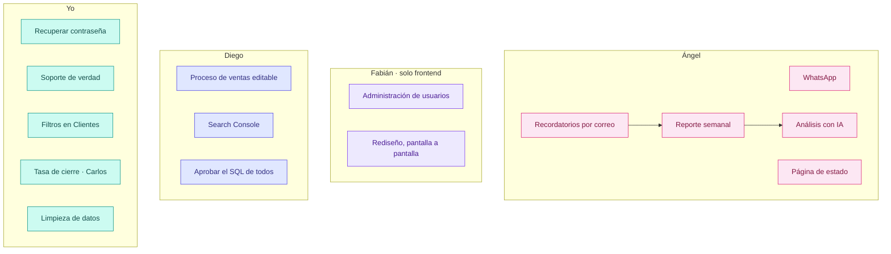
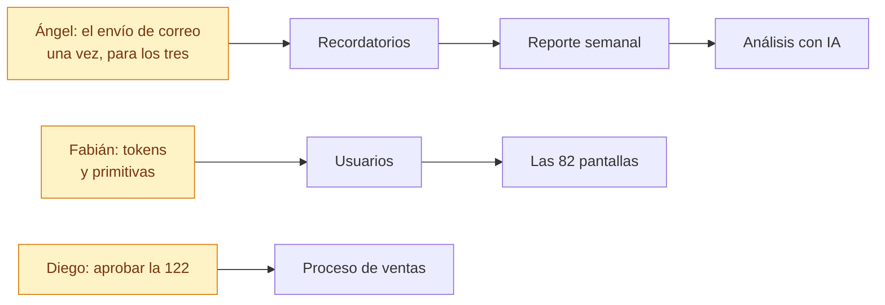

# Tareas del equipo · agosto 2026

Quién hace qué, qué significa que algo esté terminado, y en qué orden conviene
hacerlo. Una tarea sin criterio de terminada se da por hecha tres veces.

---

## Las cuatro reglas

1. **El SQL lo aprueba Diego.** Nadie aplica una migración. Se escribe, se sube
   al repositorio y él la ejecuta. Vale para todos.
2. **Fabián no toca backend ni base de datos.** Solo frontend. Si algo que
   necesita no existe en el servidor, lo dice y se le hace.
3. **Se trabaja sobre MultiCRM y yo lo replico a ISEIE.** Los dos CRMs tienen
   que acabar iguales salvo la marca, pero duplicar a mano mientras se
   desarrolla es lo que los desincroniza.
4. **Cada uno en su rama, con su nombre.** A `main` no se empuja: se pide
   y Diego aprueba. GitHub lo impide, no es un acuerdo de palabra.

| | Rama |
|---|---|
| Ángel | `feat/angel` |
| Fabián | `feat/fabian` |
| Diego | `feat/diego` |
| Yo | la que toque, por tarea |

**Nada llega a `main` sin que Diego lo apruebe.** `main` es lo que está aprobado:
no se puede empujar a ella directamente ni con prisa. Se abre una petición de
cambios desde tu rama, él la mira y la aprueba. Es el único camino, y vale
también para mí.

---

## El reparto



Ángel lleva cinco y no es casualidad: **tres de ellas son la misma tubería**.
Recordatorios, reporte semanal y análisis con IA salen todos por Brevo y por una
tarea programada. Si se hace primero el envío y luego los tres contenidos, son
una tarea y media. Si se hacen por separado, son tres veces el mismo trabajo.

---

## Cómo tiene que verse esto

La referencia es **SuiteDash y Zoho CRM**: sobrio, denso, con jerarquía clara.
No hay que inventar nada — mirar cómo resuelven ellos una pantalla de
administración y hacer eso.

**Tipografía.** Una sola familia para la interfaz, **Inter**, con tres pesos:
400 normal, 500 etiquetas y cabeceras, 600 títulos. Y **números de ancho fijo**
(`tabular-nums`) en toda columna de dinero, fecha o cantidad: sin eso las cifras
bailan de fila en fila y no se pueden comparar de un vistazo, que es justo para
lo que se miran. Los códigos —números de factura, NIF, identificadores— en
monoespaciada: un `2026/0695` así se lee de un golpe.

> Hoy hay un fallo ahí: `tailwind.config.js` declara «Plus Jakarta Sans» y
> **nadie la carga**, así que cae a la fuente del sistema y el CRM se ve
> distinto en cada ordenador. Se arregla en la tarea #50.

**Iconos: Phosphor, nunca emojis.** Un emoji cambia de dibujo según el sistema,
no se puede colorear ni alinear con el texto, y delante de un cliente hace que
el CRM parezca un chat. Mismo grosor y mismo tamaño por contexto.

**Los estados, con punto de color _y_ palabra.** Nunca solo color: quien no
distingue rojo de verde se queda sin la mitad de la información.

**Quién hace qué.** La estructura —rutas, layout, navegación— la llevamos
nosotros. El aspecto lo lleva Fabián. Así no se pisan: uno mueve dónde están las
cosas, el otro cómo se ven.

---

## Una tarea no está hecha hasta que se ve

**Regla de Diego, 24/08/2026. No es una preferencia.**

Da igual cuántas líneas tenga el PR: si al abrir `/testeo` no se aprecia la
diferencia, la tarea **no está terminada**. Ni «a medias», ni «el cimiento está
puesto»: no está.

Esto salió de un caso concreto. Se entregaron cuatro PRs, 118 ficheros y más de
3.900 líneas, y al abrir el CRM la respuesta fue: *«lo veo casi todo igual»*.
Y era cierto — el trabajo estaba en tokens, tipografía y una pestaña de
Configuración. Todo correcto, todo invisible.

### Qué se entrega con cada tarea

1. **Dónde mirarlo**: el enlace exacto de `/testeo`, no «en Configuración».
2. **Qué se ve distinto**, en una frase que pueda comprobar quien no escribió el
   código.
3. **Una captura de antes y otra de después.** Si no se distinguen, la tarea
   sigue abierta.

### Por qué, y no es capricho

Quien revisa no lee el código: **abre el CRM**. Si la diferencia no se ve, no se
puede aprobar, ni corregir, ni saber si vamos bien. Un cimiento invisible puede
ser necesario —los tokens lo eran— pero entonces **va dentro de la tarea que sí
se ve**, no como entrega propia.

### La trampa que hay que evitar

Un PR puede decir `Closes #33` sin haber hecho la #33. Pasó: la tarea del marco
—menú, cabecera, selector de proyecto— se dio por cerrada en un PR que no toca
`Sidebar.jsx`, `AppLayout.jsx` ni `Navbar.jsx`. **Antes de cerrar una tarea, se
comprueba en pantalla.**

## Decisiones que ya se tomaron

Están aquí para no volver a discutirlas cada vez que alguien las encuentra en el
código. Si una deja de tener sentido, se habla con Diego **antes** de cambiarla.

**WhatsApp · se puede escribir a cualquier número** *(21/08/2026)*. Había un
freno que impedía el primer mensaje a quien no fuera prospecto y nunca hubiera
escrito. Parecía proteger la línea y hacía lo contrario: cuando el CRM se
negaba, la gestora escribía **desde su móvil** — el mensaje salía igual, pero
sin registro, sin plantilla y sin los topes de ritmo. Queda apagado y solo se
apunta en el registro. Se puede reactivar con `WA_BLOQUEO_DESCONOCIDOS=true`.

**Lo que sí sigue frenando, y no se toca:** «no escribir» —si alguien lo pide,
no se le escribe ni con plantilla— y los topes de ritmo: 6 por minuto, 60 por
hora, 300 al día, por número.

**Las tareas del CRM las lleva Diego.** Cualquiera comenta en ellas; crear,
cerrar y asignar lo hace él. Es acuerdo, no candado: GitHub no sabe separar
«subir código» de «gestionar tareas».

---

# Ángel

## A1 · Terminar WhatsApp

Hoy la gestora tiene un botón en la lista de prospectos que abre WhatsApp, y ya.
Las plantillas **viven en el navegador de cada una**: nadie más las ve y nadie
puede revisarlas. En ISEIE hay además dos versiones incompatibles entre sí.

**Terminado cuando:**
- Las plantillas están en base de datos, compartidas por proyecto, y se pueden
  crear y editar desde el panel. *(La migración 122 ya está escrita, sin aplicar
  — la aplica Diego.)*
- El botón existe también **en la ficha abierta** del prospecto y en Clientes, no
  solo en el listado.
- Al pulsarlo **queda registrada la interacción**. Hoy se hace un POST que si
  falla no dice nada: WhatsApp se abre igual y no queda rastro. Si falla, se
  avisa en pantalla.
- El teléfono se arma con las reglas del backend (`phoneCanonical`), que ya sabe
  lo del `1` de México y el `9` de Argentina. Hoy el frontal quita todo lo que no
  sea número y un `0034…` genera un enlace roto.

**No entra aquí:** el navegador remoto de WhatsApp dentro del CRM. Eso necesita
servidor propio y coste mensual; es otra decisión.

## A2 · Página de estado del sistema

Una pantalla que responda «¿está todo funcionando?» sin tener que entrar por SSH.

**Terminado cuando** se ve, para cada pieza: si responde, cuándo sincronizó por
última vez y qué falló.

| Qué vigilar | De dónde sale |
|---|---|
| Meta Ads | última sincronización del programador de Meta |
| Stripe | último cobro recibido y último webhook |
| WooCommerce | última importación de productos |
| Brevo | último correo enviado |
| Tareas programadas | las siete que corren hoy, con su última vuelta |
| Base de datos y API | responde / no responde |

**Ojo con dos cosas:** que la página **no pida datos sensibles** si algún día se
publica fuera, y que **una pieza caída no tumbe la pantalla** — cada bloque va por
su lado y el que falle se pinta en rojo, no rompe el resto.

## A3 · Recordatorios por correo

**Terminado cuando** salen solos, sin que nadie los lance:

| Qué | A quién | Cuándo |
|---|---|---|
| Lead sin contactar | Su gestora | A los 30 minutos |
| Resumen del día | Gestora y administración | Al cerrar |
| Plan de mañana | Gestora | Por la noche |

**La tubería se hace aquí y sirve para A4 y A5.** Con dos cosas que no son
opcionales: que **no se repita** el mismo aviso si el servidor se reinicia —el
vigilante del catálogo llegó a mandar el mismo cinco veces en una tarde— y que en
pruebas **no salga ni un correo** a un cliente real.

## A4 · Reporte semanal por correo

Los lunes, a dirección: leads entrados, ventas cerradas, dinero cobrado, y cómo
va cada gestora. Comparado con la semana anterior, que es lo único que hace que
un número signifique algo.

**Terminado cuando** llega solo y **las cifras cuadran con las pantallas**. Si el
correo dice una cosa y el panel otra, deja de leerse en dos semanas.

⚠️ **La regla del dinero:** lo cobrado sale de `conversion_payments`, **nunca** de
`conversions.importe_pagado` — ese campo declara de más (en ISEIE, 209.930 € de
más). Y se redondea en SQL con `ROUND(...,2)`, no con `toFixed`.

## A5 · Análisis con IA

Dos cosas, en este orden:

1. **Preguntas en lenguaje natural.** «¿Cuánto vendió ICTESS en julio?» y
   responde con el dato **y de dónde sale**, para poder comprobarlo. Un número
   sin desglose no se cree nadie.
2. **El análisis dentro del correo semanal.** Qué subió, qué bajó, qué campaña
   rinde y qué conviene mirar.

**Dos límites que hay que respetar:** la IA **no ejecuta lo que se le ocurra**
contra la base —consultas preparadas o solo lectura con tiempo máximo—, y **no
inventa**: si no tiene el dato, lo dice.

---

# Fabián · solo frontend

## F1 · Terminar la administración de usuarios

**Terminado cuando** desde la pantalla se puede: crear y desactivar, cambiar rol,
asignar proyectos, marcar quién recibe leads, gestionar ausencias y reiniciar
contraseñas — sin tener que tocar la base.

**Antes de empezar hay que saber esto:** el catálogo de permisos y los roles a
medida **son decorativos**. `checkPermission` no se usa en ninguna ruta, el
frontal descarta el mapa que le manda el servidor y las claves ni siquiera
coinciden (`leads.view` contra `leads.read`). Pintar una pantalla encima de eso
da un panel que parece que hace algo y no hace nada. Si hace falta que funcione,
el backend es mío.

## F2 · Rediseño, pantalla a pantalla

82 pantallas, 256 componentes y 23 primitivas.

**El orden importa.** Tokens y primitivas primero —`index.css` y
`shared/components/ui/`— porque cambian el aspecto de las 82 pantallas de golpe.
Ir pantalla a pantalla desde el principio significa repetir la misma decisión 82
veces y que la número 40 no se parezca a la número 3.

**Cómo levantarlo sin instalar nada:**

```bash
cd frontend
npm install
VITE_BASE_PATH=/testeo/ VITE_API_TARGET=https://360crm.tech npm run dev
```

Eso levanta el frontal en su equipo contra **la API de pruebas**. Sin backend,
sin PostgreSQL, y con datos de verdad en pantalla. No hay CORS de por medio
porque el navegador solo habla con su propio Vite.

**Lo que se respeta:** Tailwind y shadcn/ui —nunca CSS en módulos ni
styled-components—, los tokens de `index.css` en vez de colores sueltos, y que
**siga funcionando en oscuro**. Y probar con más de un rol: lo que ve una gestora
no es lo que ve un superadministrador.

---

# Compartida · Ángel y Fabián

## Sincronizar los proyectos de IA con el CRM

Psicólogo IA, Nutricionista IA y Tarot IA tienen que quedar dentro del CRM como
cualquier otra marca: sus ventas, sus cobros y sus clientes.

**La hacen los dos, y lo primero es sentarse media hora a repartírsela.** La
mitad del servidor y la de la pantalla se tocan constantemente; si cada uno
decide por su lado sale un panel que no cuadra con los datos.

**Cómo se hace, decidido por Diego:** con las **claves secretas de Stripe de cada
proyecto** y **una API que los conecte**. Nada a mano, nada de subir un Excel.

Lo que eso obliga:

- **Una clave por proyecto**, nunca la compartida — así se puede cortar uno solo.
- **Cifradas en la base** (`api_credentials`, AES-256), donde ya viven las demás.
  Nunca en el repositorio ni en el frontal.
- **Su secreto de webhook, uno por proyecto.** Hoy no lo tiene ninguno, y el
  webhook acepta eventos sin firma cuando falta: quien sepa la dirección puede
  inventarse un cobro. Con dinero automático detrás, eso es fabricar ingresos.
- **Token propio para la API** — el CRM ya tiene esa pieza (`webhook-tokens`).

**La regla que no se negocia:** cada proyecto **factura desde el día que entra al
CRM, no desde antes**. Si lleva meses cobrando, ese histórico no se importa:
entraría como ventas de este mes e inflaría las cifras y las comisiones.

Lo que tienen que decidir ellos antes de escribir código: **hacia dónde va la
API** —si el CRM pregunta cada X tiempo o si cada plataforma avisa al CRM—, qué
se trae además de los cobros, y cada cuánto.

**Terminada cuando** se cobra algo de verdad en un proyecto de IA, aparece solo
en el CRM una vez, y el total del mes sube exactamente ese importe.

---

# Diego

## D1 · Proceso de ventas, y que sea editable

Los pasos del proceso comercial y qué toca hacer hoy con cada lead. Hoy están
fijos en el código.

**Terminado cuando** los pasos se editan desde el panel y la ficha del lead dice
qué toca ahora. El estado **se deduce de las interacciones** — no se guarda a
mano, porque un estado que hay que mantener a mano acaba mintiendo.

**Lleva migración.** La 122 estaba pensada para esto.

## D2 · Search Console

Autorizar GSC y traer los datos de posicionamiento. Es lo único que queda de todo
el asunto del OAuth: **entrar con Google no se va a usar** y las credenciales de
publicidad van aparte.

## D3 · Aprobar el SQL de todos

Ninguna migración se aplica sola. Se escribe, se sube y la ejecutas tú.

---

# Yo

## C1 · Recuperar la contraseña por correo

**Hoy no existe.** Quien la pierde depende de que alguien se la cambie a mano.
Ya está montado casi todo: el alta de usuario manda un enlace con token de 24 h
que caduca —`set_password_token`, SHA-256— y hay pantalla pública para ponerla.
Falta el «la he olvidado» que dispara ese mismo camino.

## C2 · Soporte, de verdad

La pantalla tiene 836 líneas y **el backend no existe**: los tickets se guardan
en el navegador de quien los abre. Nadie los recibe y no sale ningún correo.
Falta tabla, endpoints, envío por Brevo, adjuntos, y el tiempo de respuesta y de
cierre.

## C3 · Filtros en Clientes y Matrículas

Prospectos guarda sus filtros en la dirección y se pueden compartir. Clientes y
Matrículas **no tienen ninguno**. Se replica el juego entero.

## C4 · Tasa de cierre y baremo · lo de Carlos

Con su desglose «¿de dónde sale este número?». Y hay que **unificar la tarjeta de
conversión** que hoy usa otra fórmula: dos porcentajes distintos en la misma
pantalla es exactamente lo que hace que no se crea ninguno.

## C5 · Datos que no cuadran

Contado el 18/08 en las dos bases. **Los cargos de Stripe sin enlazar quedan
fuera por decisión del owner**, y lo de Carlos y su WiFi está resuelto con
Cloudflare.

| Qué | Cuánto | Qué es |
|---|---|---|
| **Ventas sin formación identificada** | 321 | Cobradas, pero sin curso del catálogo detrás: **ningún profesor cobra comisión** por ellas y en los informes salen como «servicio académico». 272 en ISEIE, 49 en MultiCRM |
| **Leads que no dicen qué curso quieren** | 3.369 | En MultiCRM son 1.301 de 2.245 — más de la mitad. De aquí salen las ventas de arriba; se arregla en el origen, con lo de Make |
| Alumnos con más de una venta | 7 | Puede ser que compraran dos cursos, o que la segunda cuota se metiera como venta nueva. Eso infla las ventas y parte el plan de pago |
| Proformas que gastaron número | 7 | Un presupuesto se llevó un número de la serie: la numeración queda con huecos |
| Teléfonos inservibles | 12 | Guardados a medias (`+340`, `+5823232`): el enlace de WhatsApp abre un chat que no existe |
| Comprobaciones en rojo | 10 de 180 | Fallan por datos de ejemplo. Con diez siempre rojas, nadie mira el día que se pone roja la once |

## C6 · Lo que quedó a medias

Asociar proformas ya creadas a una venta · el menú de Finanzas · el documento al
convertir · el modo BETA de ISEIE · los certificados de matrícula.

---

## Por dónde empezar



Lo amarillo es lo que desbloquea a los demás: **hasta que no esté, lo que va
detrás se hace dos veces**.

---

## Lo que hace falta antes de arrancar

> ### ⚠️ El CRM no puede mandar correo. Hoy lo tapa Make.
>
> Comprobado el 18/08 en los registros y en la base: **el CRM no ha enviado ni un
> correo nunca** —2.513 intentos fallidos en ISEIE, 620 en MultiCRM— porque **no
> tiene clave de Brevo en ninguna parte**: ni en el `.env` ni en
> `api_credentials`, que está vacía en los dos.
>
> **Los leads no se pierden y las gestoras sí se enteran**: el aviso lo manda
> Make, por su lado. Eso funciona y no se toca.
>
> Lo que sí se pierde es lo que solo puede mandar el CRM:
>
> - **«Bienvenido al CRM · establece tu contraseña»** — por eso hay usuarios que
>   se quedaron sin poder entrar.
> - **«Recordatorio vencido»** de la ficha del lead.
>
> Y sobre todo: **bloquea A3, A4 y A5**. El reporte semanal, los recordatorios y
> el análisis por correo salen del CRM, no de Make. Mientras no haya clave, se
> pueden programar pero no llegan a nadie. Es lo primero, y es poner una clave.

| Quién | Qué necesita | De quién |
|---|---|---|
| Ángel | Clave de Brevo — en pruebas **y en producción** | Diego |
| Ángel | Clave de la API de IA y un tope de gasto | Diego |
| Fabián | Usuario en el CRM de pruebas | Diego |
| Todos | Que las migraciones se apliquen | Diego |

---

## Documentos relacionados

- `ESTADO-Y-PENDIENTES.md` — qué está montado y qué no
- `PARIDAD-ENTRE-CRMS.md` — en qué se diferencian los dos repositorios
- `README.md` — arquitectura y cómo se despliega
