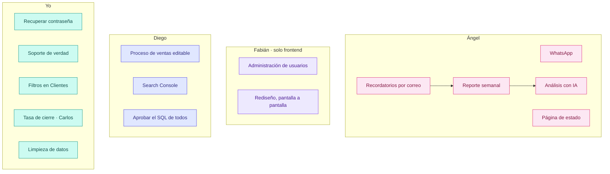
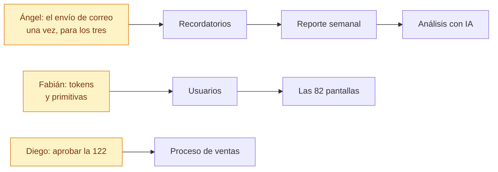

# Tareas del equipo · agosto 2026

Quién hace qué, qué significa que algo esté terminado, y en qué orden conviene
hacerlo. Una tarea sin criterio de terminada se da por hecha tres veces.

---

## Las cuatro reglas

1. **El SQL lo aprueba Diego.** Nadie aplica una migración. Se escribe, se sube
   al repositorio y él la ejecuta. Vale para todos.
2. **Fabián no toca backend ni base de datos.** Solo frontend. Si algo que
   necesita no existe en el servidor, lo dice y se le hace.
3. **Se trabaja sobre MultiCRM y yo lo replico a ISEIE.** Los dos CRMs tienen
   que acabar iguales salvo la marca, pero duplicar a mano mientras se
   desarrolla es lo que los desincroniza.
4. **Cada uno en su rama.** Nada va directo a `main` ni a `staging`.

| | Rama |
|---|---|
| Ángel | `feat/angel` |
| Fabián | `feat/rediseno` |
| Diego | `feat/ventas` |
| Yo | la que toque, por tarea |

---

## El reparto



Ángel lleva cinco y no es casualidad: **tres de ellas son la misma tubería**.
Recordatorios, reporte semanal y análisis con IA salen todos por Brevo y por una
tarea programada. Si se hace primero el envío y luego los tres contenidos, son
una tarea y media. Si se hacen por separado, son tres veces el mismo trabajo.

---

# Ángel

## A1 · Terminar WhatsApp

Hoy la gestora tiene un botón en la lista de prospectos que abre WhatsApp, y ya.
Las plantillas **viven en el navegador de cada una**: nadie más las ve y nadie
puede revisarlas. En ISEIE hay además dos versiones incompatibles entre sí.

**Terminado cuando:**
- Las plantillas están en base de datos, compartidas por proyecto, y se pueden
  crear y editar desde el panel. *(La migración 122 ya está escrita, sin aplicar
  — la aplica Diego.)*
- El botón existe también **en la ficha abierta** del prospecto y en Clientes, no
  solo en el listado.
- Al pulsarlo **queda registrada la interacción**. Hoy se hace un POST que si
  falla no dice nada: WhatsApp se abre igual y no queda rastro. Si falla, se
  avisa en pantalla.
- El teléfono se arma con las reglas del backend (`phoneCanonical`), que ya sabe
  lo del `1` de México y el `9` de Argentina. Hoy el frontal quita todo lo que no
  sea número y un `0034…` genera un enlace roto.

**No entra aquí:** el navegador remoto de WhatsApp dentro del CRM. Eso necesita
servidor propio y coste mensual; es otra decisión.

## A2 · Página de estado del sistema

Una pantalla que responda «¿está todo funcionando?» sin tener que entrar por SSH.

**Terminado cuando** se ve, para cada pieza: si responde, cuándo sincronizó por
última vez y qué falló.

| Qué vigilar | De dónde sale |
|---|---|
| Meta Ads | última sincronización del programador de Meta |
| Stripe | último cobro recibido y último webhook |
| WooCommerce | última importación de productos |
| Brevo | último correo enviado |
| Tareas programadas | las siete que corren hoy, con su última vuelta |
| Base de datos y API | responde / no responde |

**Ojo con dos cosas:** que la página **no pida datos sensibles** si algún día se
publica fuera, y que **una pieza caída no tumbe la pantalla** — cada bloque va por
su lado y el que falle se pinta en rojo, no rompe el resto.

## A3 · Recordatorios por correo

**Terminado cuando** salen solos, sin que nadie los lance:

| Qué | A quién | Cuándo |
|---|---|---|
| Lead sin contactar | Su gestora | A los 30 minutos |
| Resumen del día | Gestora y administración | Al cerrar |
| Plan de mañana | Gestora | Por la noche |

**La tubería se hace aquí y sirve para A4 y A5.** Con dos cosas que no son
opcionales: que **no se repita** el mismo aviso si el servidor se reinicia —el
vigilante del catálogo llegó a mandar el mismo cinco veces en una tarde— y que en
pruebas **no salga ni un correo** a un cliente real.

## A4 · Reporte semanal por correo

Los lunes, a dirección: leads entrados, ventas cerradas, dinero cobrado, y cómo
va cada gestora. Comparado con la semana anterior, que es lo único que hace que
un número signifique algo.

**Terminado cuando** llega solo y **las cifras cuadran con las pantallas**. Si el
correo dice una cosa y el panel otra, deja de leerse en dos semanas.

⚠️ **La regla del dinero:** lo cobrado sale de `conversion_payments`, **nunca** de
`conversions.importe_pagado` — ese campo declara de más (en ISEIE, 209.930 € de
más). Y se redondea en SQL con `ROUND(...,2)`, no con `toFixed`.

## A5 · Análisis con IA

Dos cosas, en este orden:

1. **Preguntas en lenguaje natural.** «¿Cuánto vendió ICTESS en julio?» y
   responde con el dato **y de dónde sale**, para poder comprobarlo. Un número
   sin desglose no se cree nadie.
2. **El análisis dentro del correo semanal.** Qué subió, qué bajó, qué campaña
   rinde y qué conviene mirar.

**Dos límites que hay que respetar:** la IA **no ejecuta lo que se le ocurra**
contra la base —consultas preparadas o solo lectura con tiempo máximo—, y **no
inventa**: si no tiene el dato, lo dice.

---

# Fabián · solo frontend

## F1 · Terminar la administración de usuarios

**Terminado cuando** desde la pantalla se puede: crear y desactivar, cambiar rol,
asignar proyectos, marcar quién recibe leads, gestionar ausencias y reiniciar
contraseñas — sin tener que tocar la base.

**Antes de empezar hay que saber esto:** el catálogo de permisos y los roles a
medida **son decorativos**. `checkPermission` no se usa en ninguna ruta, el
frontal descarta el mapa que le manda el servidor y las claves ni siquiera
coinciden (`leads.view` contra `leads.read`). Pintar una pantalla encima de eso
da un panel que parece que hace algo y no hace nada. Si hace falta que funcione,
el backend es mío.

## F2 · Rediseño, pantalla a pantalla

82 pantallas, 256 componentes y 23 primitivas.

**El orden importa.** Tokens y primitivas primero —`index.css` y
`shared/components/ui/`— porque cambian el aspecto de las 82 pantallas de golpe.
Ir pantalla a pantalla desde el principio significa repetir la misma decisión 82
veces y que la número 40 no se parezca a la número 3.

**Cómo levantarlo sin instalar nada:**

```bash
cd frontend
npm install
VITE_BASE_PATH=/testeo/ VITE_API_TARGET=https://360crm.tech npm run dev
```

Eso levanta el frontal en su equipo contra **la API de pruebas**. Sin backend,
sin PostgreSQL, y con datos de verdad en pantalla. No hay CORS de por medio
porque el navegador solo habla con su propio Vite.

**Lo que se respeta:** Tailwind y shadcn/ui —nunca CSS en módulos ni
styled-components—, los tokens de `index.css` en vez de colores sueltos, y que
**siga funcionando en oscuro**. Y probar con más de un rol: lo que ve una gestora
no es lo que ve un superadministrador.

---

# Diego

## D1 · Proceso de ventas, y que sea editable

Los pasos del proceso comercial y qué toca hacer hoy con cada lead. Hoy están
fijos en el código.

**Terminado cuando** los pasos se editan desde el panel y la ficha del lead dice
qué toca ahora. El estado **se deduce de las interacciones** — no se guarda a
mano, porque un estado que hay que mantener a mano acaba mintiendo.

**Lleva migración.** La 122 estaba pensada para esto.

## D2 · Search Console

Autorizar GSC y traer los datos de posicionamiento. Es lo único que queda de todo
el asunto del OAuth: **entrar con Google no se va a usar** y las credenciales de
publicidad van aparte.

## D3 · Aprobar el SQL de todos

Ninguna migración se aplica sola. Se escribe, se sube y la ejecutas tú.

---

# Yo

## C1 · Recuperar la contraseña por correo

**Hoy no existe.** Quien la pierde depende de que alguien se la cambie a mano.
Ya está montado casi todo: el alta de usuario manda un enlace con token de 24 h
que caduca —`set_password_token`, SHA-256— y hay pantalla pública para ponerla.
Falta el «la he olvidado» que dispara ese mismo camino.

## C2 · Soporte, de verdad

La pantalla tiene 836 líneas y **el backend no existe**: los tickets se guardan
en el navegador de quien los abre. Nadie los recibe y no sale ningún correo.
Falta tabla, endpoints, envío por Brevo, adjuntos, y el tiempo de respuesta y de
cierre.

## C3 · Filtros en Clientes y Matrículas

Prospectos guarda sus filtros en la dirección y se pueden compartir. Clientes y
Matrículas **no tienen ninguno**. Se replica el juego entero.

## C4 · Tasa de cierre y baremo · lo de Carlos

Con su desglose «¿de dónde sale este número?». Y hay que **unificar la tarjeta de
conversión** que hoy usa otra fórmula: dos porcentajes distintos en la misma
pantalla es exactamente lo que hace que no se crea ninguno.

## C5 · Limpieza de datos

| Qué | Cuánto |
|---|---|
| Cargos de Stripe de 2026 sin enlazar | 501 · 152.098 € |
| Enlazables por importe y fecha | 241 |
| Teléfonos que `normalizePhone` estropea | 188 |
| Leads de CETLAT sin cruzar con su programa | 382 |
| Segundas cuotas registradas como venta nueva | por barrer |

## C6 · Lo que quedó a medias

Asociar proformas ya creadas a una venta · el menú de Finanzas · el documento al
convertir · el modo BETA de ISEIE · los certificados de matrícula.

---

## Por dónde empezar



Lo amarillo es lo que desbloquea a los demás: **hasta que no esté, lo que va
detrás se hace dos veces**.

---

## Lo que hace falta antes de arrancar

> ### ⚠️ El correo no funciona en producción. En ninguno de los dos.
>
> Comprobado en los registros el 18/08: **0 correos enviados**, 2.513 perdidos en
> ISEIE y 620 en MultiCRM. El último se perdió **hoy a las 15:51** — «Nuevo lead
> asignado: Nerea». La clave de Brevo está vacía en ISEIE y en MultiCRM ni
> siquiera existe la línea.
>
> Lo que se está perdiendo, hoy y desde hace meses:
>
> - **«Nuevo lead asignado»** a la gestora. Nadie ha recibido uno nunca.
> - **«Recordatorio vencido»**.
> - **«Bienvenido al CRM · establece tu contraseña»** — por eso hay usuarios
>   que se quedaron sin poder entrar.
>
> Esto **bloquea A3, A4 y A5 enteras**: no tiene sentido programar un reporte
> semanal por correo mientras el correo no sale. Es lo primero que hay que
> arreglar, y es poner una clave.

| Quién | Qué necesita | De quién |
|---|---|---|
| Ángel | Clave de Brevo — en pruebas **y en producción** | Diego |
| Ángel | Clave de la API de IA y un tope de gasto | Diego |
| Fabián | Usuario en el CRM de pruebas | Diego |
| Todos | Que las migraciones se apliquen | Diego |

---

## Documentos relacionados

- `ESTADO-Y-PENDIENTES.md` — qué está montado y qué no
- `PARIDAD-ENTRE-CRMS.md` — en qué se diferencian los dos repositorios
- `README.md` — arquitectura y cómo se despliega
