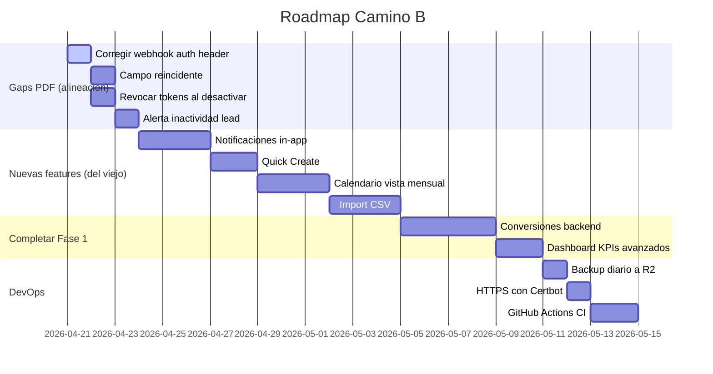

# Plan de Implementacion - Camino B

## Objetivo

Fusionar lo mejor del CRM viejo en nuestra arquitectura **sin romper nada** de lo que ya funciona.

## Principios

1. **Nuestra arquitectura es la base**: Node/Express + PG + JWT propio + multi-proyecto real
2. **Del viejo tomamos patrones UX**: quick create, notificaciones, filtros, calendario, import CSV
3. **NO reemplazar** lo que ya funciona (73 tests pasan, no rompemos)
4. **Migrar incrementalmente**: cada feature es un commit independiente

## Fases de implementacion

## Orden detallado

### Sprint 1 - Correcciones PDF + features Camino B basicas (1 semana)

**Dia 1-2: Alineacion con PDF spec**
- Webhook: usar `Authorization: Bearer` (en vez de `X-API-Key`)
- Agregar columna `reincidente` en leads con logica de duplicado mismo producto
- Revocar refresh tokens cuando se desactiva usuario
- Badge de alerta inactividad en LeadsPage (usando `dias_alerta_inactividad`)

**Dia 3-5: Notificaciones in-app**
- Migracion `004_notifications.sql`
- Endpoints notifications CRUD
- Triggers automaticos (lead_assigned, reminder_due, status_changed, payment_overdue)
- NotificationBell component con polling 30s
- Tests

### Sprint 2 - Features nuevas (1 semana)

**Dia 1-2: Quick Create**
- Endpoint POST /api/leads (lead manual, reutiliza round-robin)
- Componente QuickCreateModal
- Keyboard shortcut Cmd+K
- Boton Plus en Navbar

**Dia 3-5: Calendario**
- Endpoint GET /api/reminders con rango de fechas
- Pagina /calendar con 3 vistas (mes/semana/lista)
- CalendarMonthView, WeekView, DayDetailPanel

### Sprint 3 - Conversiones + Dashboard (1 semana)

**Dia 1-4: Conversiones backend completo**
- Migracion no necesaria (tablas ya existen)
- Endpoints: POST /conversions, POST /conversions/:id/payments, GET /conversions
- Cron pagos vencidos
- Tests

**Dia 5: Dashboard avanzado**
- Queries: ingresos por mes, tasa conversion, leads por canal
- Endpoints con filtros por rango

### Sprint 4 - Import CSV + DevOps (1 semana)

**Dia 1-3: Import CSV**
- Endpoint POST /api/leads/bulk-import con csv-parse
- Frontend modal multi-step
- Validacion fila por fila + reporte errores
- Tests

**Dia 4-5: DevOps**
- Script backup.sh + crontab
- HTTPS con Certbot (cuando haya dominio)
- GitHub Actions workflow para deploy staging automatico

## Features NO incluidas en Camino B

Estas van a Fase 2 o Fase 3:

- Meta Ads API integration
- Google Ads API
- Google Search Console
- Stripe sync (proyectos IA)
- Reportes Claude AI
- Chat conversacional IA
- Export PDF con Puppeteer
- Custom Audiences Meta

## Que NO vamos a copiar del viejo

| Feature viejo | Por que NO |
|---------------|-----------|
| TypeScript | CLAUDE.md dice JavaScript explicitamente |
| Supabase backend | Ya tenemos Node/Express propio mas flexible |
| Gemini (IA) | Usaremos Claude en Fase 3 |
| Tabla `clients` separada de `prospects` | Duplicacion innecesaria, nuestro `leads` unificado es mejor |
| Chart.js | Ya tenemos Recharts |
| `crm_id` en cada tabla | Nuestro `project_id` ya hace multi-tenant |
| n8n workflow externo | Brevo API directa es mas simple |

## Metricas de exito

Cuando terminemos Camino B:

- [ ] 73 tests -> 110+ tests (mas cobertura)
- [ ] 100% features PDF Fase 1 implementadas
- [ ] Staging y production sincronizados
- [ ] Backup diario funcionando
- [ ] HTTPS activo
- [ ] GitHub Actions deploy automatico
- [ ] 0 emojis en UI (solo Phosphor icons)
- [ ] Todas las pantallas del PDF implementadas

## Compromiso

Cada sprint termina con:
1. Tests pasando
2. Build sin errores
3. Deploy a staging
4. QA manual
5. Commit + push
6. Documentacion actualizada

## Cuando empezamos?

Proxima sesion.
