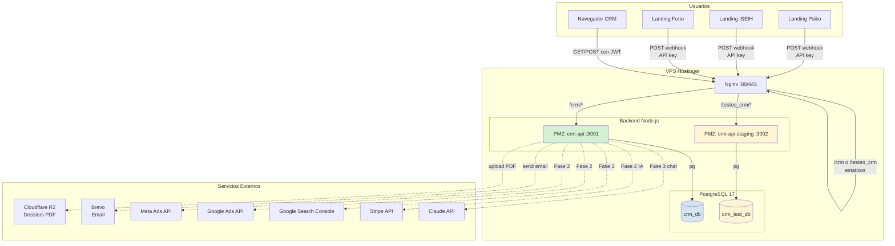
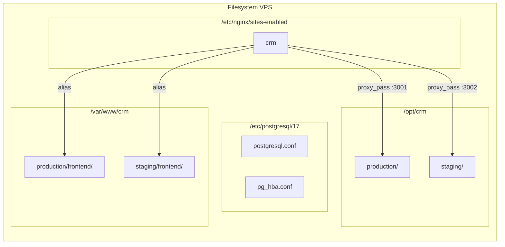
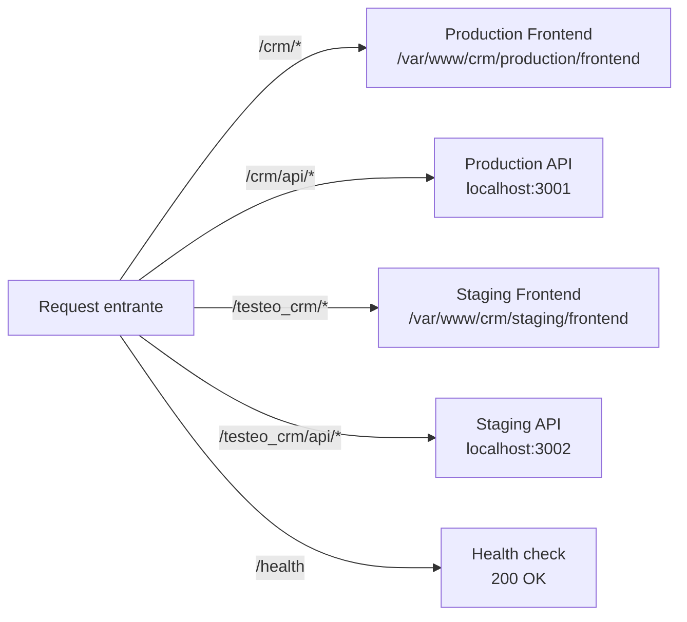

# 01. Arquitectura General del Sistema

## Vista 10.000 pies



## Stack tecnologico

| Capa | Tecnologia | Version |
|------|------------|---------|
| **Frontend** | React + Vite + shadcn/ui + Tailwind | 18 / 6 |
| **Backend** | Node.js + Express | 24 LTS / 4.21 |
| **DB** | PostgreSQL | 17.7 |
| **Proceso** | PM2 + systemd | 6.0 |
| **Proxy** | Nginx | 1.26 |
| **Storage** | Cloudflare R2 (S3 compatible) | - |
| **Email** | Brevo API v3 | - |
| **Tests** | Vitest + Supertest | 2.1 |

## Estructura del servidor VPS



## Rutas Nginx



## Arquitectura modular del backend

```
backend/src/
├── app.js                          # Express setup + auto-registro modulos
├── modules/                        # Un directorio por dominio
│   ├── auth/                       # Login, refresh, logout, me
│   ├── users/                      # CRUD usuarios + asignar proyectos
│   ├── leads/                      # Webhook, CRUD, interacciones, reminders
│   ├── products/                   # CRUD productos por proyecto
│   ├── dossiers/                   # Upload PDF, pre-signed URLs
│   └── [nuevo] notifications/      # A agregar (Camino B)
│   └── [nuevo] conversions/        # A agregar (Fase 1 pendiente)
│   └── [nuevo] calendar/           # A agregar (Camino B)
├── shared/
│   ├── config/
│   │   ├── db.js                   # Pool PostgreSQL
│   │   └── r2.js                   # S3 client Cloudflare R2
│   ├── middleware/
│   │   ├── auth.js                 # verifyToken + roleGuard
│   │   ├── projectAccess.js        # Filtrado por proyecto
│   │   ├── errorHandler.js         # Handler global errores
│   │   └── upload.js               # Multer + validacion PDF
│   ├── services/
│   │   └── r2.service.js           # uploadToR2, deleteFromR2
│   └── utils/
│       ├── AppError.js             # Error class custom
│       ├── logger.js               # Pino logger
│       └── presignedUrl.js         # URLs temporales R2 (15min)
├── migrations/                     # SQL secuencial (001, 002, 003...)
├── seeds/                          # Data inicial
└── tests/                          # Vitest + Supertest (73 tests)
```

## Arquitectura modular del frontend

```
frontend/src/
├── App.jsx                         # Router principal + lazy imports
├── main.jsx                        # BrowserRouter dinamico
├── contexts/
│   ├── AuthContext.jsx             # JWT en memoria + refresh auto
│   ├── ProjectContext.jsx          # Proyecto activo
│   └── ThemeContext.jsx            # Dark/light mode
├── modules/
│   ├── leads/                      # Feature leads
│   │   ├── api/
│   │   ├── hooks/
│   │   ├── components/
│   │   └── pages/
│   ├── products/
│   ├── settings/
│   └── [nuevo] calendar/
│   └── [nuevo] notifications/
└── shared/
    ├── api/client.js               # Axios/fetch con interceptors
    ├── components/
    │   ├── ui/                     # StatusBadge, KpiCard, etc
    │   └── layout/                 # Sidebar, Navbar, AppLayout
    ├── hooks/
    └── pages/                      # LoginPage, DashboardPage
```
