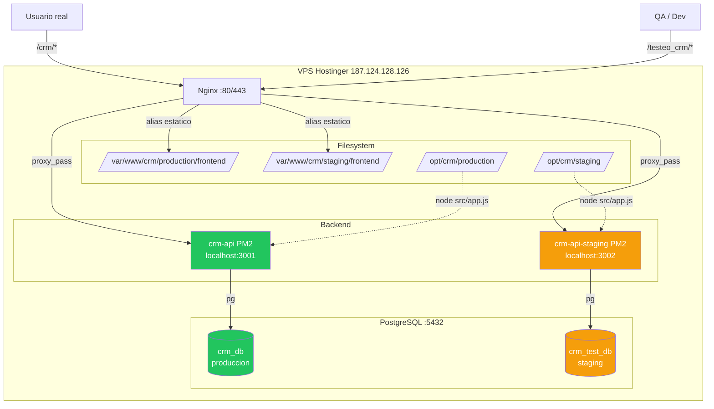
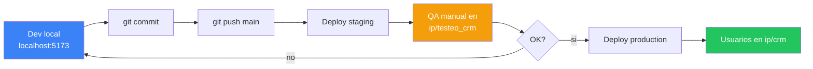

# 02. Entornos: Production vs Staging

## Vista general



## Tabla comparativa

| Aspecto | Production | Staging |
|---------|-----------|---------|
| URL | `/crm/` | `/testeo_crm/` |
| API | `/crm/api/*` | `/testeo_crm/api/*` |
| Puerto Node | 3001 | 3002 |
| Backend | `/opt/crm/production/` | `/opt/crm/staging/` |
| Frontend | `/var/www/crm/production/frontend/` | `/var/www/crm/staging/frontend/` |
| DB | `crm_db` | `crm_test_db` |
| PM2 name | `crm-api` | `crm-api-staging` |
| NODE_ENV | production | staging |
| LOG_LEVEL | info | debug |
| Vite base | `/crm/` | `/testeo_crm/` |
| Datos | Reales | Seed + datos QA |

## Ciclo: desarrollo -> staging -> production



## Nginx config simplificado

```nginx
server {
    listen 80 default_server;

    # Staging
    location /testeo_crm {
        alias /var/www/crm/staging/frontend;
        try_files $uri $uri/ /testeo_crm/index.html;
    }
    location /testeo_crm/api {
        proxy_pass http://localhost:3002/api;
        proxy_set_header Host $host;
        proxy_set_header X-Real-IP $remote_addr;
    }

    # Production
    location /crm {
        alias /var/www/crm/production/frontend;
        try_files $uri $uri/ /crm/index.html;
    }
    location /crm/api {
        proxy_pass http://localhost:3001/api;
        proxy_set_header Host $host;
        proxy_set_header X-Real-IP $remote_addr;
    }

    location /health {
        return 200 "OK - CRM Server";
    }
}
```

## Aislamiento de datos

Cada entorno tiene su propia DB. **NUNCA** conectar staging a crm_db ni production a crm_test_db.

Los refresh tokens son por DB, asi que una sesion de staging no funciona en production y viceversa.
