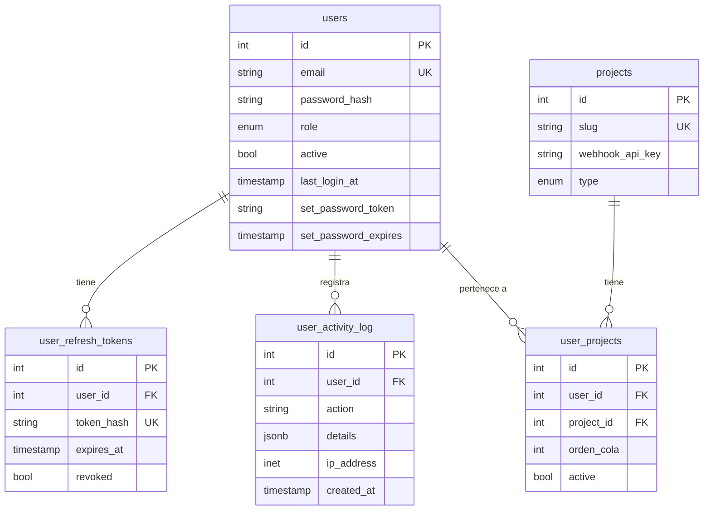
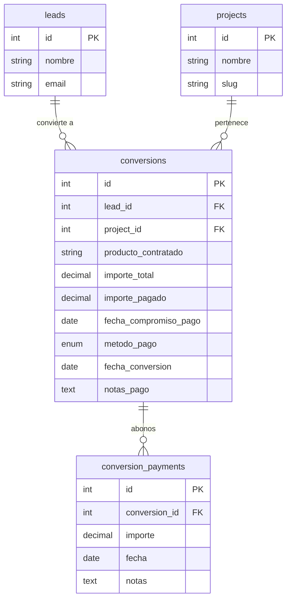
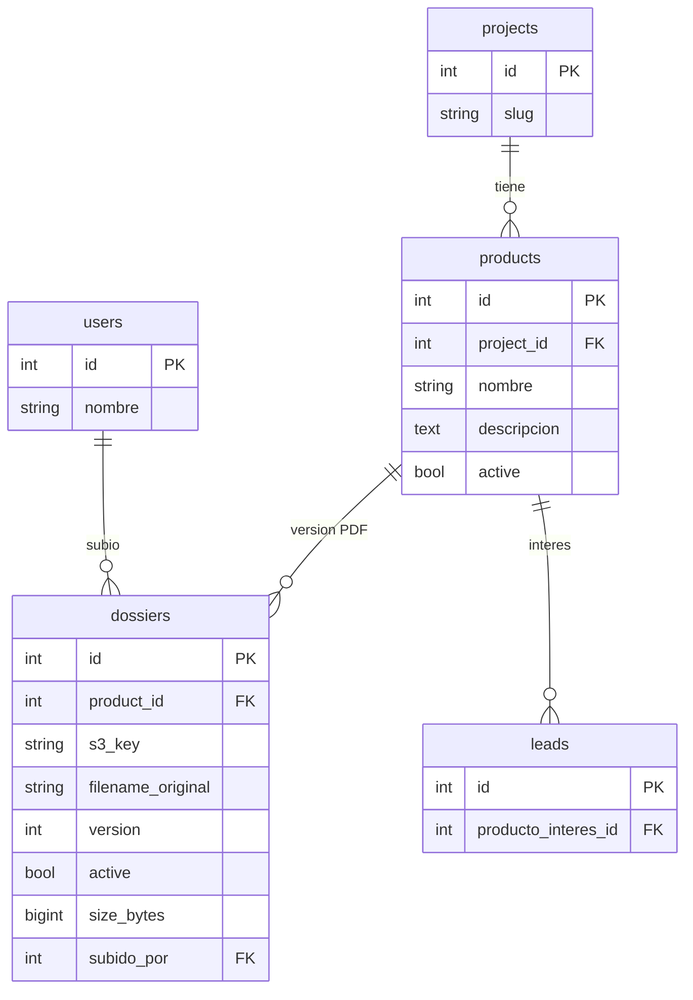
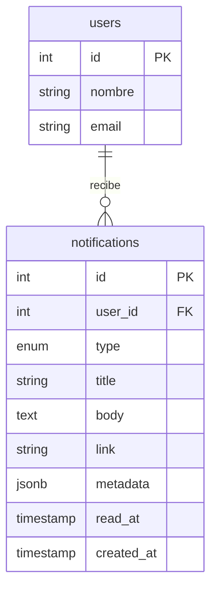
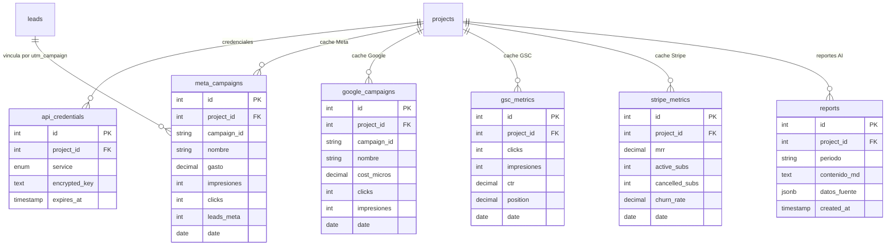

# 03. Modelo Entidad-Relacion (ERD)

## Diagrama completo de la base de datos

```mermaid
erDiagram
    users ||--o{ user_projects : "asignado a"
    users ||--o{ user_refresh_tokens : "tiene"
    users ||--o{ user_activity_log : "registra"
    users ||--o{ leads : "responsable de"
    users ||--o{ lead_interactions : "crea"
    users ||--o{ lead_reminders : "crea"
    users ||--o{ lead_status_history : "cambia"
    users ||--o{ dossiers : "sube"

    projects ||--o{ user_projects : "tiene usuarios"
    projects ||--o{ products : "tiene"
    projects ||--o{ leads : "recibe"
    projects ||--o{ conversions : "genera"
    projects ||--o{ project_queue_state : "cola round-robin"

    products ||--o{ dossiers : "tiene version"
    products ||--o{ leads : "interes"

    leads ||--|| lead_utms : "trazabilidad"
    leads ||--o{ lead_interactions : "historial"
    leads ||--o{ lead_status_history : "cambios"
    leads ||--o{ lead_reminders : "recordatorios"
    leads ||--o{ conversions : "convierte a"
    leads ||--o{ leads : "duplicado de"

    conversions ||--o{ conversion_payments : "abonos"

    users {
        int id PK
        string nombre
        string email UK
        string password_hash
        enum role "superadmin/admin/gestor"
        bool active
        string set_password_token
        timestamp set_password_expires
        timestamp last_login_at
    }

    projects {
        int id PK
        string nombre
        string slug UK
        enum type "crm/ia"
        string emoji
        string webhook_api_key
        int dias_alerta_inactividad
        bool active
    }

    user_projects {
        int id PK
        int user_id FK
        int project_id FK
        int orden_cola "round-robin"
        bool active
    }

    products {
        int id PK
        int project_id FK
        string nombre
        text descripcion
        bool active
    }

    dossiers {
        int id PK
        int product_id FK
        string s3_key "R2 key"
        string filename_original
        int version
        bool active
        bigint size_bytes
        int subido_por FK
    }

    leads {
        int id PK
        int project_id FK
        string nombre
        string email
        string telefono
        int producto_interes_id FK
        enum status
        int responsable_id FK
        bool dossier_enviado
        text notas
        int lead_duplicado_de FK
        text landing_url
        timestamp fecha_solicitud
    }

    lead_utms {
        int id PK
        int lead_id FK UK
        string utm_source
        string utm_medium
        string utm_campaign
        string utm_content
        string utm_term
        text landing_url
        enum canal_detectado
    }

    lead_interactions {
        int id PK
        int lead_id FK
        enum tipo "llamada/email/whatsapp/nota"
        text nota
        timestamp fecha
        int created_by FK
    }

    lead_reminders {
        int id PK
        int lead_id FK
        date fecha_recordatorio
        text nota
        bool completado
        int created_by FK
    }

    lead_status_history {
        int id PK
        int lead_id FK
        enum status_anterior
        enum status_nuevo
        int changed_by FK
        timestamp changed_at
    }

    conversions {
        int id PK
        int lead_id FK
        int project_id FK
        string producto_contratado
        decimal importe_total
        decimal importe_pagado
        date fecha_compromiso_pago
        enum metodo_pago
        text notas_pago
        date fecha_conversion
    }

    conversion_payments {
        int id PK
        int conversion_id FK
        decimal importe
        date fecha
        text notas
    }

    project_queue_state {
        int id PK
        int project_id FK UK
        int last_assigned_user_id FK
        int last_assigned_index
    }

    user_activity_log {
        int id PK
        int user_id FK
        string action
        jsonb details
        inet ip_address
        timestamp created_at
    }

    user_refresh_tokens {
        int id PK
        int user_id FK
        string token_hash UK
        timestamp expires_at
        bool revoked
    }
```

## Tablas y su proposito

| Tabla | Proposito | Estado |
|-------|-----------|--------|
| users | Usuarios del CRM (3 roles) | OK |
| projects | Proyectos CRM e IA | OK |
| user_projects | N:M usuarios-proyectos + orden round-robin | OK |
| user_refresh_tokens | JWT refresh tokens hasheados | OK |
| user_activity_log | Log de acciones (login, logout, etc) | OK |
| products | Cursos/productos por proyecto | OK |
| dossiers | PDFs versionados en Cloudflare R2 | OK |
| leads | Leads con pipeline de status | OK |
| lead_utms | UTMs 1:1 con leads | OK |
| lead_status_history | Historial cambios de status | OK |
| lead_interactions | Llamadas, emails, whatsapp, notas | OK |
| lead_reminders | Recordatorios con fecha + completado | OK |
| project_queue_state | Estado round-robin por proyecto | OK |
| conversions | Ventas con importe + metodo_pago | Tabla creada, endpoints FALTAN |
| conversion_payments | Abonos parciales | Tabla creada, endpoints FALTAN |

## Tablas pendientes (Camino B)

| Tabla | Proposito |
|-------|-----------|
| **notifications** | In-app notifications con badge campana |
| **api_credentials** | Credenciales Meta/Google/Stripe encriptadas (AES-256) |
| **meta_campaigns** | Cache metricas Meta Ads (Fase 2) |
| **google_campaigns** | Cache metricas Google Ads (Fase 2) |
| **gsc_metrics** | Cache GSC (Fase 2) |
| **stripe_metrics** | Cache Stripe MRR/churn (Fase 2) |
| **reports** | Reportes mensuales Claude AI (Fase 2) |

## Enums definidos

```sql
user_role         ('superadmin', 'admin', 'gestor')
project_type      ('crm', 'ia')
lead_status       ('nuevo', 'por_contactar', 'contactado', 'en_seguimiento', 'convertido', 'no_interesado')
interaction_type  ('llamada', 'email', 'whatsapp', 'nota')
payment_method    ('transferencia', 'tarjeta', 'efectivo', 'fraccionado')
utm_channel       ('meta_ads', 'google_ads', 'tiktok_ads', 'organico', 'chatgpt_ia', 'directo', 'referido')
api_service       ('meta', 'google_ads', 'gsc', 'stripe', 'claude', 'brevo')
```

## ERDs por contexto (mas legibles)

### Contexto: Auth y Usuarios



### Contexto: Leads (core del sistema)

```mermaid
erDiagram
    projects ||--o{ leads : "recibe"
    products ||--o{ leads : "interes"
    users ||--o{ leads : "responsable"
    leads ||--o{ leads : "duplicado de"
    leads ||--|| lead_utms : "1:1"
    leads ||--o{ lead_status_history : "historial"
    leads ||--o{ lead_interactions : "actividad"
    leads ||--o{ lead_reminders : "recordatorios"
    projects ||--o{ project_queue_state : "cola"

    leads {
        int id PK
        int project_id FK
        string nombre
        string email
        string telefono
        int producto_interes_id FK
        enum status
        int responsable_id FK
        bool dossier_enviado
        int lead_duplicado_de FK
        text landing_url
        timestamp fecha_solicitud
    }

    lead_utms {
        int lead_id FK UK
        string utm_source
        string utm_medium
        string utm_campaign
        string utm_content
        string utm_term
        enum canal_detectado
    }

    lead_status_history {
        int id PK
        int lead_id FK
        enum status_anterior
        enum status_nuevo
        int changed_by FK
        timestamp changed_at
    }

    lead_interactions {
        int id PK
        int lead_id FK
        enum tipo
        text nota
        int created_by FK
        timestamp fecha
    }

    lead_reminders {
        int id PK
        int lead_id FK
        date fecha_recordatorio
        text nota
        bool completado
        int created_by FK
    }

    project_queue_state {
        int project_id FK UK
        int last_assigned_user_id FK
        int last_assigned_index
    }
```

### Contexto: Conversiones y pagos



### Contexto: Productos y dossiers (PDFs)



### Contexto: Notificaciones (PENDIENTE - Camino B)



### Contexto: Fase 2 - Integraciones API (PENDIENTE)



## Indices clave

| Indice | Tabla | Columnas | Optimiza |
|--------|-------|----------|----------|
| idx_leads_email | leads | email | Busqueda duplicados |
| idx_leads_project_status | leads | project_id, status | Pipeline |
| idx_leads_responsable_status | leads | responsable_id, status | Vista gestor |
| idx_leads_fecha_solicitud | leads | fecha_solicitud | Orden temporal |
| idx_conversions_project_fecha | conversions | project_id, fecha_conversion | Dashboard ingresos |
| idx_refresh_tokens_hash | user_refresh_tokens | token_hash (partial) | Auth refresh |
| idx_user_activity_log | user_activity_log | user_id, created_at | Timeline user |
