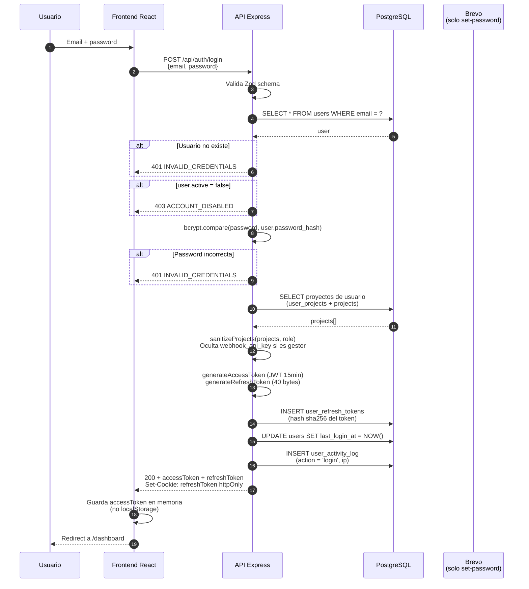
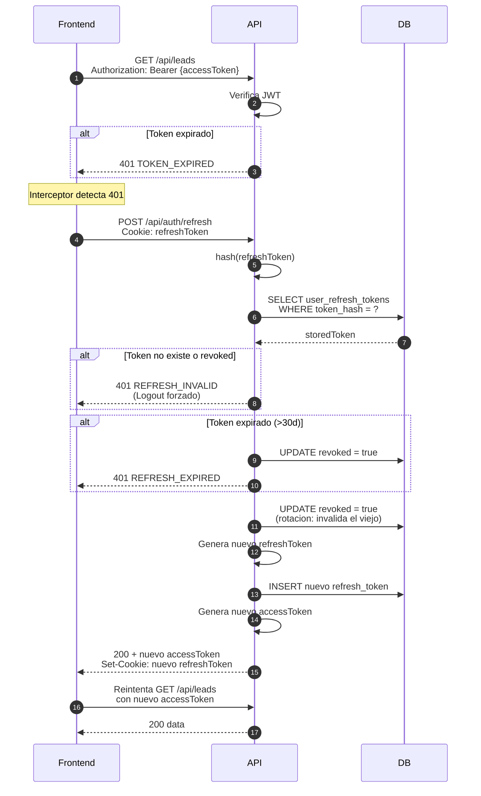
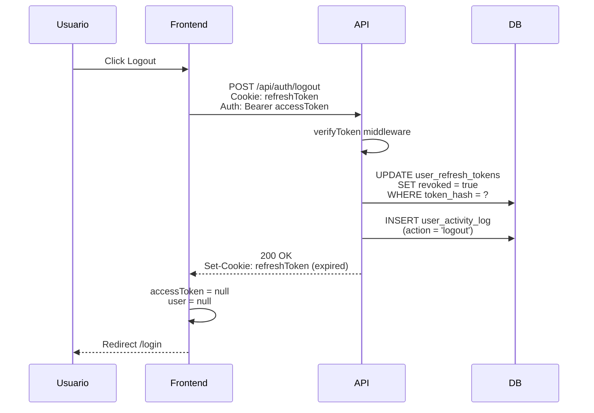
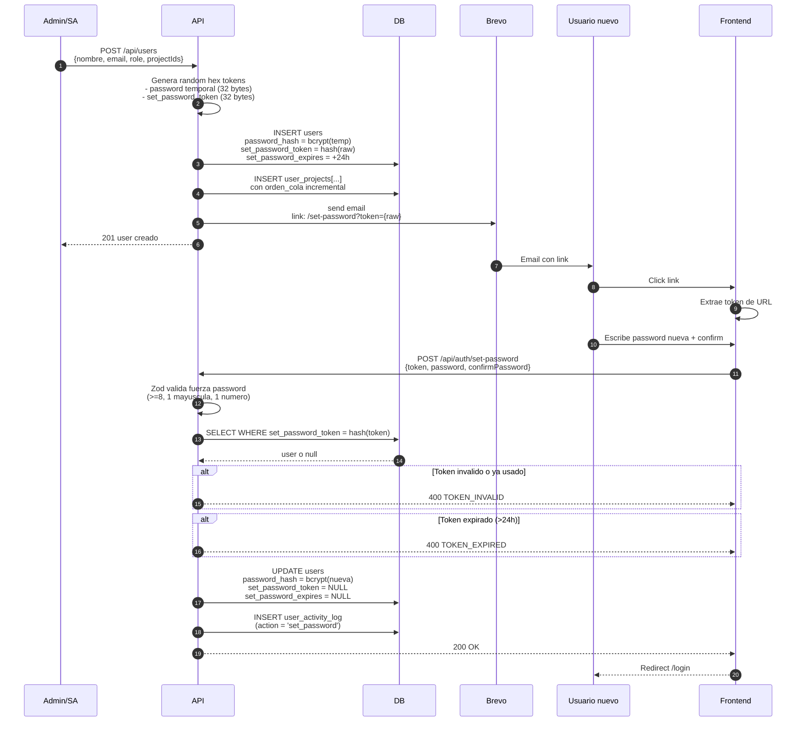
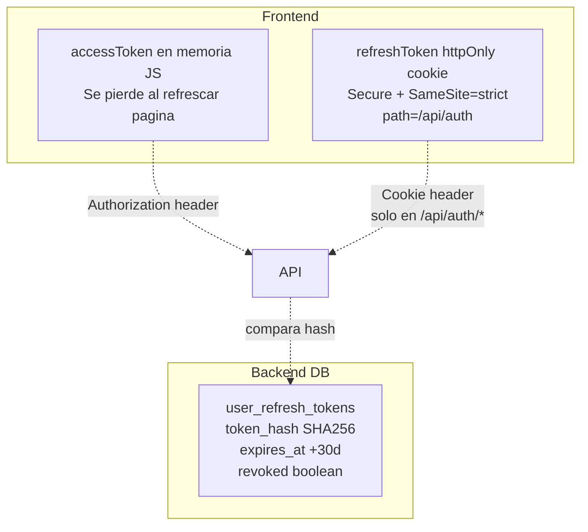

# 04. Flujo de Autenticacion

## Login



## Refresh automatico (cuando accessToken expira)



## Logout



## Set Password (primer login / reset)



## Almacenamiento de tokens



## Por que no localStorage?

| Opcion | Seguridad | Persistencia | Eleccion |
|--------|-----------|--------------|----------|
| localStorage | Vulnerable a XSS | Si | NO |
| sessionStorage | Vulnerable a XSS | Solo tab actual | NO |
| Cookie httpOnly | Segura (no accesible JS) | Si (hasta expiry) | **SI para refresh** |
| Memoria JS | Segura (muere al cerrar) | No | **SI para access** |

El access token se pierde al refrescar la pagina, pero el refresh cookie sigue. Al cargar la app, `AuthContext` hace un refresh automatico para obtener un nuevo access token.

## Desactivar usuario = cerrar sesion

Segun PDF spec: al desactivar un usuario, su sesion activa debe cerrarse inmediatamente.

**PENDIENTE**: cuando admin llama `DELETE /api/users/:id`, actualmente solo marca `active = false`. Hay que tambien:

```sql
UPDATE user_refresh_tokens
SET revoked = true
WHERE user_id = {id} AND revoked = false;
```

Al siguiente refresh request, el backend retorna 401 USER_INVALID y el frontend lo expulsa.
