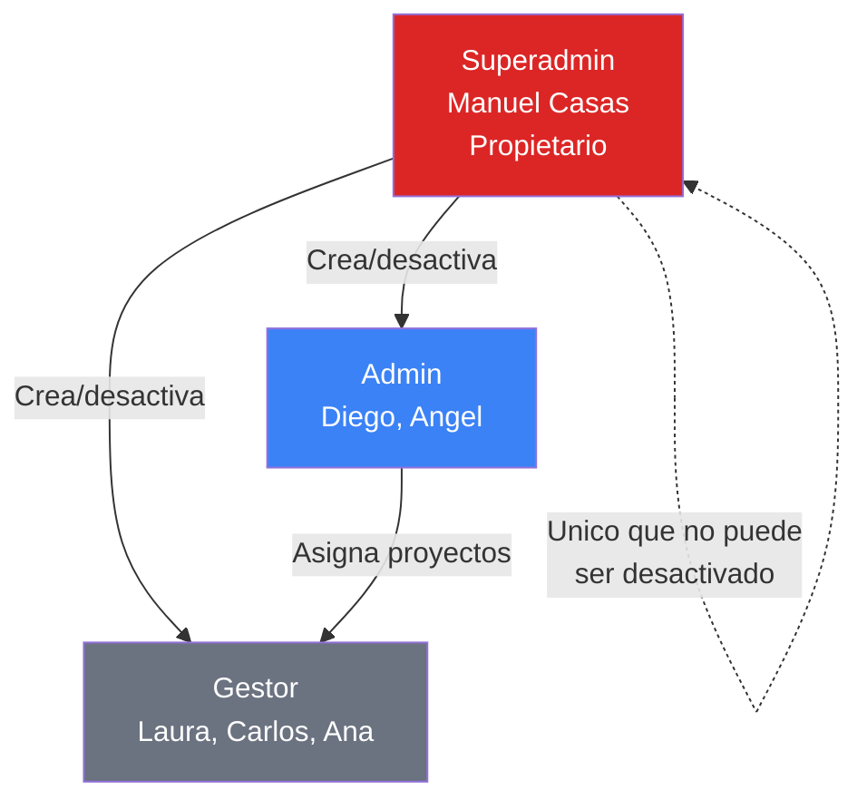
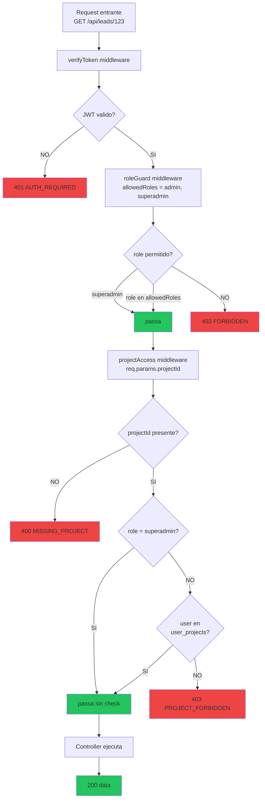
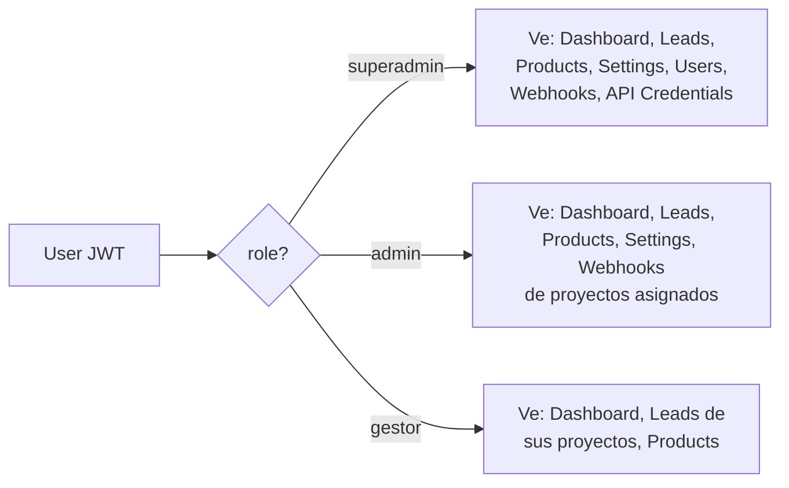

# 05. Roles y Permisos

## Los 3 roles del sistema



## Matriz de permisos

| Recurso / Accion | Superadmin | Admin | Gestor |
|------------------|:----------:|:-----:|:------:|
| **Proyectos** | | | |
| Ver todos los proyectos | SI | solo asignados | solo asignados |
| Crear proyectos | SI | NO | NO |
| Editar proyectos | SI | NO | NO |
| Eliminar proyectos | SI | NO | NO |
| **Webhooks** | | | |
| Ver webhook URL + API key | SI todos | solo asignados | NO (oculto) |
| Regenerar API key | SI | solo asignados | NO |
| **Credenciales API externas** (Meta, Google, Stripe) | | | |
| Ver | SI | NO | NO |
| Configurar | SI | NO | NO |
| **Usuarios** | | | |
| Crear usuarios | SI | NO | NO |
| Desactivar/reactivar usuarios | SI | NO | NO |
| Editar roles | SI | NO | NO |
| Ver lista completa de usuarios | SI | SI (solo lectura) | NO |
| **Leads** | | | |
| Ver leads de cualquier proyecto | SI | solo asignados | solo asignados |
| Crear leads manualmente | SI | SI asignados | SI asignados |
| Editar lead (nombre, telefono, notas) | SI | SI asignados | solo los suyos |
| Cambiar status | SI | SI asignados | solo los suyos |
| Reasignar lead a otro gestor | SI | SI asignados | NO |
| Eliminar lead | SI | NO | NO |
| **Interacciones y reminders** | | | |
| Crear | SI | SI asignados | SI (leads suyos) |
| Ver historial | SI | SI asignados | SI (leads suyos) |
| **Conversiones y pagos** | | | |
| Registrar conversion | SI | SI asignados | SI (leads suyos) |
| Editar conversion | SI | SI asignados | NO |
| Ver dashboard ingresos | SI | SI | NO |
| **Productos y dossiers** | | | |
| Crear producto | SI | SI asignados | NO |
| Subir dossier | SI | SI asignados | NO |
| Ver/descargar dossier | SI | SI asignados | SI asignados |
| **Sistema** | | | |
| Ver activity log completo | SI | NO | NO |
| Ver activity log propio | SI | SI | SI |
| Acceder a Settings | SI | parcial | NO |
| Generar reportes IA | SI | SI asignados | NO |

## Flujo de autorizacion en cada request



## Middleware chain en Express

```js
// backend/src/modules/leads/lead.routes.js
router.use(verifyToken);                    // Todos los endpoints requieren auth
router.get('/', leadController.list);       // list con projectId en query
router.patch('/:id', leadController.update); // cualquier user autenticado puede editar los suyos

// Reasignar solo admin/superadmin
router.patch('/:id/reassign',
  roleGuard('admin', 'superadmin'),        // roleGuard chequea el rol
  leadController.reassign
);
```

## Filtrado en backend (gestor solo ve sus leads)

```js
// backend/src/modules/leads/lead.service.js (PENDIENTE implementar)
export async function list(filters, userContext) {
  // Si es gestor, forzar responsable_id = user
  if (userContext.role === 'gestor') {
    filters.responsableId = userContext.userId;
  }
  return await leadModel.findAll(filters);
}
```

## Frontend: ocultar UI segun rol



Implementacion en Sidebar:

```jsx
// frontend/src/shared/components/layout/Sidebar.jsx
const navItems = [
  { label: 'Dashboard', roles: ['superadmin', 'admin', 'gestor'] },
  { label: 'Leads', roles: ['superadmin', 'admin', 'gestor'] },
  { label: 'Products', roles: ['superadmin', 'admin'] },
  { label: 'Settings', roles: ['superadmin', 'admin'] },
  { label: 'Users', roles: ['superadmin'] },
];

const visibleItems = navItems.filter(item =>
  item.roles.includes(user.role)
);
```

## Estado actual de implementacion

| Check | Backend | Frontend |
|-------|---------|----------|
| verifyToken en todos los endpoints autenticados | OK | - |
| roleGuard en endpoints admin | OK | - |
| projectAccess en endpoints con projectId | OK | - |
| Sidebar filtra por rol | - | OK |
| sanitizeProjects oculta webhook_api_key a gestor | OK | OK |
| **Filtrar leads por responsable_id si gestor** | **PENDIENTE** | - |
| **Dashboard de gestor solo muestra sus leads** | **PENDIENTE** | Parcial |
| **Desactivar user cierra sesion (revoke tokens)** | **PENDIENTE** | - |
