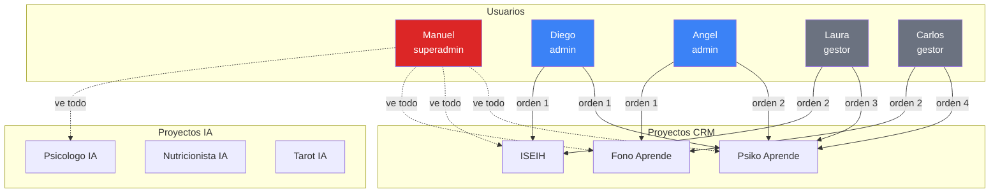
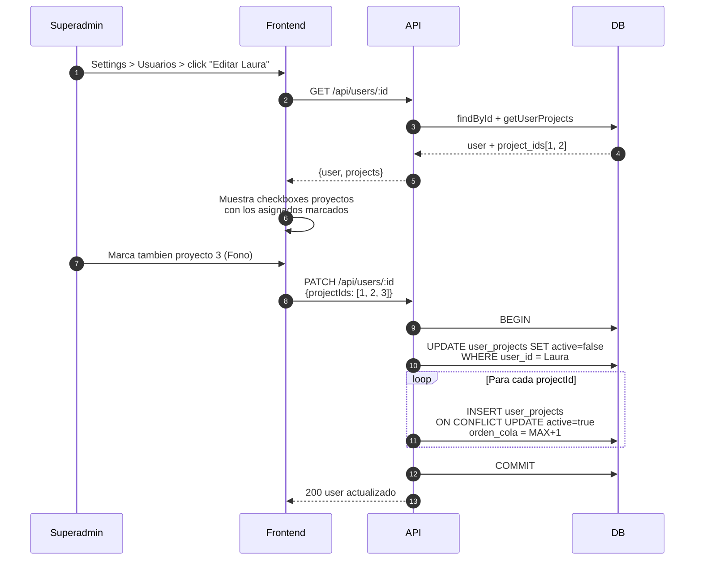
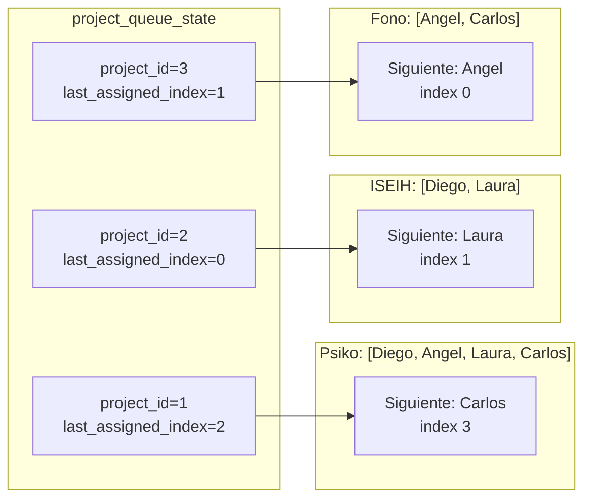
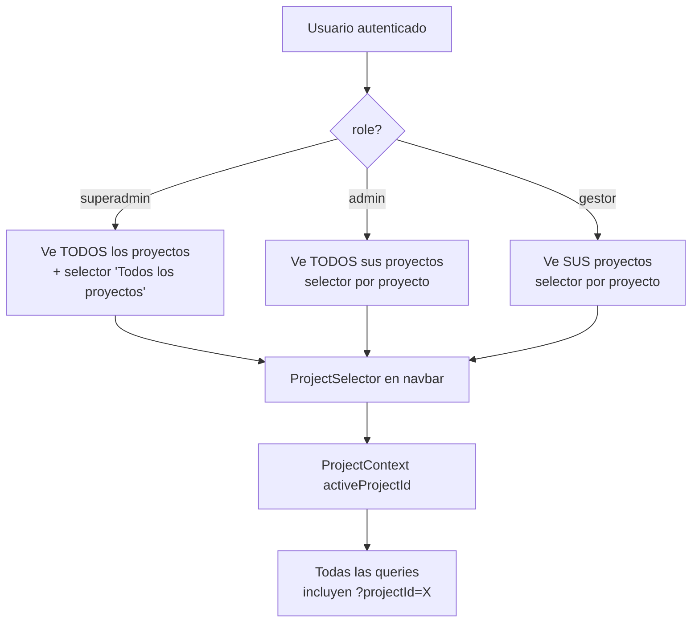
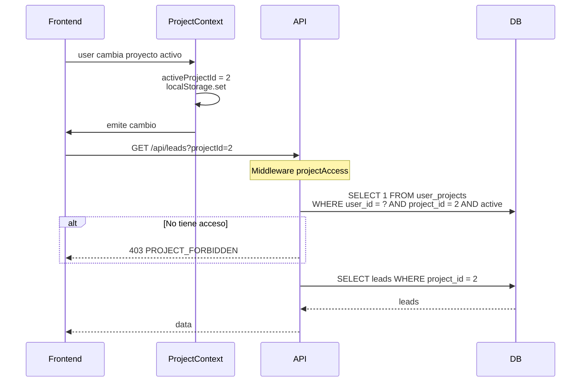
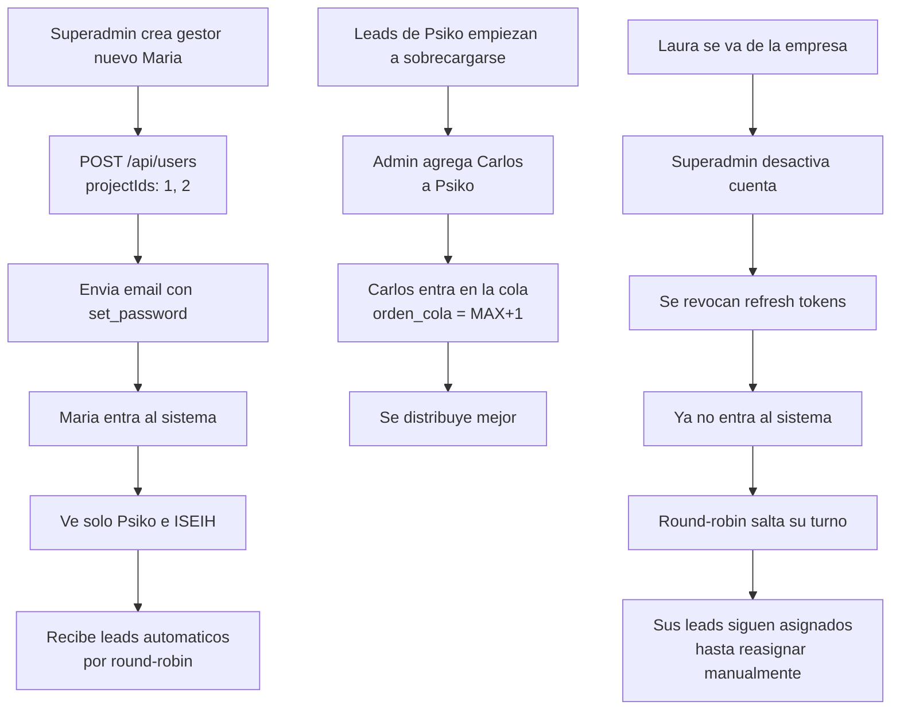

# 06. Multi-Proyecto (Equipos)

## Concepto

Un usuario puede pertenecer a varios proyectos con un orden de cola definido (para round-robin). El superadmin gestiona a quien va que proyecto.

## ERD del sistema multi-proyecto

```mermaid
erDiagram
    users ||--o{ user_projects : "trabaja en"
    projects ||--o{ user_projects : "tiene equipo"
    projects ||--o{ project_queue_state : "cola round-robin"

    users {
        int id PK
        string nombre
        string email UK
        enum role
        bool active
    }

    projects {
        int id PK
        string nombre
        string slug UK
        enum type "crm/ia"
        string webhook_api_key
        int dias_alerta_inactividad
        bool active
    }

    user_projects {
        int id PK
        int user_id FK
        int project_id FK
        int orden_cola "orden en round-robin"
        bool active
    }

    project_queue_state {
        int id PK
        int project_id FK UK
        int last_assigned_user_id FK
        int last_assigned_index
        timestamp updated_at
    }
```

## Relacion usuarios-proyectos



Lectura: Diego esta en Psiko(orden 1) e ISEIH(orden 1). Angel en Psiko(orden 2) y Fono(orden 1). Laura en Psiko(orden 3) e ISEIH(orden 2). Etc.

## Flujo: asignar proyecto a usuario



## Round-robin por proyecto

Cada proyecto tiene su propio state. No interfieren entre si.



## Que ve cada rol en el sidebar



## Filtrado de datos por proyecto activo



## Superadmin: caso especial

El superadmin en el PDF puede ver TODO sin estar asignado. Actualmente:

```js
// projectAccess.js
if (req.user.role === 'superadmin') {
  req.projectId = Number(projectId);
  return next();  // bypass check
}
```

Para ver TODOS los proyectos (sin filtrar), el superadmin puede:
- Dejar `projectId` vacio en algunos endpoints (PENDIENTE implementar)
- O tener un selector especial "Todos los proyectos" en el navbar (PENDIENTE)

## Casos de uso


