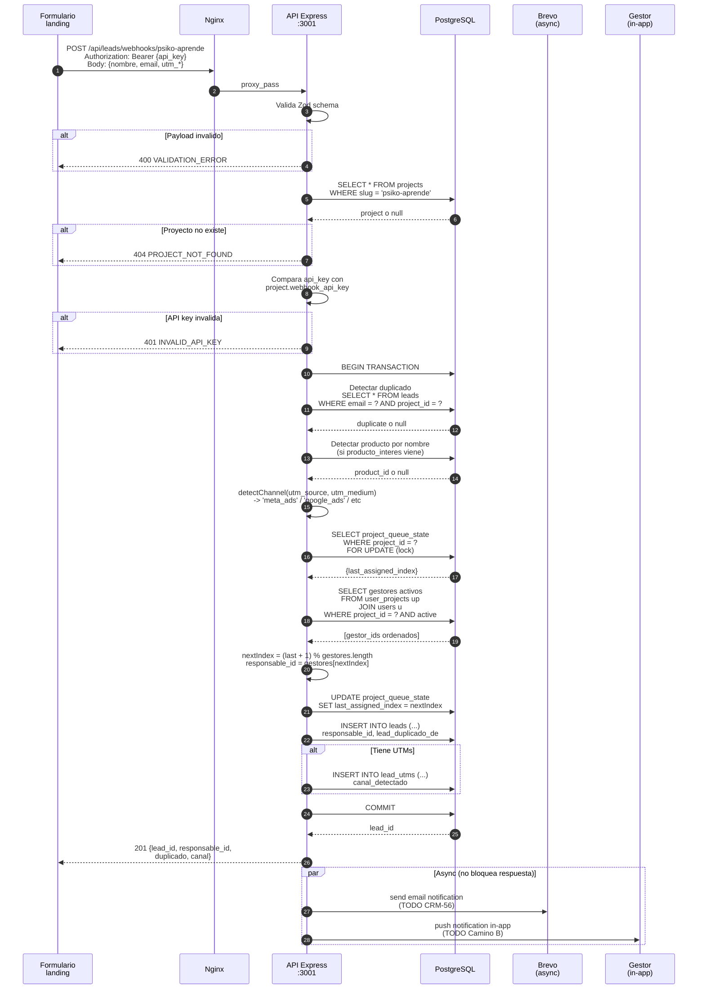
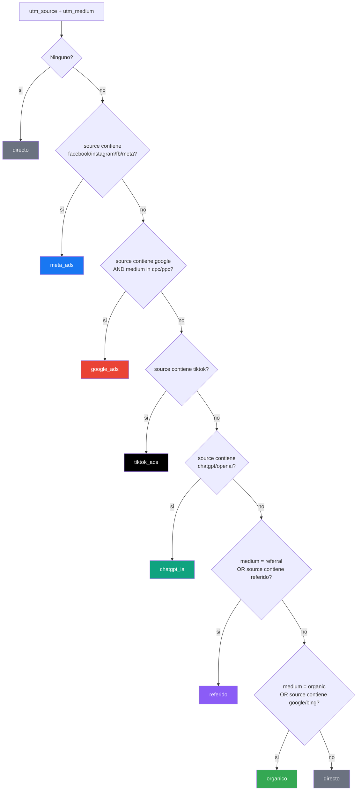
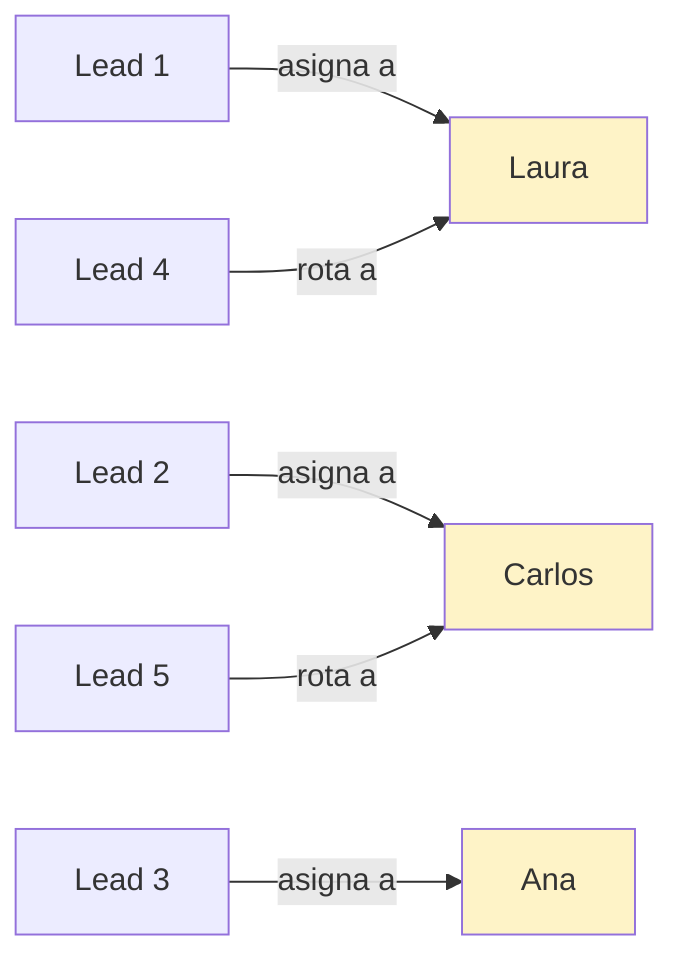
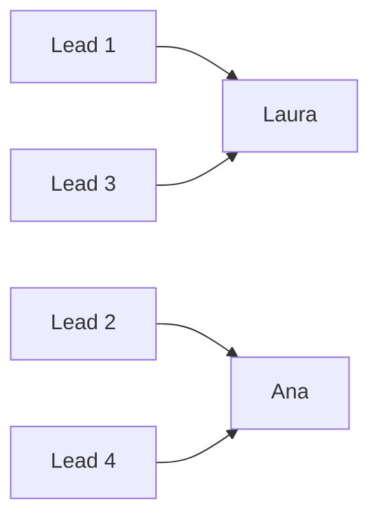
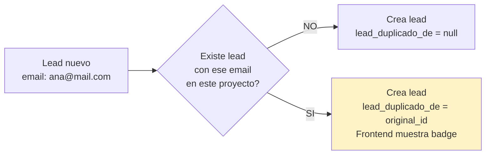

# 07. Flujo de Webhook de Leads + Round-Robin

## Vision general

Un formulario en la landing del proyecto hace POST al webhook. El backend crea el lead, detecta duplicados, parsea UTMs, y asigna automaticamente al siguiente gestor en la cola (round-robin). Todo en < 500ms.

## Flujo completo

## Flujo de detección de canal

## Round-robin: ejemplo visual

Proyecto **Psiko Aprende** tiene 3 gestores: Laura, Carlos, Ana (en ese orden).

Estado en `project_queue_state`:

| project_id | last_assigned_index | last_assigned_user_id |
|------------|---------------------|----------------------|
| 1 | 0 | Laura (tras lead 1) |
| 1 | 1 | Carlos (tras lead 2) |
| 1 | 2 | Ana (tras lead 3) |
| 1 | 0 | Laura (tras lead 4 - vuelve) |

## Gestor inactivo - que pasa?

Si **Carlos esta inactivo** (`user_projects.active = false` o `users.active = false`), el query de gestores no lo devuelve. La cola funciona solo con [Laura, Ana]:

## Duplicados

Si ya existe un lead con el mismo email en el MISMO proyecto:

Importante: segun el PDF spec, si es **mismo proyecto + mismo producto** hay que marcar `reincidente = true`. **PENDIENTE** agregar esa logica.

## Performance requerida

- Respuesta < 500ms (segun PDF spec)
- Email Brevo async (no bloquea respuesta)
- SELECT FOR UPDATE solo bloquea 1 fila (project_queue_state)
- Indices usados: `idx_leads_email`, `idx_leads_project_id`

## Seguridad

- API key por header `Authorization: Bearer {key}` (PDF spec) o `X-API-Key` (actual - **pendiente corregir**)
- CORS configurable por dominio del proyecto (PDF seccion 03)
- Rate limiting: **PENDIENTE** agregar (proteccion contra abuso)
