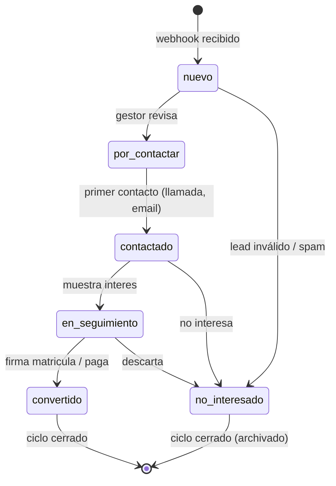
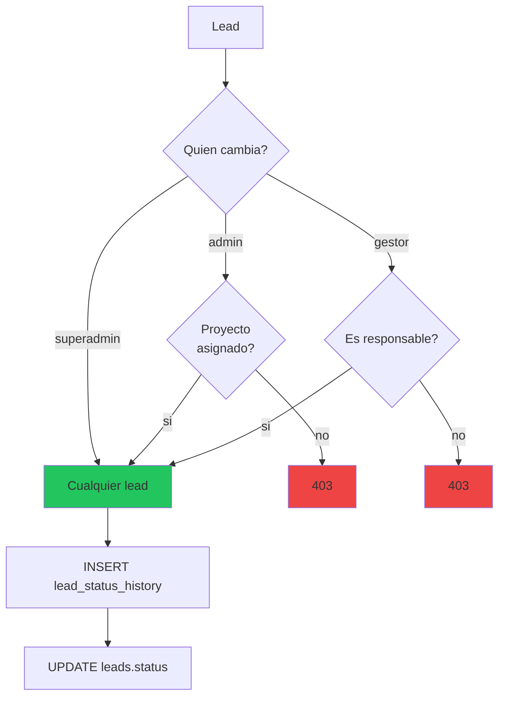
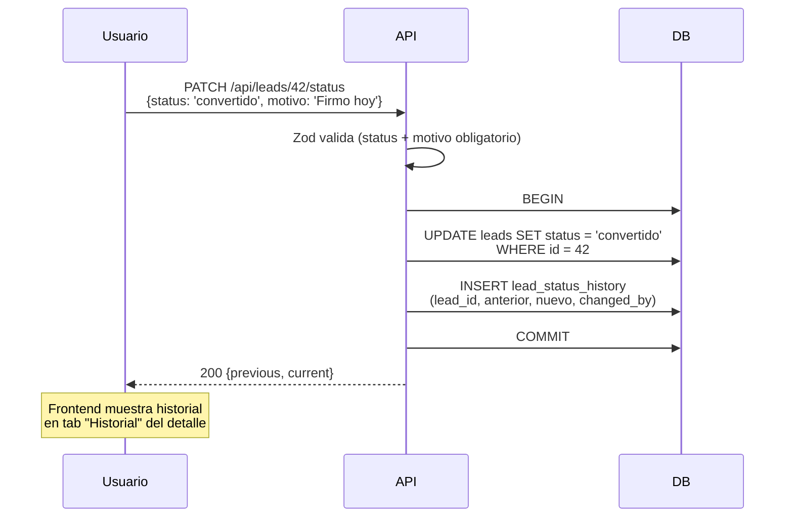
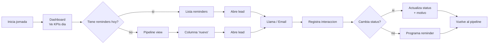
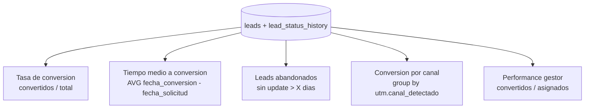

# 08. Ciclo de vida del Lead

## Estados y transiciones



## Estados y sus colores

| Status | Color Tailwind | Uso |
|--------|---------------|-----|
| `nuevo` | blue-500 | Recien recibido, sin tocar |
| `por_contactar` | orange-500 | Gestor lo priorizo, va a llamar |
| `contactado` | yellow-500 | Ya hubo primer contacto |
| `en_seguimiento` | purple-500 | Interesado, conversacion abierta |
| `convertido` | green-500 | Matriculado/comprado |
| `no_interesado` | red-500 | Cerrado sin conversion |

## Quien puede cambiar el status



## Historial de cambios

Cada cambio de status se registra automaticamente:



## Vista del gestor: su dia a dia



## Alerta por inactividad (PDF spec)

Cada proyecto tiene `dias_alerta_inactividad` (default 3). Si un lead no tiene actualizacion en ese periodo, aparece alerta visual:

```mermaid
flowchart TD
    LEAD[Lead status != convertido/no_interesado]
    LEAD --> CALC[dias_sin_update = NOW - MAX<br/>(updated_at, last_interaction)]
    CALC --> CHECK{dias_sin_update ><br/>dias_alerta_inactividad?}
    CHECK -->|SI| BADGE[Badge rojo pulsante<br/>'Inactivo X dias']
    CHECK -->|NO| NORM[Visualizacion normal]

    style BADGE fill:#fef3c7,color:#92400e
```

**PENDIENTE**: implementar este badge en LeadsPage + LeadDetailPage.

## Transiciones invalidas

Actualmente el backend no restringe transiciones (cualquier status puede ir a cualquiera). Esto es intencional porque:

- Un lead puede volver de `convertido` a `en_seguimiento` si se arrepiente y vuelve a negociar
- Un `no_interesado` puede reactivarse si vuelve a llamar

Lo unico que se valida es que **status nuevo != status actual** (error `SAME_STATUS`).

## Metricas derivadas (Dashboard)



**Estado actual**: Dashboard muestra total por status. Las metricas derivadas estan PENDIENTES de implementar.
