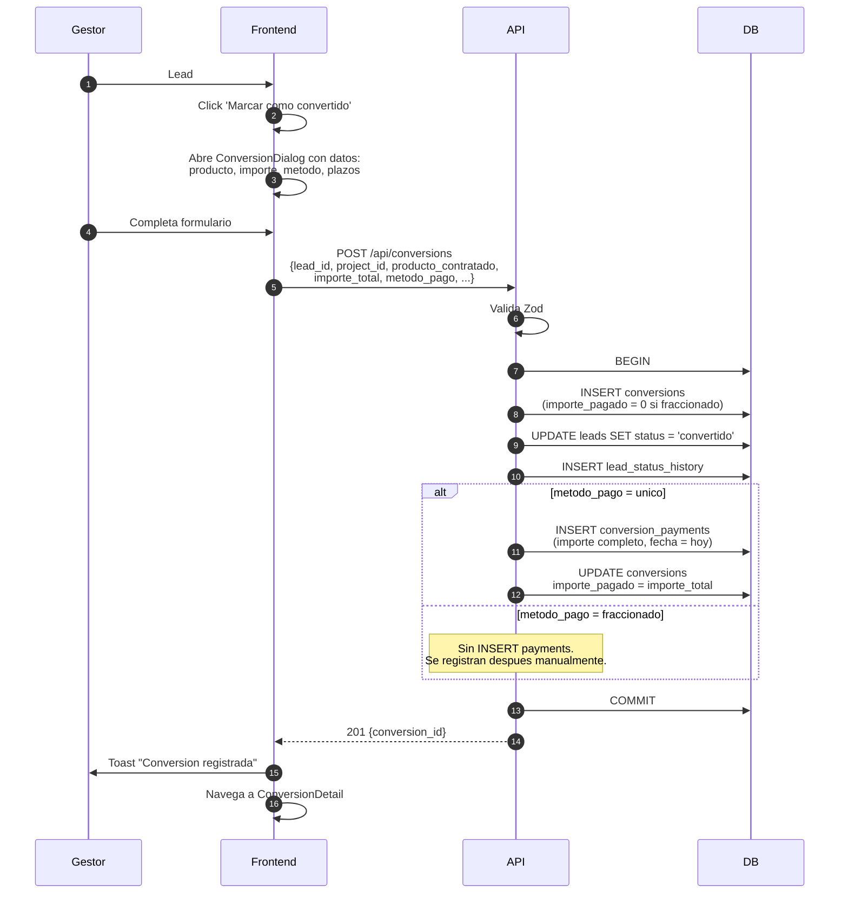
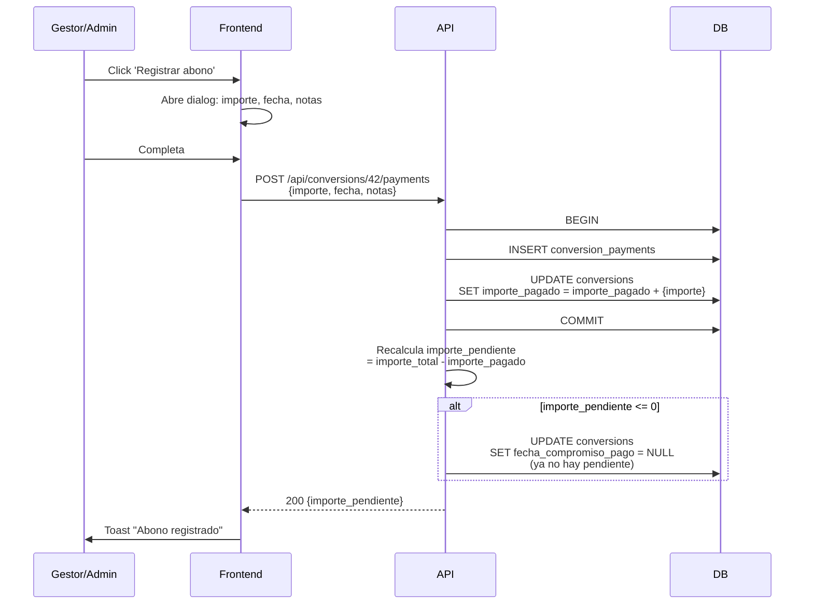
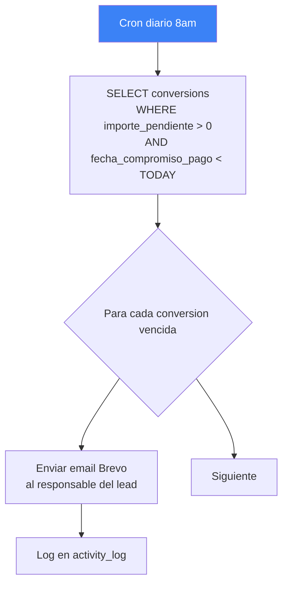
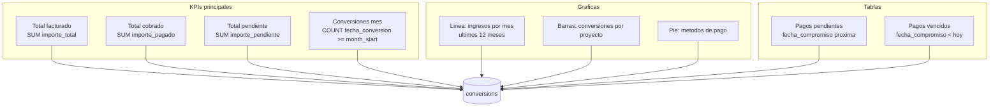

# 09. Conversion y Pagos

## Flujo: convertir lead



## Flujo: registrar abono parcial



## Estructura de una conversion con pagos

```
conversion #1 (Maria Garcia)
├── producto_contratado: "Master en Psicologia"
├── importe_total: 2500.00
├── importe_pagado: 1500.00
├── importe_pendiente: 1000.00 (calculado)
├── metodo_pago: "fraccionado"
├── fecha_compromiso_pago: 2026-05-15
│
├── payments (conversion_payments)
│   ├── #1: 500 EUR el 2026-04-01 (matricula)
│   ├── #2: 500 EUR el 2026-05-01 (primer plazo)
│   └── #3: 500 EUR el 2026-05-15 (segundo plazo)
│
└── pendiente: 1000 EUR (se recalcula en cada INSERT payment)
```

## Cron pagos vencidos (PENDIENTE implementar)



## Dashboard de ingresos



## Estado actual

| Componente | Estado |
|-----------|--------|
| Tabla `conversions` | OK |
| Tabla `conversion_payments` | OK |
| Endpoint POST /api/conversions | PENDIENTE |
| Endpoint POST /api/conversions/:id/payments | PENDIENTE |
| Endpoint GET /api/conversions?projectId | PENDIENTE |
| Dashboard ingresos frontend | Mock (datos falsos) |
| Cron pagos vencidos | PENDIENTE |
| Tests conversions | PENDIENTE |

## JSON de respuesta esperada

```json
{
  "success": true,
  "data": {
    "id": 1,
    "lead_id": 42,
    "project_id": 1,
    "lead_nombre": "Maria Garcia",
    "producto_contratado": "Master en Psicologia",
    "importe_total": 2500.00,
    "importe_pagado": 1500.00,
    "importe_pendiente": 1000.00,
    "metodo_pago": "fraccionado",
    "fecha_compromiso_pago": "2026-05-15",
    "fecha_conversion": "2026-04-01",
    "payments": [
      { "id": 1, "importe": 500, "fecha": "2026-04-01", "notas": "Matricula" },
      { "id": 2, "importe": 500, "fecha": "2026-05-01", "notas": "Primer plazo" },
      { "id": 3, "importe": 500, "fecha": "2026-05-15", "notas": "Segundo plazo" }
    ],
    "created_at": "2026-04-01T10:30:00Z",
    "updated_at": "2026-05-15T14:20:00Z"
  }
}
```
