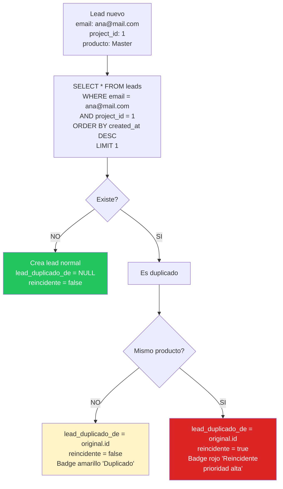
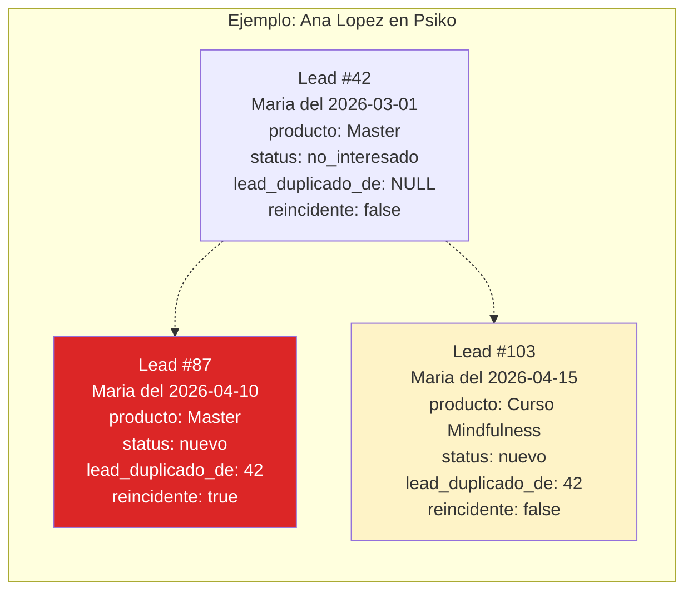
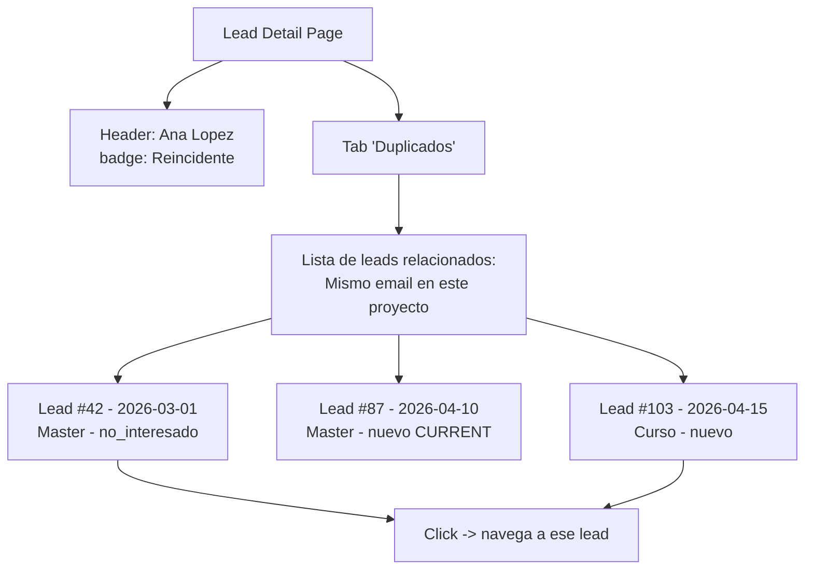
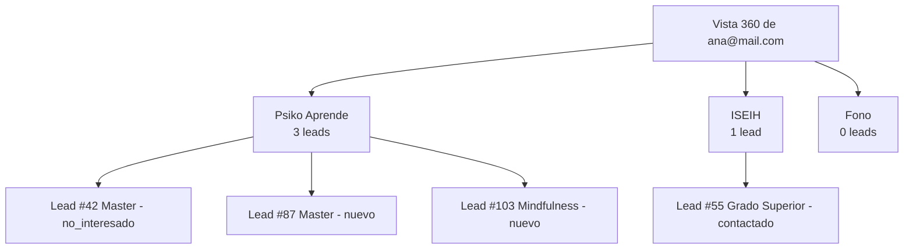
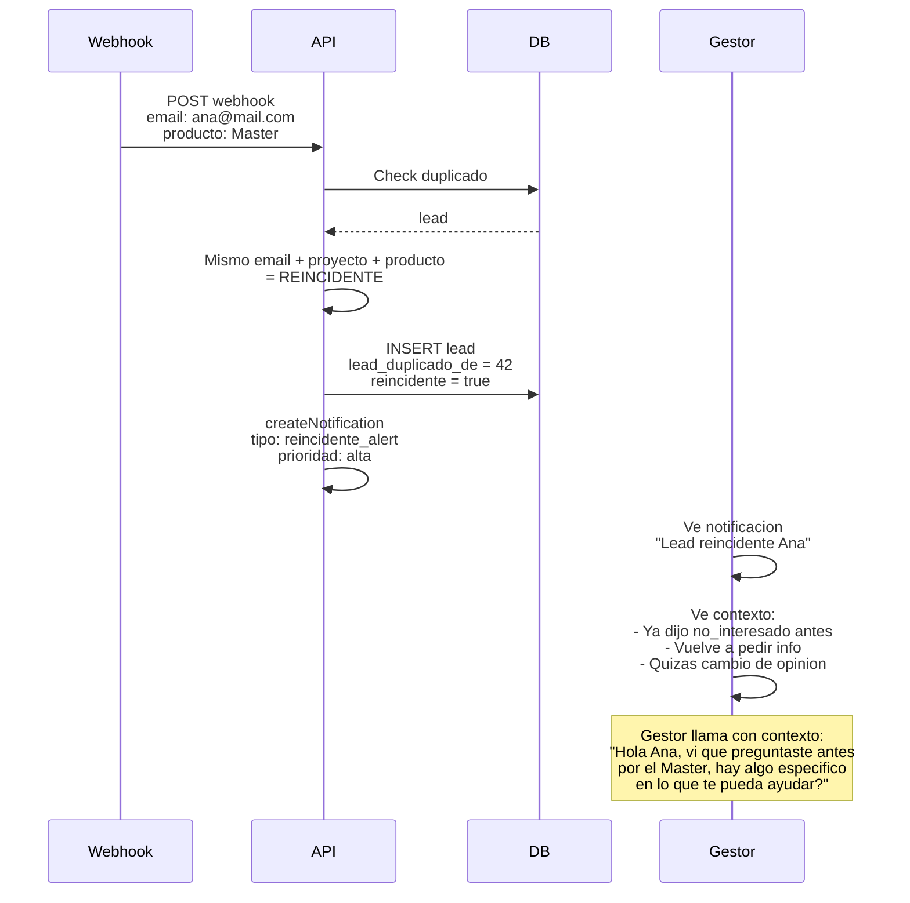

# 10. Duplicados y Reincidentes

## Logica de deteccion

Cuando llega un lead nuevo, se compara su `email` con los leads existentes del **mismo proyecto**.



## Diferencia duplicado vs reincidente

| Escenario | `lead_duplicado_de` | `reincidente` | UI |
|-----------|--------------------|--------------| ---|
| Ana ya pregunto por el Master (mismo proyecto) | original.id | **true** | Badge rojo "Reincidente" |
| Ana ya pregunto por el Curso, ahora por Master | original.id | false | Badge amarillo "Duplicado" |
| Ana ya pregunto en Psiko, ahora en ISEIH | NULL | false | Normal (otro proyecto) |
| Ana lead totalmente nuevo | NULL | false | Normal |

## Estructura de datos



## Vista en ficha lead



## Vista multi-proyecto (PDF spec)

Si Ana tambien esta en ISEIH, se puede ver el historial completo:



**PENDIENTE implementar** - requiere endpoint `GET /api/leads/by-email/:email` que busque en todos los proyectos donde el usuario tiene acceso.

## Flujo de gestion de reincidente



## Estado actual

| Feature | Estado |
|---------|--------|
| Detectar duplicado por email + project_id | OK |
| `lead_duplicado_de` en DB | OK |
| **Campo `reincidente` en tabla leads** | **PENDIENTE agregar** |
| **Logica "mismo producto = reincidente"** | **PENDIENTE** |
| Badge frontend duplicado | OK |
| **Badge frontend reincidente** | **PENDIENTE** |
| Tab "Duplicados" en detail | PENDIENTE |
| Vista multi-proyecto 360 | PENDIENTE |
| Notificacion prioridad alta para reincidentes | PENDIENTE |

## Migracion necesaria

```sql
-- 004_reincidente.sql
ALTER TABLE leads ADD COLUMN reincidente BOOLEAN NOT NULL DEFAULT false;
CREATE INDEX idx_leads_reincidente ON leads (project_id, reincidente) WHERE reincidente = true;
```
