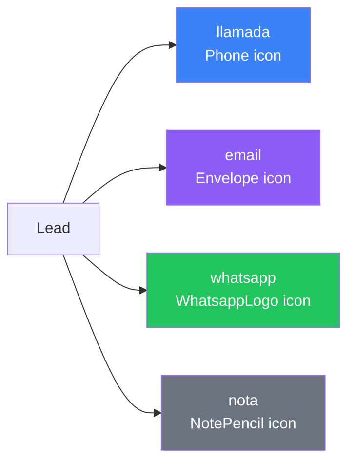
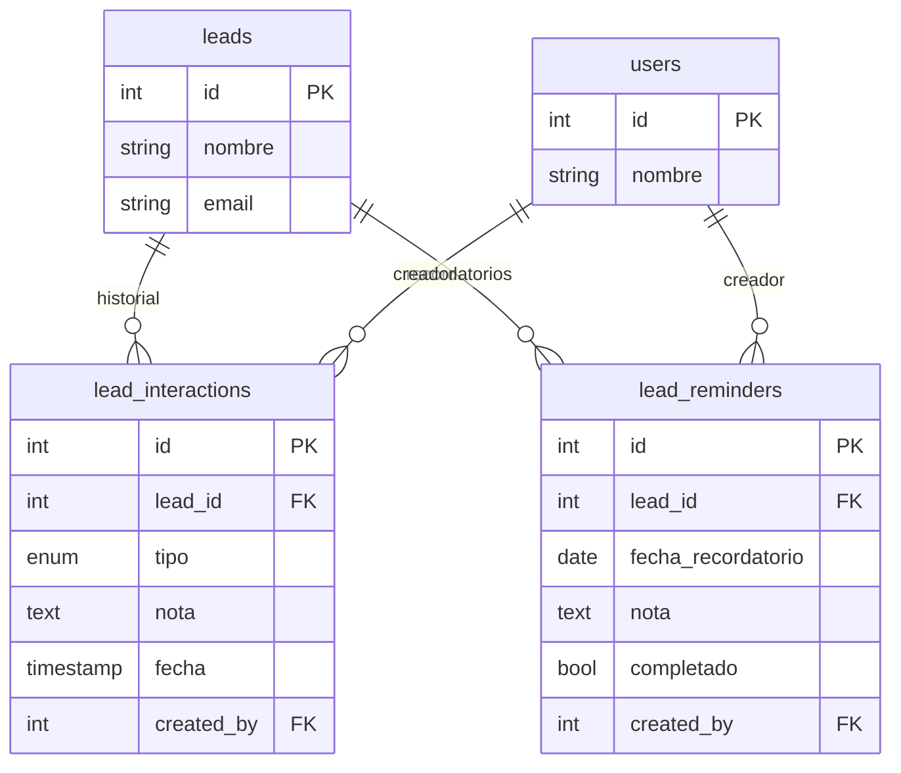
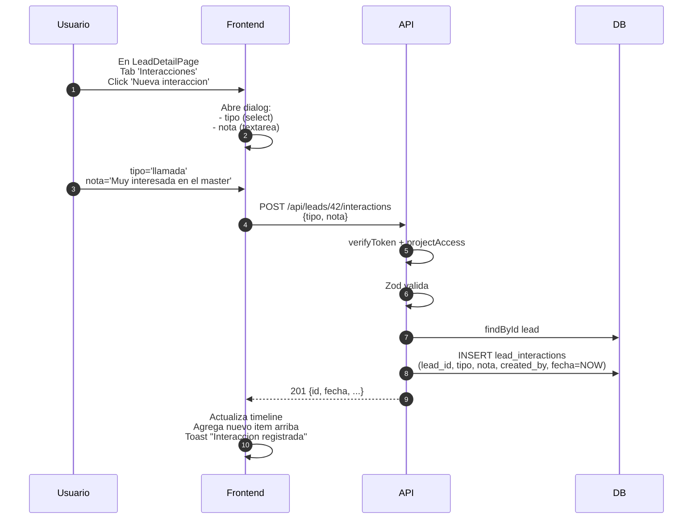
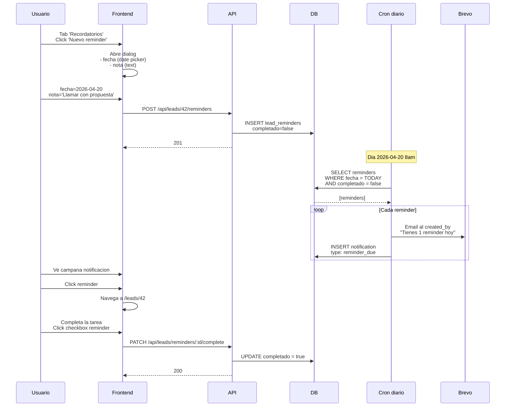
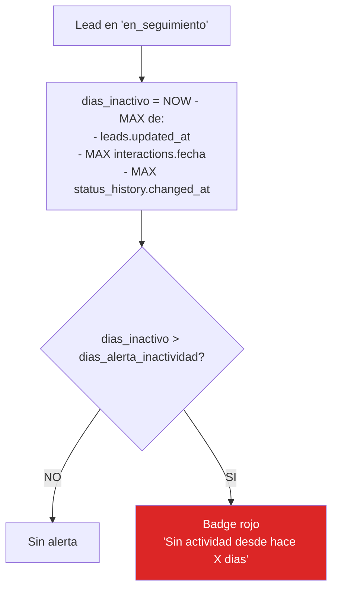

# 11. Interacciones y Recordatorios

## Tipos de interaccion



## ERD



## Timeline de interacciones

```mermaid
timeline
    title Historial de Ana Lopez (Lead #87)
    2026-04-10 10:30 : Lead creado (webhook) : canal meta_ads
    2026-04-10 14:15 : Llamada de Laura : "Primer contacto, muy interesada"
    2026-04-10 15:00 : Email de Laura : "Enviado dossier informativo"
    2026-04-11 11:20 : WhatsApp de Laura : "Confirma asistencia a jornada"
    2026-04-15 09:00 : Nota de Laura : "Cliente potencial alto"
    2026-04-18 : Recordatorio pendiente : "Llamar con propuesta final"
```

## Flujo: crear interaccion



## Flujo: crear y completar reminder



## Vista calendario (PENDIENTE)

Los reminders se pueden ver tambien en vista calendario (ver [16-flujo-calendario.md](16-flujo-calendario.md)).

## Alerta por inactividad

Segun PDF spec, cada proyecto tiene `dias_alerta_inactividad`. Si un lead no tiene interacciones ni cambios en ese periodo, aparece alerta visual.



**PENDIENTE** implementar este calculo en la query de `lead.list()`.

## Estado actual

| Feature | Backend | Frontend |
|---------|---------|----------|
| Crear interaccion | OK | OK (dialog) |
| Listar interacciones | OK (en detail) | OK (timeline) |
| Tipos con iconos correctos | N/A | OK |
| Crear reminder | OK | OK (dialog) |
| Completar reminder | OK | OK (checkbox) |
| Listar reminders | OK (en detail) | OK |
| Cron alerta email reminders | PENDIENTE | - |
| Notificacion in-app al vencer | PENDIENTE | PENDIENTE |
| Vista calendario | - | PENDIENTE |
| Alerta inactividad | PENDIENTE calculo | PENDIENTE badge |
