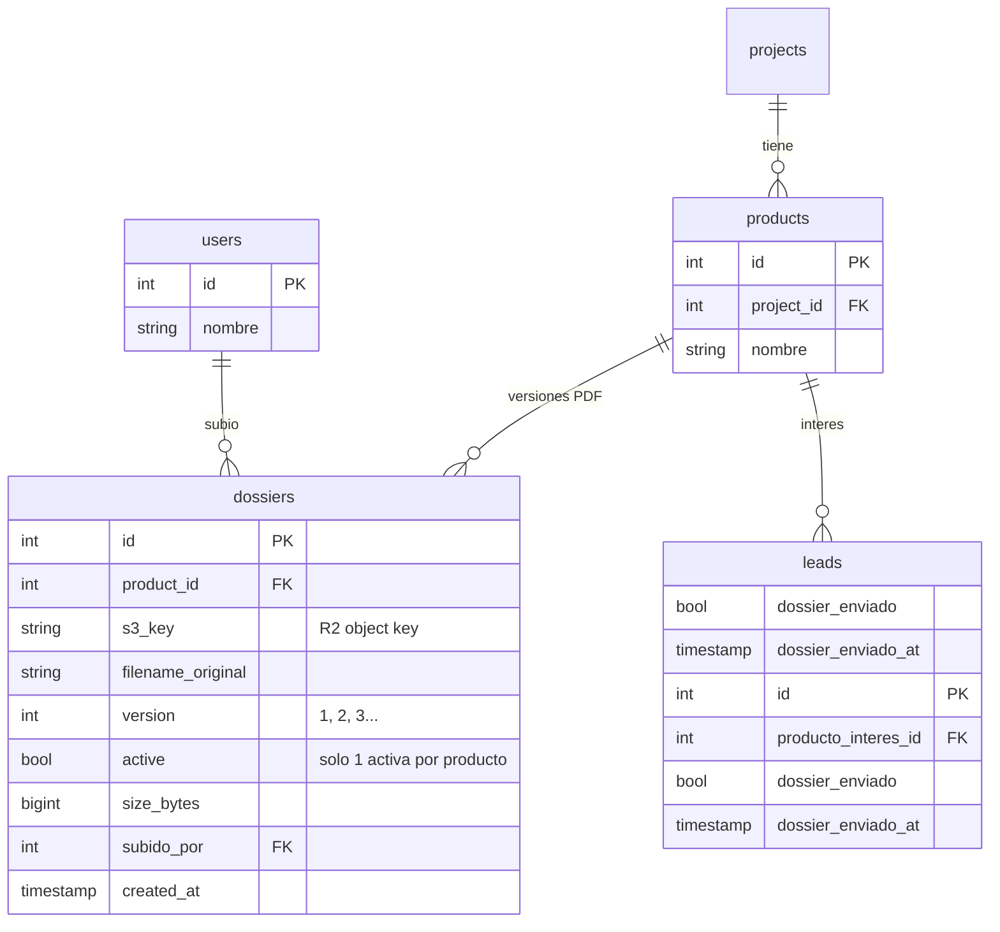
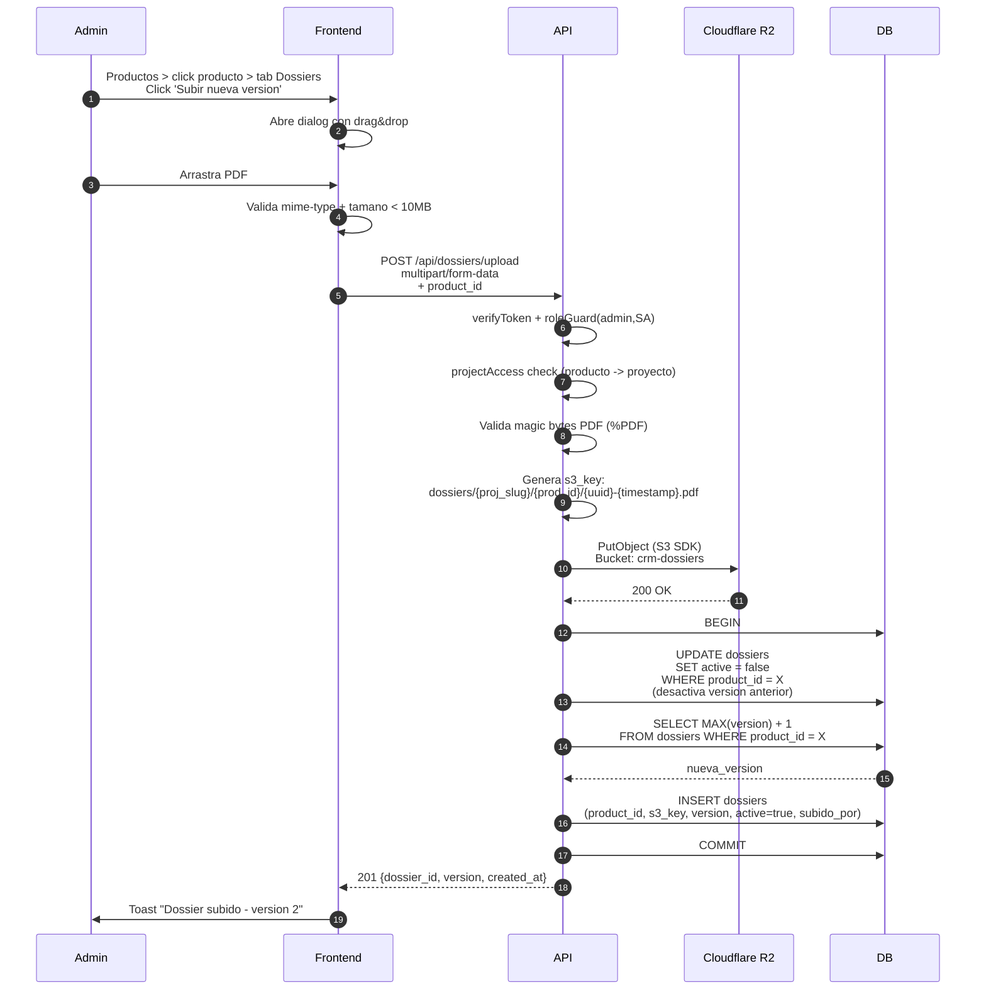
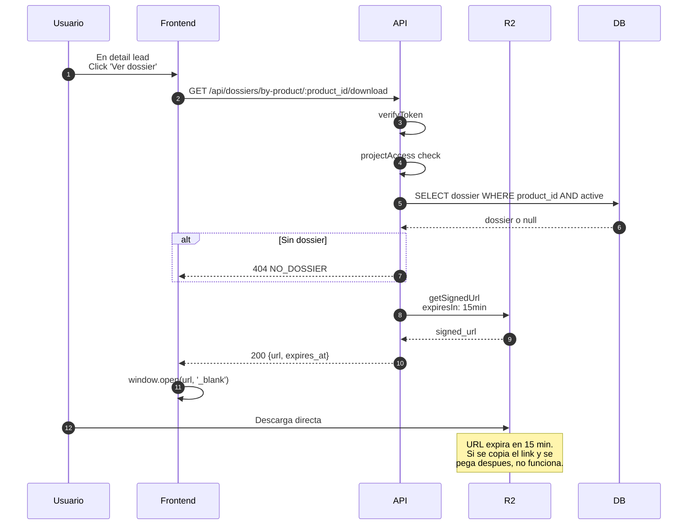
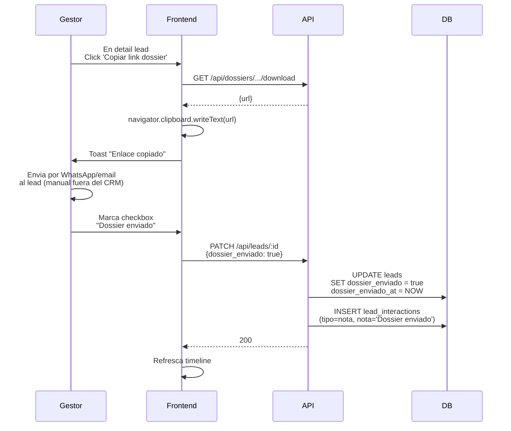
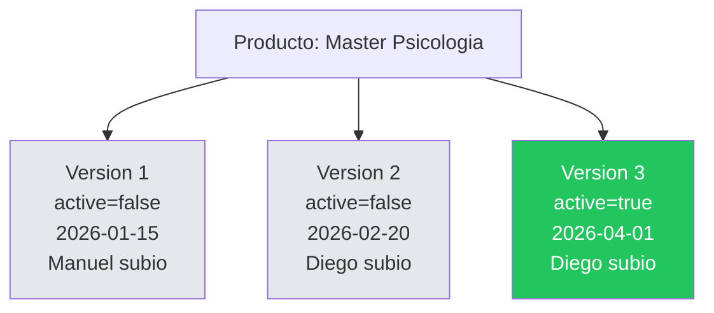
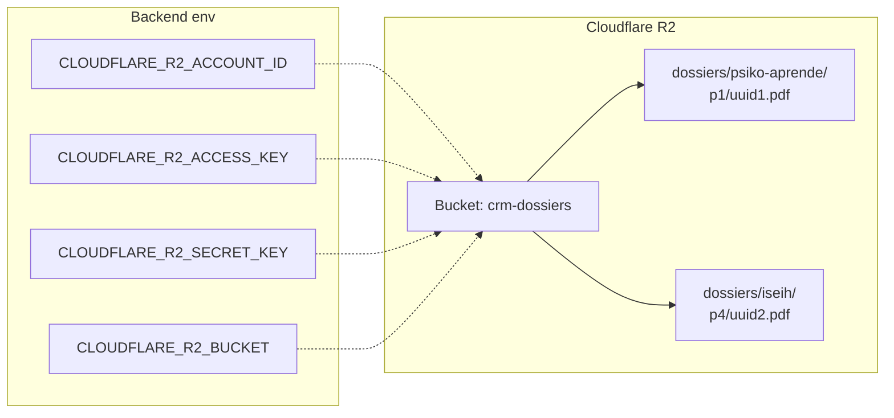

# 12. Dossiers (PDFs)

## Concepto

Cada producto de un proyecto puede tener un PDF informativo (dossier). Se almacena en Cloudflare R2 (S3 compatible) y se sirve via pre-signed URLs temporales.

## ERD



## Upload: flujo completo



## Download: pre-signed URL



## Marcar dossier enviado



## Versionado: historial de dossiers



- **Siempre hay 1 version activa** por producto (la mas reciente)
- **Las anteriores no se borran** - quedan como historial
- **URLs antiguas siguen funcionando** (R2 key se mantiene)

## Seguridad

```mermaid
flowchart TD
    REQ[Request download]
    REQ --> T1{Tiene JWT valido?}
    T1 -->|NO| E1[401]
    T1 -->|SI| T2{Tiene acceso<br/>al proyecto?}
    T2 -->|NO| E2[403]
    T2 -->|SI| T3{Existe dossier activo?}
    T3 -->|NO| E3[404]
    T3 -->|SI| GEN[Genera URL firmada<br/>expira en 15min]
    GEN --> RET[200 {url}]

    style RET fill:#22c55e
    style E1 fill:#ef4444
    style E2 fill:#ef4444
    style E3 fill:#ef4444
```

## Configuracion R2



## Estado actual

| Feature | Backend | Frontend | R2 |
|---------|---------|----------|-----|
| Upload PDF + versionado | OK | OK (drag&drop) | **PENDIENTE config** |
| Pre-signed URL 15min | OK | OK | - |
| Marcar dossier_enviado en lead | OK | OK | - |
| Historial versiones | OK | OK | - |
| Validacion magic bytes PDF | OK | - | - |
| Max tamano 10MB | OK | OK | - |
| **Creacion bucket R2 en Cloudflare** | - | - | **PENDIENTE** |
| **Config .env con keys R2** | **PENDIENTE** | - | - |
| **Copiar link directo WhatsApp/email** | Parcial (URL funciona) | **PENDIENTE boton dedicado** | - |
