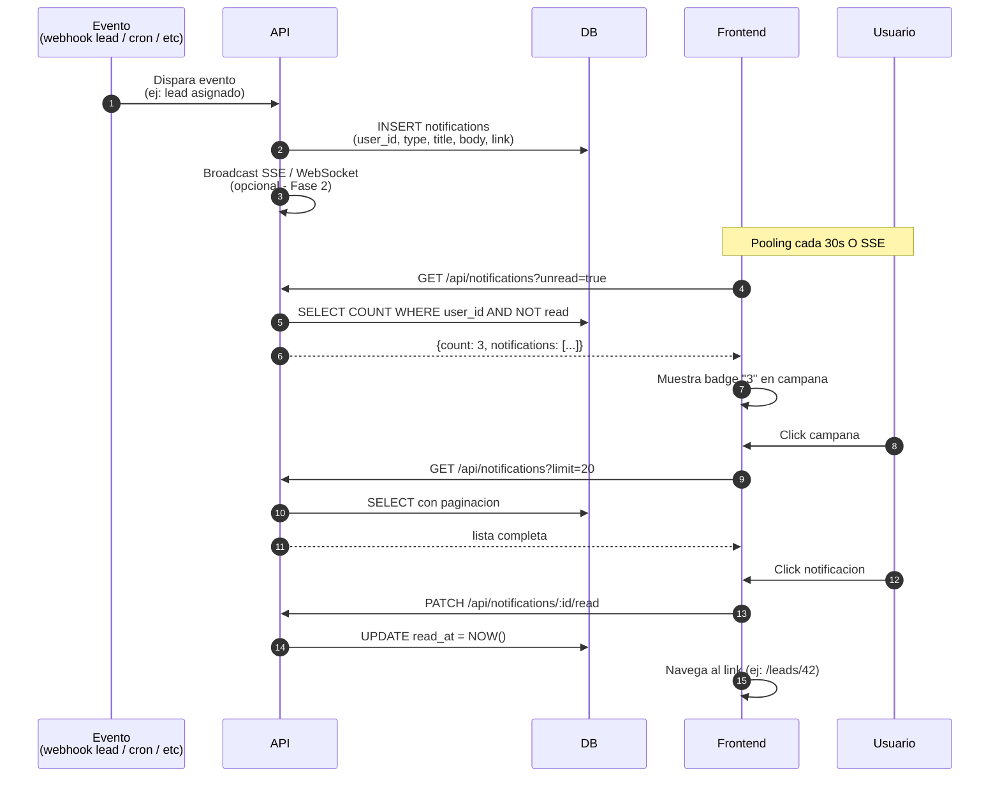
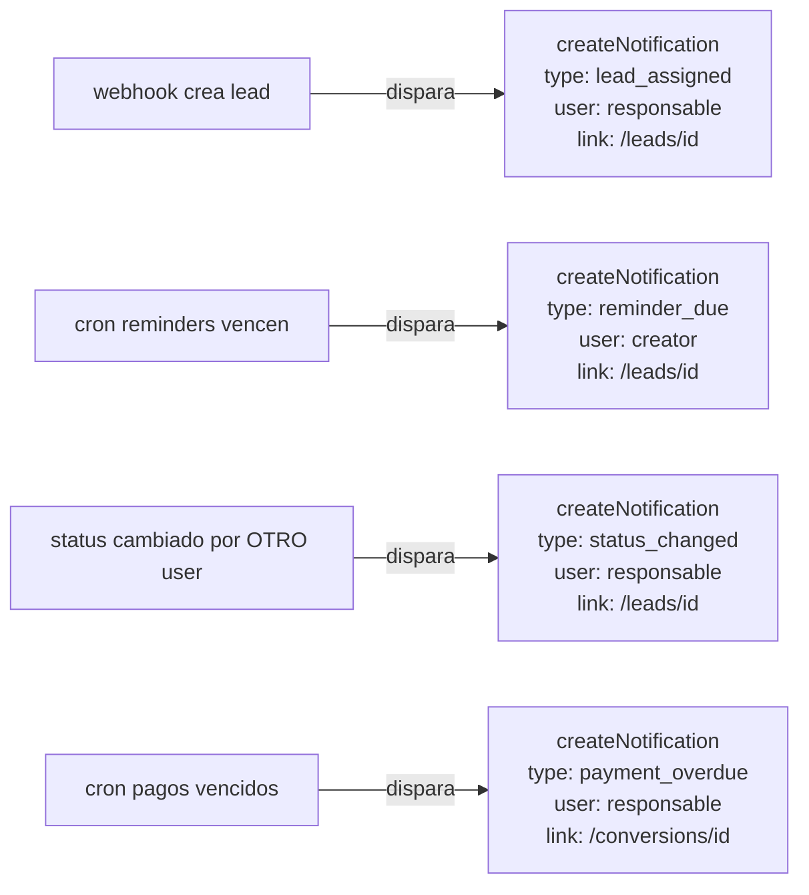
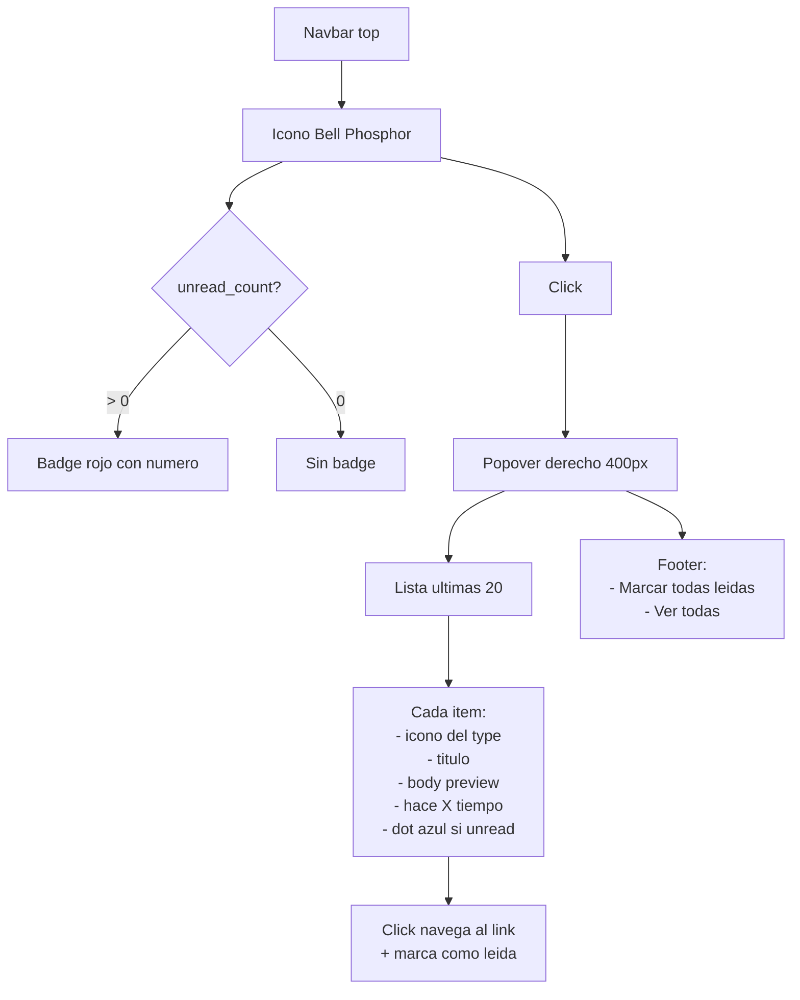

# 13. Notificaciones In-App (NUEVO - Camino B)

## Concepto

Campana en el navbar con badge rojo contando notificaciones no leidas. Click abre panel dropdown con la lista. Idea tomada del CRM viejo + PDF spec.

## Tipos de notificaciones

| Tipo | Cuando se crea | Quien la ve |
|------|---------------|-------------|
| `lead_assigned` | Round-robin asigna lead nuevo | Gestor asignado |
| `reminder_due` | Reminder llega a su fecha | Quien lo creo |
| `status_changed` | Alguien cambia status de lead suyo | Responsable |
| `payment_overdue` | Pago se pasa de fecha | Responsable del lead |
| `mention` | Alguien te menciona en nota (Fase 2) | Usuario mencionado |
| `system` | Anuncios del sistema | Todos / segmento |

## Flujo de creacion y consumo



## Esquema DB nuevo

```sql
-- Migracion 004_notifications.sql
CREATE TYPE notification_type AS ENUM (
  'lead_assigned',
  'reminder_due',
  'status_changed',
  'payment_overdue',
  'mention',
  'system'
);

CREATE TABLE notifications (
  id          SERIAL        PRIMARY KEY,
  user_id     INTEGER       NOT NULL,
  type        notification_type NOT NULL,
  title       VARCHAR(200)  NOT NULL,
  body        TEXT,
  link        VARCHAR(500),  -- URL interna para redirigir
  metadata    JSONB,         -- Datos extra (lead_id, etc)
  read_at     TIMESTAMPTZ,   -- NULL = no leida
  created_at  TIMESTAMPTZ   NOT NULL DEFAULT NOW(),

  CONSTRAINT fk_notif_user FOREIGN KEY (user_id)
    REFERENCES users(id) ON DELETE CASCADE
);

CREATE INDEX idx_notif_user_unread
  ON notifications (user_id, created_at DESC)
  WHERE read_at IS NULL;
```

## Endpoints

```
GET    /api/notifications              -> lista paginada
GET    /api/notifications/unread-count -> {count: N}
PATCH  /api/notifications/:id/read     -> marca como leida
PATCH  /api/notifications/read-all     -> marca todas como leidas
DELETE /api/notifications/:id          -> elimina
```

## Triggers automaticos (en backend)



## UI de la campana



## Componentes React a crear

```
frontend/src/modules/notifications/
├── api/
│   └── notifications.api.js
├── hooks/
│   ├── useNotifications.js         # polling + count
│   └── useNotificationsList.js     # paginacion
├── components/
│   ├── NotificationBell.jsx        # campana en navbar
│   ├── NotificationPopover.jsx     # dropdown
│   ├── NotificationItem.jsx        # cada fila
│   └── NotificationIcon.jsx        # icono segun type
└── pages/
    └── NotificationsPage.jsx       # /notifications
```

## Polling vs WebSocket / SSE

**Decision actual: Polling cada 30 segundos**
- Simple de implementar
- No requiere infraestructura adicional
- Trade-off: latencia maxima 30s

**Futuro: SSE (Server-Sent Events)**
- Empuje en tiempo real
- Mas eficiente con muchos usuarios
- Requiere mantener conexiones abiertas en Express

## Estado actual

**PENDIENTE implementar completo.** Nada existe todavia en backend ni frontend. Con los diagramas y el schema de DB arriba se puede implementar limpio.
