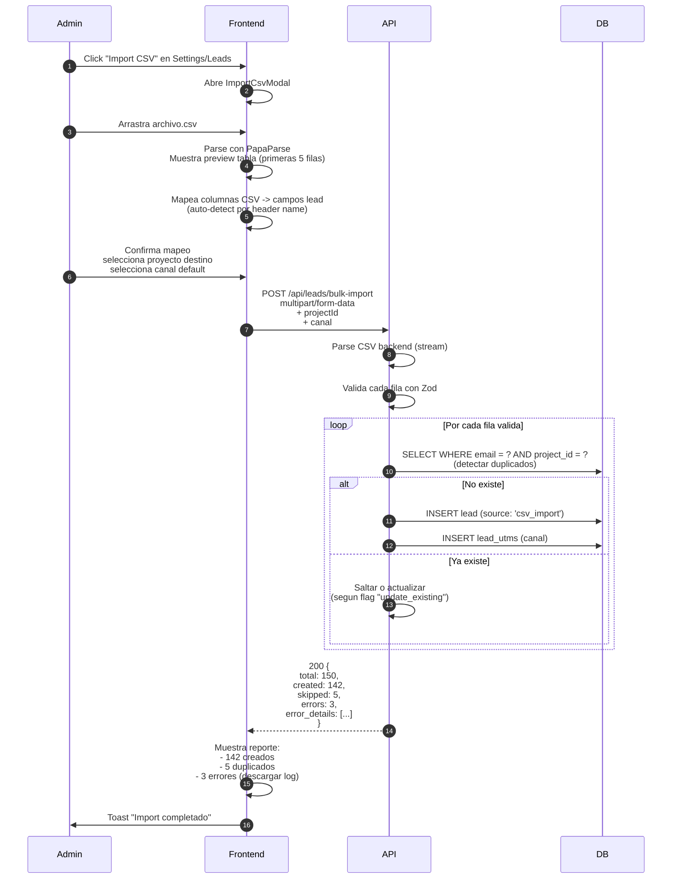
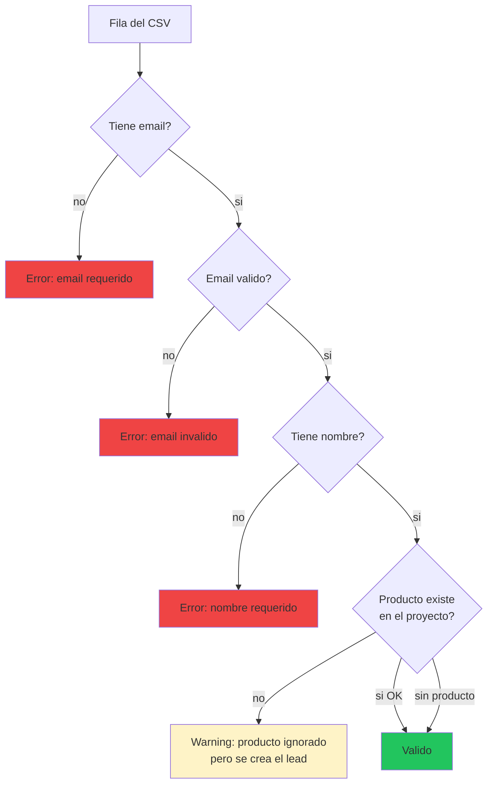

# 15. Import CSV de Leads (NUEVO - Camino B)

## Concepto

Admin/superadmin puede subir un CSV con leads existentes (migracion desde Excel o otro CRM) y el sistema los procesa en bulk. Inspirado en el CRM viejo.

## Flujo completo



## Columnas soportadas

| Columna CSV | Campo DB | Requerido |
|-------------|----------|-----------|
| `nombre` / `name` | leads.nombre | SI |
| `email` | leads.email | SI |
| `telefono` / `phone` | leads.telefono | NO |
| `producto` / `producto_interes` | resuelve a producto_interes_id | NO |
| `notas` / `notes` | leads.notas | NO |
| `canal` / `origen` | lead_utms.canal_detectado | NO (default elegido) |
| `fecha` / `fecha_solicitud` | leads.fecha_solicitud | NO (default NOW) |
| `utm_source` | lead_utms.utm_source | NO |
| `utm_medium` | lead_utms.utm_medium | NO |
| `utm_campaign` | lead_utms.utm_campaign | NO |
| `landing_url` | lead_utms.landing_url | NO |

## Reglas

1. **Email es unico por (proyecto, email)**. Si ya existe, se salta o se actualiza segun config.
2. **Round-robin NO se aplica** en import masivo (el admin elige si asignar o dejar sin responsable).
3. **Limite sugerido**: 5000 leads por archivo. Mas de eso, partir en chunks.
4. **Transaccion**: cada 100 filas se hace COMMIT parcial para no bloquear la DB.

## Validaciones



## Frontend: modal con steps


## Endpoint backend

```
POST /api/leads/bulk-import
Content-Type: multipart/form-data
Body:
  - file: archivo CSV
  - projectId: number
  - canalDefault: enum (default 'directo')
  - updateExisting: boolean (default false)
  - skipFirstRow: boolean (default true - header)

Response:
{
  "success": true,
  "data": {
    "total": 150,
    "created": 142,
    "skipped": 5,
    "errors": 3,
    "errors_detail": [
      { "row": 23, "error": "Email invalido", "data": { ... } }
    ]
  }
}
```

## Permisos

- Solo **superadmin** o **admin** con acceso al proyecto
- Gestor: NO puede hacer bulk import

## Estado actual

**PENDIENTE implementar.** Requiere:
1. Endpoint POST /api/leads/bulk-import con parse CSV
2. Frontend modal multi-step
3. Libreria PapaParse (frontend) o csv-parse (backend)
4. Rate limiting para evitar abuso
