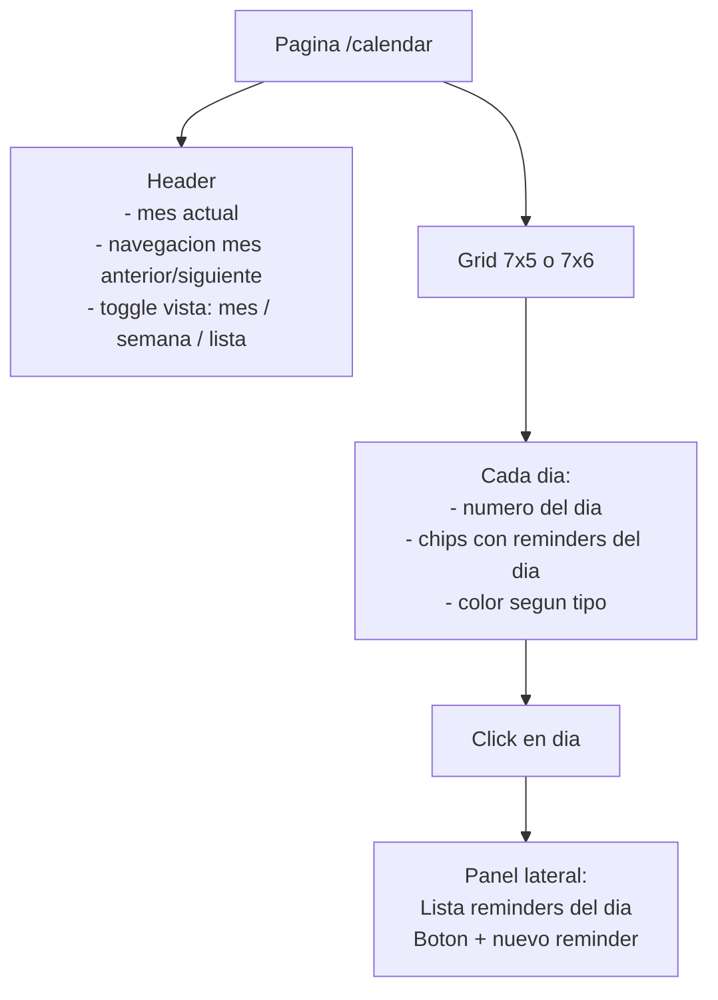
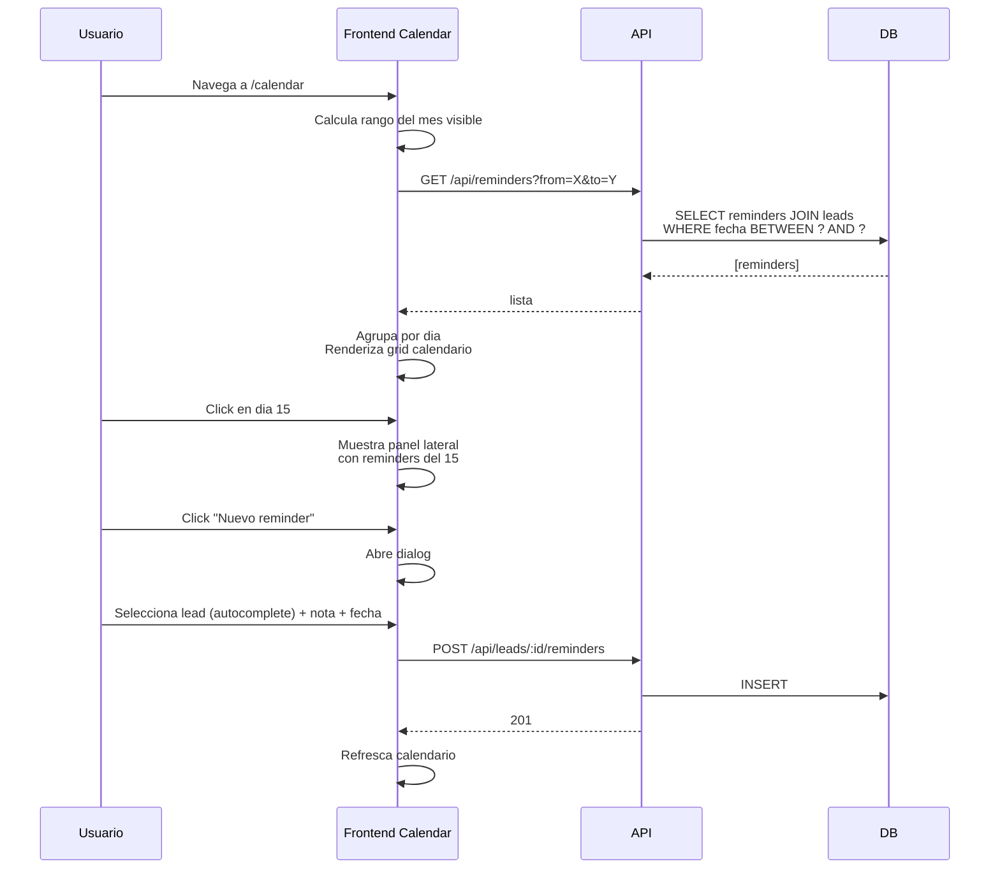
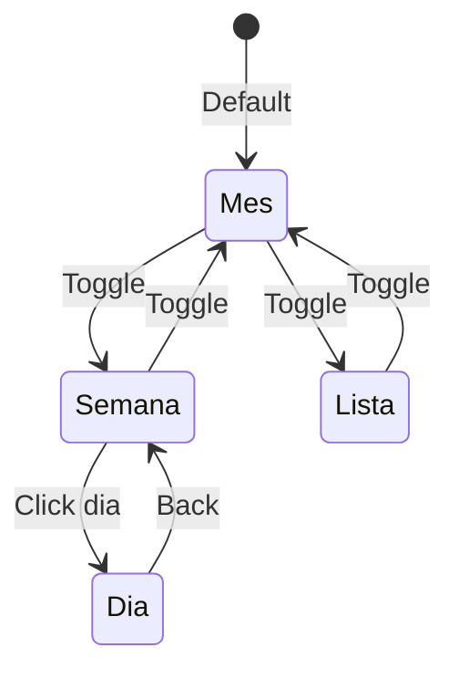

# 16. Calendario (NUEVO - Camino B)

## Concepto

Vista de calendario mensual/semanal con todos los reminders del usuario (y del equipo si es admin). Inspirado en el CRM viejo.

## Vista mensual



## Filtros

```mermaid
flowchart LR
    FP[Filtro panel]
    FP --> F1[Solo mios / Todo el equipo<br/>(admin only)]
    FP --> F2[Proyecto activo / Todos]
    FP --> F3[Pendientes / Completados / Todos]
    FP --> F4[Buscar por nombre lead]
```

## Endpoint backend

```
GET /api/reminders?
  from=2026-04-01
  &to=2026-04-30
  &projectId=1         (opcional)
  &userId=2            (solo admin puede filtrar por otro user)
  &completed=false     (opcional)

Response:
{
  "success": true,
  "data": [
    {
      "id": 1,
      "lead_id": 42,
      "lead_nombre": "Maria Garcia",
      "lead_email": "maria@mail.com",
      "fecha_recordatorio": "2026-04-15",
      "nota": "Llamar para seguimiento",
      "completado": false,
      "created_by": 3,
      "created_by_nombre": "Diego"
    }
  ]
}
```

## Data flow



## UI componentes

```
frontend/src/modules/calendar/
├── pages/
│   └── CalendarPage.jsx
├── components/
│   ├── CalendarMonthView.jsx
│   ├── CalendarWeekView.jsx
│   ├── CalendarDayCell.jsx
│   ├── ReminderChip.jsx        # chip dentro del dia
│   ├── DayDetailPanel.jsx      # lateral con lista
│   └── NewReminderDialog.jsx
└── hooks/
    └── useReminders.js          # cache + invalidacion por rango
```

## Vistas



## Integracion con Google Calendar (futuro)

Opcion futura: export .ics para que el usuario suscriba desde Google Calendar:

```
GET /api/reminders/subscribe.ics?token={user_subscription_token}
-> retorna ICS con todos los reminders del usuario
```

## Estado actual

**PENDIENTE implementar.** Los reminders ya se crean/completan. Solo falta la UI de calendario y el endpoint que retorna por rango de fechas.
