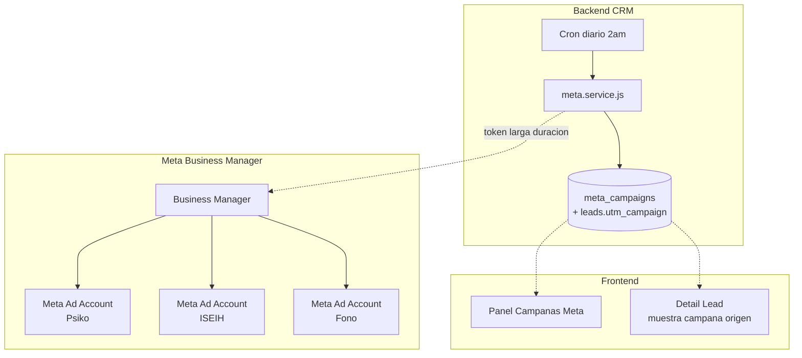
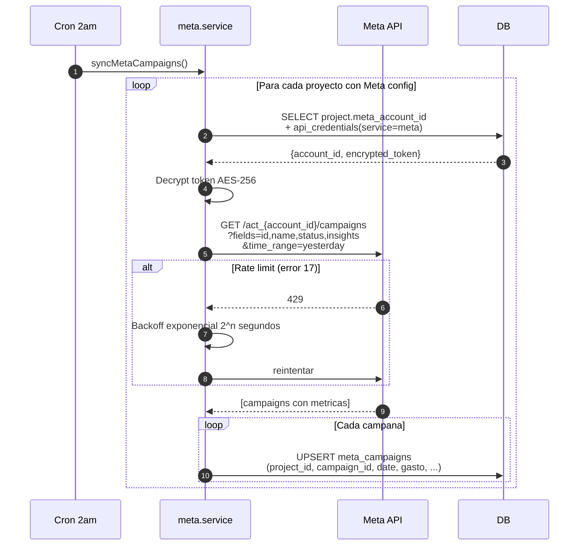
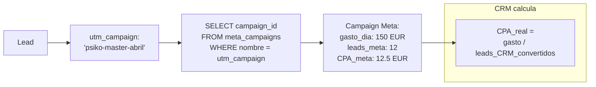
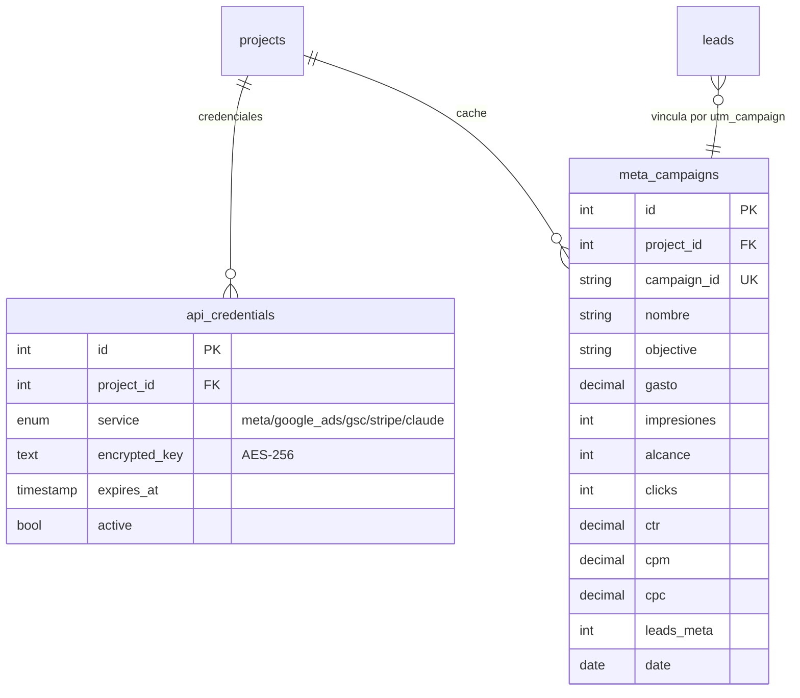
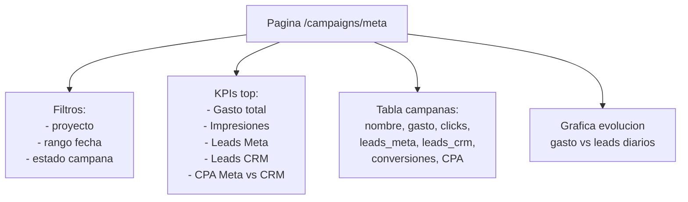

# 17. Meta Ads API (Fase 2 - PENDIENTE)

## Objetivo

Vincular campanas de Meta Ads con los leads del CRM via `utm_campaign` para medir CPA real vs CPA reportado.

## Arquitectura



## Flujo de sincronizacion diaria



## Vincular lead con campana



## Entidades



## Panel frontend (PENDIENTE)



## Endpoints a crear

```
GET  /api/meta/campaigns?projectId=X&from=Y&to=Z
GET  /api/meta/campaigns/:id/leads      (leads vinculados)
POST /api/meta/sync-now?projectId=X     (disparar sync manual)
GET  /api/meta/credentials?projectId=X  (admin/SA only)
POST /api/meta/credentials              (configurar token)
```

## Permisos

- **Credenciales** (ver token): solo superadmin
- **Metricas**: admin + gestor (solo proyectos asignados)
- **Sync manual**: admin + superadmin

## Estado actual

**TODO PENDIENTE** - es Fase 2 completa.

Stories Jira:
- CRM-92 Crear Facebook App + App Review
- CRM-93 System User Meta + token larga duracion
- CRM-98 Schema + cron diario
- CRM-99 Retry backoff error 17
- CRM-100 Vinculacion utm_campaign
- CRM-101 Frontend modulo campanas Meta
