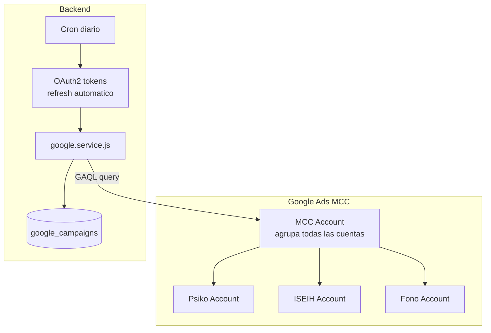
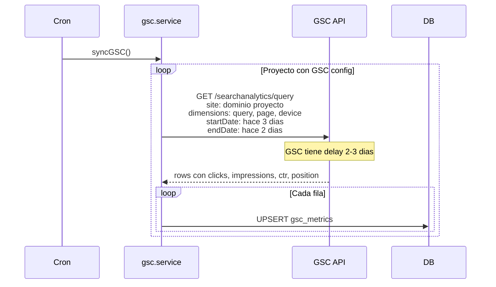
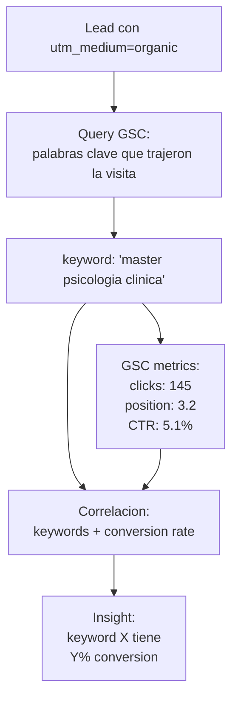
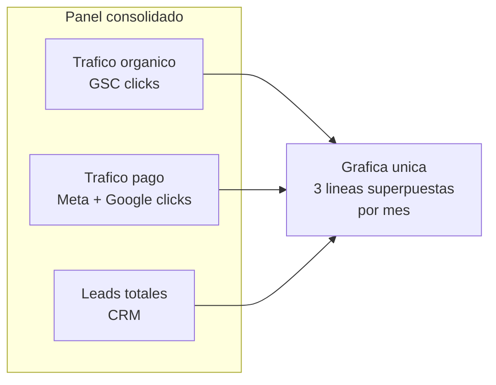
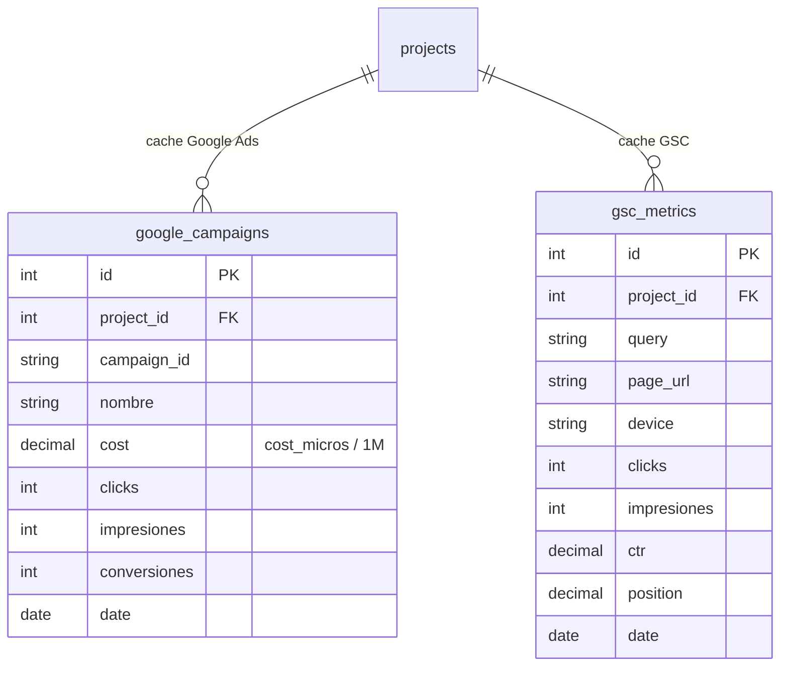

# 18. Google Ads + GSC (Fase 2 - PENDIENTE)

## Google Ads



### GAQL (Google Ads Query Language)

```sql
SELECT
  campaign.id,
  campaign.name,
  metrics.cost_micros,
  metrics.clicks,
  metrics.impressions,
  metrics.conversions
FROM campaign
WHERE segments.date DURING LAST_7_DAYS
```

`cost_micros` = gasto * 1,000,000 (dividir al guardar).

## Google Search Console

Objetivo: medir trafico organico y correlacion con leads.



### Cruces de datos



## Casos de uso

| Caso | Que responde |
|------|--------------|
| Impacto campanas en organico | Si lanzo Meta, sube/baja el trafico organico? |
| Keywords que convierten | Que busquedas generan mas leads? |
| Canibalizacion SEO vs PPC | Pago CPC por algo que ya posiciono bien? |

## Vista consolidada dashboard



## ERD



## Estado actual

**TODO PENDIENTE - Fase 2.**
