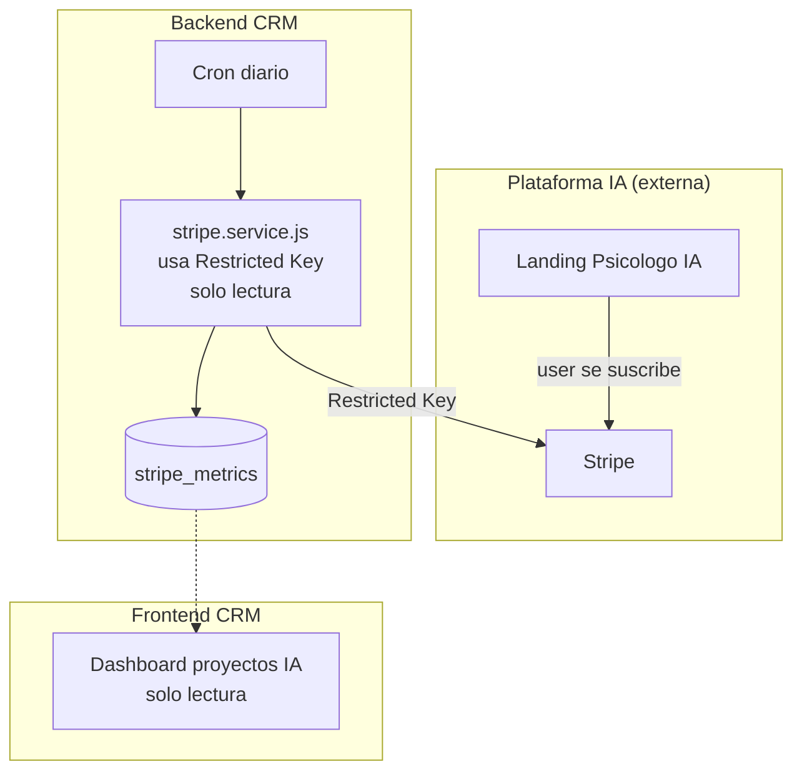
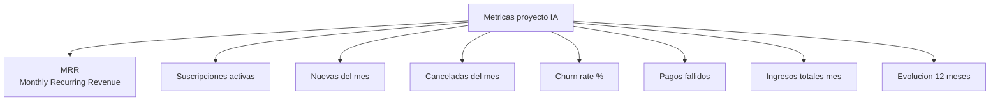
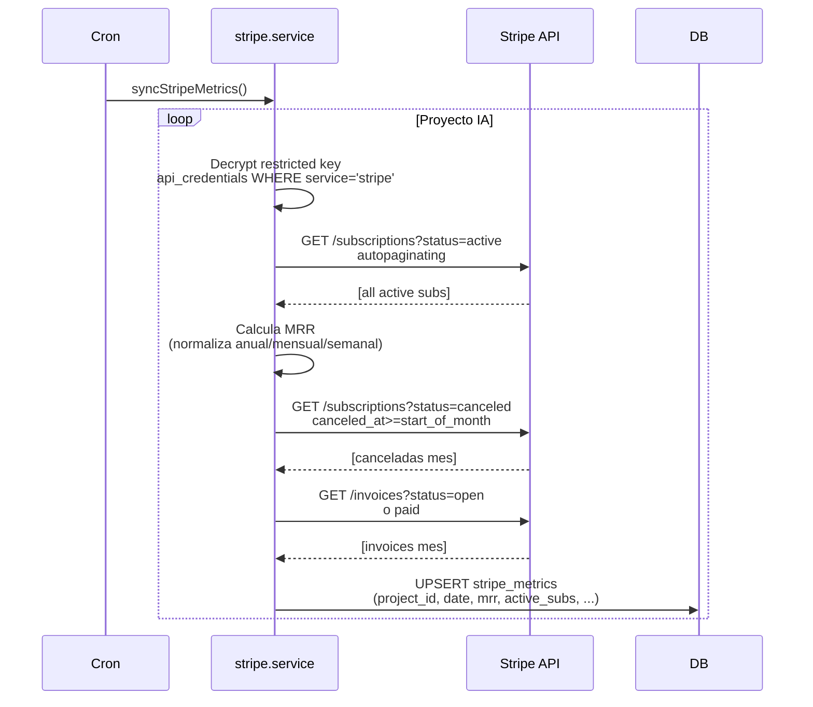
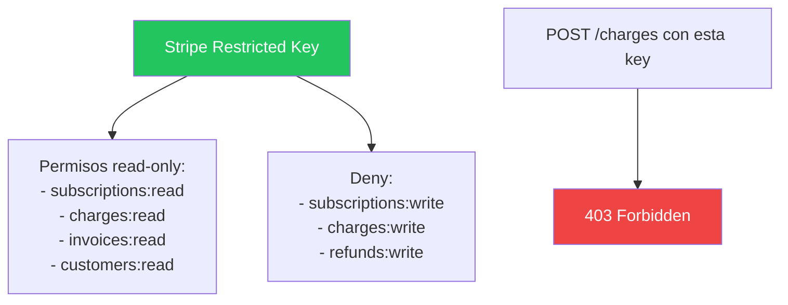
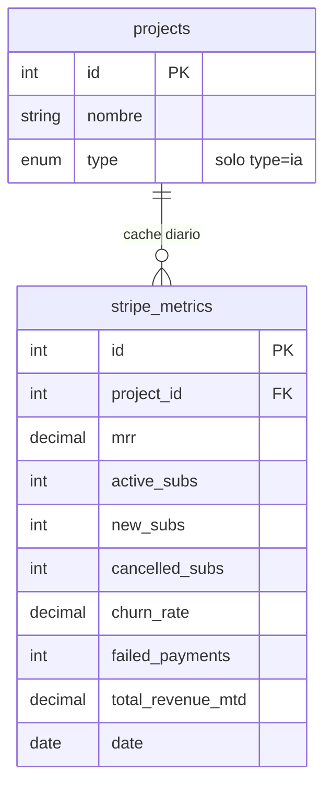
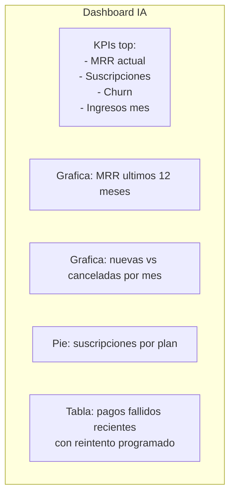

# 19. Stripe - Proyectos IA (Fase 2 - PENDIENTE)

## Concepto

Los proyectos IA (Psicologo IA, Nutricionista IA, Tarot IA) cobran por suscripcion via Stripe. El CRM solo **lee** los datos para mostrar metricas - no gestiona pagos manualmente.

## Arquitectura



## Metricas que se muestran



## Calculos

```
MRR = SUM(importe_suscripcion * frecuencia_mensualizada)
  - Mensual: importe * 1
  - Anual: importe / 12
  - Semanal: importe * 4.33

Churn rate = (canceladas_periodo / activas_periodo_anterior) * 100

Nuevas_netas = nuevas - canceladas
```

## Flujo de sincronizacion



## Seguridad: Restricted Key



Si alguien roba la key, solo puede leer, no cobrar ni reembolsar.

## ERD



## Dashboard IA



## Estado actual

**TODO PENDIENTE - Fase 2.**

Stories: CRM-96 (Restricted Key), CRM-107 (Schema + cron + MRR + churn), CRM-108 (frontend dashboard IA).
