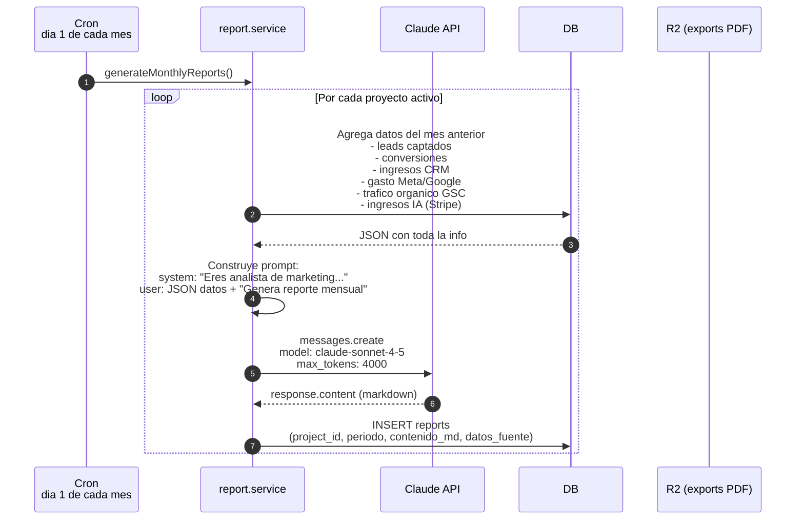
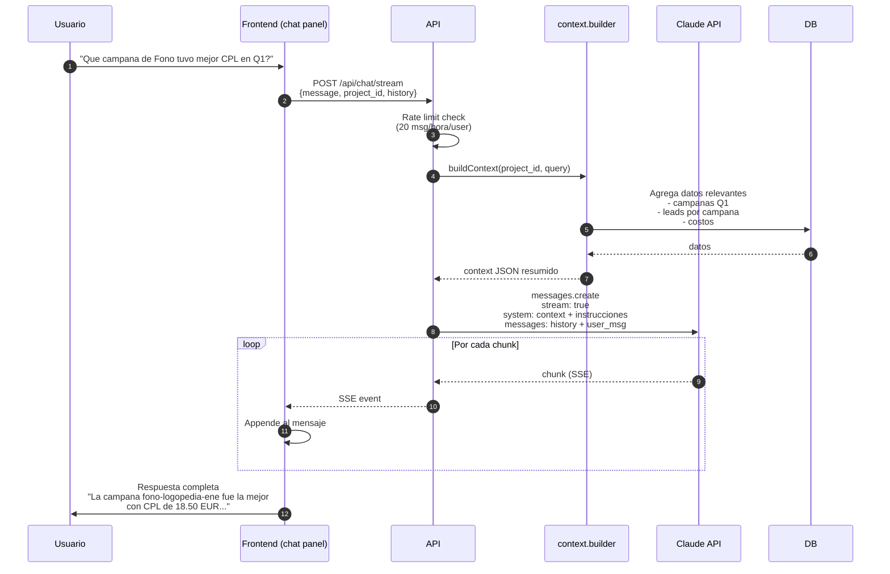
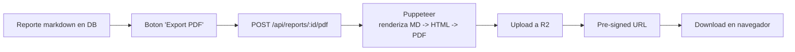
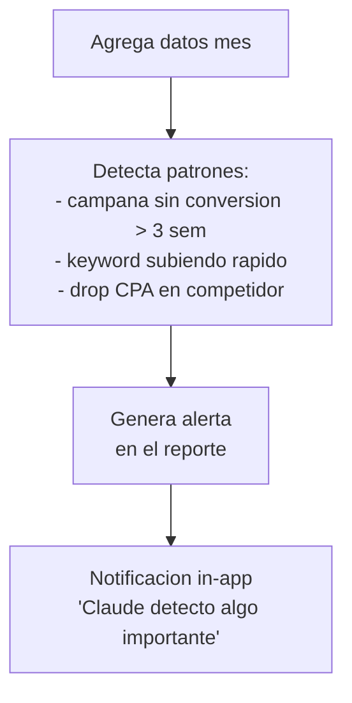
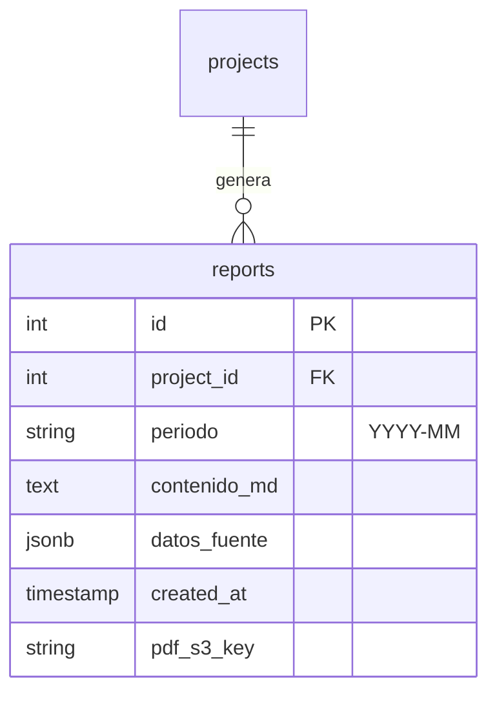

# 20. Reportes con Claude AI (Fase 2/3 - PENDIENTE)

## Concepto

Al inicio de cada mes, el sistema genera automaticamente un reporte mensual por proyecto con datos del mes anterior. Claude recibe JSON estructurado y devuelve markdown con analisis accionable.

## Flujo de generacion automatica



## Estructura del JSON enviado a Claude

```json
{
  "proyecto": "Psiko Aprende",
  "periodo": "2026-03",
  "leads_total": 148,
  "conversiones": 23,
  "tasa_conversion": 15.5,
  "ingresos_crm": 18400,
  "gasto_meta": 2100,
  "gasto_google": 980,
  "trafico_organico_gsc": {
    "clics": 3420,
    "impresiones": 52100,
    "posicion_media": 4.2,
    "ctr": 6.6
  },
  "campanas": [
    {
      "nombre": "psiko-master-marzo",
      "gasto": 890,
      "leads_meta": 45,
      "leads_crm": 38,
      "conversiones": 8,
      "cpa_real": 111.25
    }
  ],
  "leads_por_canal": {
    "meta": 89,
    "google": 34,
    "organico": 25
  },
  "comparacion_mes_anterior": {
    "leads_delta_pct": 12.5,
    "conversion_delta_pct": -3.2,
    "ingresos_delta_pct": 8.7
  }
}
```

## Estructura del reporte que Claude devuelve

```markdown
# Reporte Mensual - Psiko Aprende - Marzo 2026

## Resumen Ejecutivo
- 148 leads captados (+12.5% vs febrero)
- 23 conversiones con 15.5% de tasa (ligero bajon del 3.2%)
- Ingresos netos de 18,400 EUR (+8.7%)

## Rendimiento por Canal
### Meta Ads
Inversion 2,100 EUR generando 89 leads (CPA promedio 23.6 EUR).
La campana "psiko-master-marzo" fue la mas eficiente...

### Google Ads
...

### Organico (GSC)
Trafico organico crecio 18% con posicion media mejorando de 4.8 a 4.2.
Keywords que convierten mejor: "master psicologia", "formacion clinica"...

## Campanas destacadas
### Mejor ROI: psiko-master-marzo
- CPA real: 111.25 EUR
- 8 conversiones a 2,500 EUR cada una
- ROAS 180%

### Peor ROI: psiko-intro-general
- 0 conversiones en 45 dias
- Recomendacion: pausar y redirigir presupuesto

## Recomendaciones
1. Aumentar inversion en Meta campana master (mejor ROAS)
2. Optimizar landing Google (CTR bajo vs promedio)
3. Crear contenido SEO para keywords emergentes...

## Efecto halo detectado
Durante la campana Meta del 15-25 marzo, el trafico organico subio un 34% para keywords relacionadas. Considerar mantener ambos activos.
```

## Chat conversacional (Fase 3)



## Export PDF



## Sugerencias proactivas

Claude detecta patrones sin que se le pregunte:



## ERD



## Seguridad

- API key Claude encriptada en `api_credentials` (AES-256)
- Claude API expone logs con metadata (sin PII del lead)
- Rate limit: 20 mensajes/hora/user (Fase 3 chat)
- Reportes se pueden ver solo por users con acceso al proyecto

## Estado actual

**TODO PENDIENTE.**

- Fase 2: reportes mensuales automaticos (CRM-111, CRM-112, CRM-113)
- Fase 3: chat conversacional streaming (CRM-118, CRM-119)
- Fase 3: export PDF (CRM-120, CRM-121)
