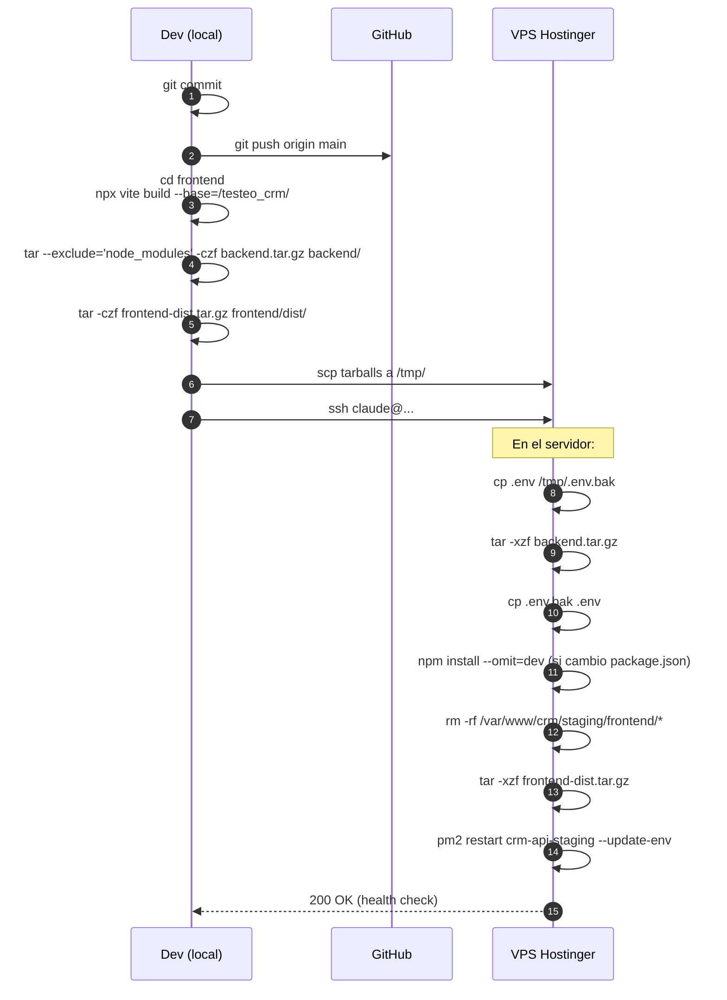
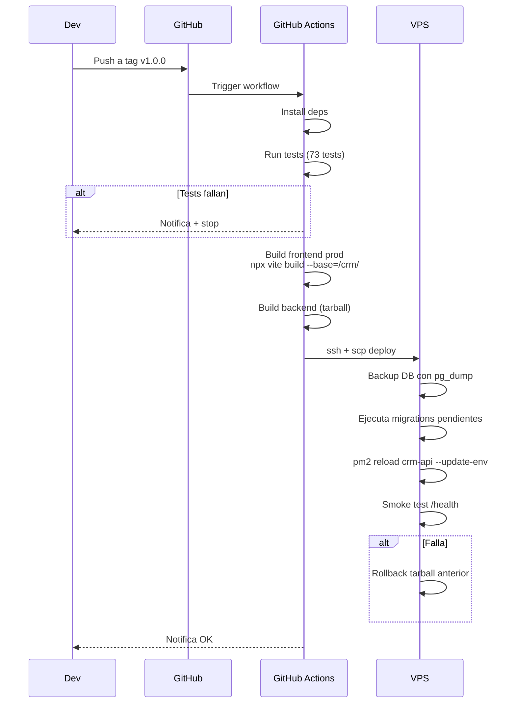

# 21. Flujo de Deploy

## Resumen

Deploy manual via scp + ssh. No hay CI/CD todavia (esta en roadmap).

## Deploy staging



## Deploy production (futuro - cuando haya CI)



## Comandos actuales

```bash
# 1. Build frontend (en local)
cd "c:/Users/Diego/Desktop/Proyectos-Carlos/CRM ISEIH/frontend"
npx vite build --base=/testeo_crm/   # staging
# o
npx vite build --base=/crm/          # production

# 2. Crear tarballs
cd ..
tar --exclude='node_modules' --exclude='.env' -czf /tmp/backend.tar.gz backend/
tar -czf /tmp/frontend-dist.tar.gz frontend/dist/

# 3. Upload
scp /tmp/backend.tar.gz /tmp/frontend-dist.tar.gz claude@187.124.128.126:/tmp/

# 4. Deploy en servidor
ssh claude@187.124.128.126 '
source ~/.nvm/nvm.sh
cd /opt/crm/staging                  # o /opt/crm/production
cp .env /tmp/.env.bak
tar -xzf /tmp/backend.tar.gz --strip-components=1
cp /tmp/.env.bak .env
npm install --omit=dev

rm -rf /var/www/crm/staging/frontend/*  # o production
cd /var/www/crm/staging/frontend
tar -xzf /tmp/frontend-dist.tar.gz --strip-components=2

pm2 restart crm-api-staging --update-env

# Verificar
curl -s http://localhost:3002/api/health
'
```

## Rollback manual

Si algo falla en production:

```bash
# 1. Para PM2
pm2 stop crm-api

# 2. Restaurar version anterior
cd /opt/crm/production
git reset --hard HEAD~1            # volver 1 commit
# o restaurar tarball anterior

# 3. Restaurar DB si hicimos migracion
pg_restore -d crm_db /backups/crm_db_YYYY-MM-DD.dump

# 4. Restart
pm2 start crm-api
```

## Diferencias production vs staging

| Aspecto | Staging | Production |
|---------|---------|------------|
| URL | ip/testeo_crm/ | ip/crm/ |
| Puerto backend | 3002 | 3001 |
| DB | crm_test_db | crm_db |
| Vite base | /testeo_crm/ | /crm/ |
| NODE_ENV | staging | production |
| LOG_LEVEL | debug | info |
| PM2 name | crm-api-staging | crm-api |
| Data | Seed + datos QA | Datos reales |

## CI/CD futuro

**PENDIENTE**: setup de GitHub Actions con:

1. Workflow `.github/workflows/deploy-staging.yml`
2. Secret con SSH key del servidor
3. Auto-deploy a staging en push a main
4. Deploy a prod en tag `v*.*.*`
5. Tests obligatorios antes de deploy
