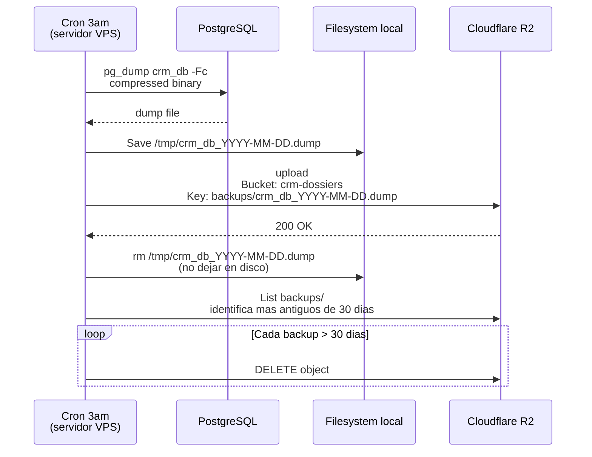
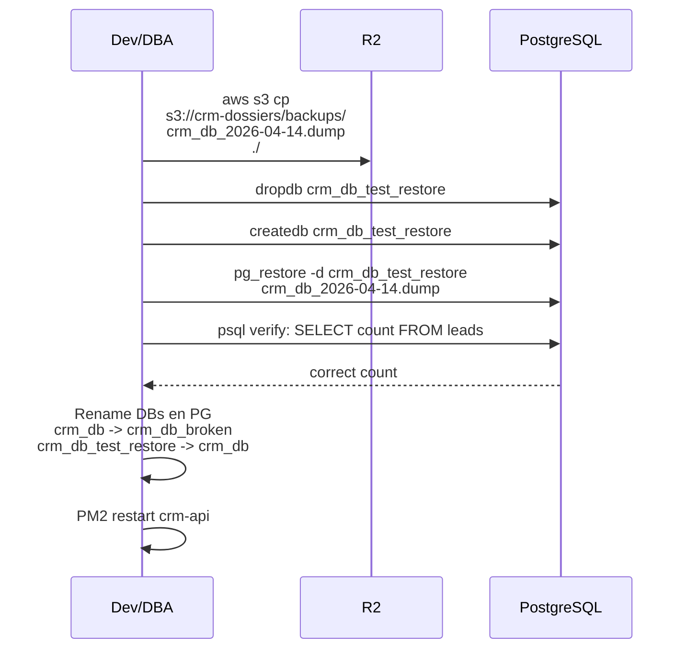

# 22. Backups (PENDIENTE)

## Objetivo (PDF spec)

- **Backups automaticos diarios** de PostgreSQL
- **Retencion minima**: 30 dias
- Almacenamiento en **Cloudflare R2** (mismo bucket de dossiers, carpeta separada)

## Flujo



## Script backup.sh

```bash
#!/bin/bash
# /opt/crm/scripts/backup.sh

set -e

DATE=$(date +%Y-%m-%d)
DUMP_FILE="/tmp/crm_db_${DATE}.dump"
R2_KEY="backups/crm_db_${DATE}.dump"

# 1. Dump
PGPASSWORD=$DB_PASS pg_dump \
  -h localhost -U crm_user -d crm_db \
  -Fc -Z 9 > "$DUMP_FILE"

# 2. Upload a R2 via aws cli
aws s3 cp "$DUMP_FILE" "s3://crm-dossiers/$R2_KEY" \
  --endpoint-url "https://${R2_ACCOUNT_ID}.r2.cloudflarestorage.com"

# 3. Limpiar local
rm "$DUMP_FILE"

# 4. Limpiar backups viejos (>30 dias)
aws s3 ls "s3://crm-dossiers/backups/" \
  --endpoint-url "..." \
  | awk '{print $4}' \
  | while read key; do
    # extraer fecha del nombre, si es vieja, borrar
    ...
  done

echo "Backup $DATE OK"
```

## Crontab

```cron
# /etc/crontab
0 3 * * * claude /opt/crm/scripts/backup.sh >> /var/log/crm/backup.log 2>&1
```

Todos los dias a las 3am.

## Restore en caso de desastre



## Metricas a monitorear

| Metrica | Alerta si |
|---------|-----------|
| Ultimo backup OK | > 24h sin exito |
| Tamano del dump | delta > 50% del anterior |
| Espacio usado en R2 | > 80% cuota |
| Tiempo de ejecucion | > 10 min |

## Backup incremental (futuro)

Para DBs grandes (> 10GB), considerar:
- **WAL archiving** continuo
- **pg_basebackup** semanal + WAL diario
- **Point-in-time recovery** (PITR)

Actualmente no aplica porque el DB es chico (~100MB incluso con datos reales).

## Estado actual

**TODO PENDIENTE** - Story CRM-32.

Pasos:
1. Crear script `/opt/crm/scripts/backup.sh`
2. Instalar `aws cli` en el servidor
3. Configurar env vars R2 en el script (no en git)
4. Agregar a crontab
5. Probar restore en crm_test_db para validar
