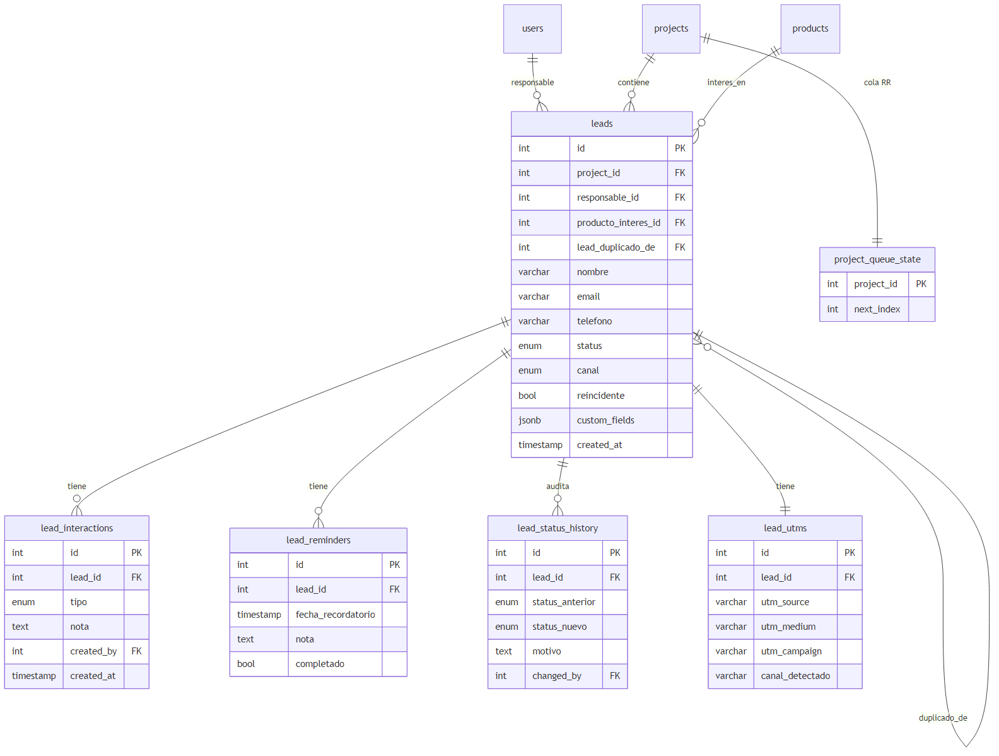
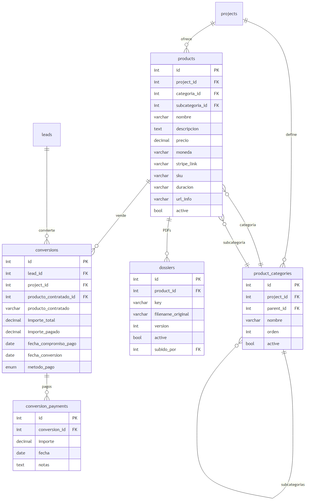
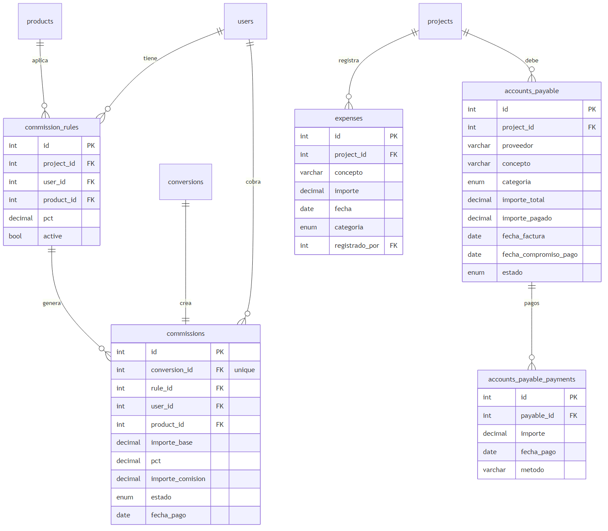
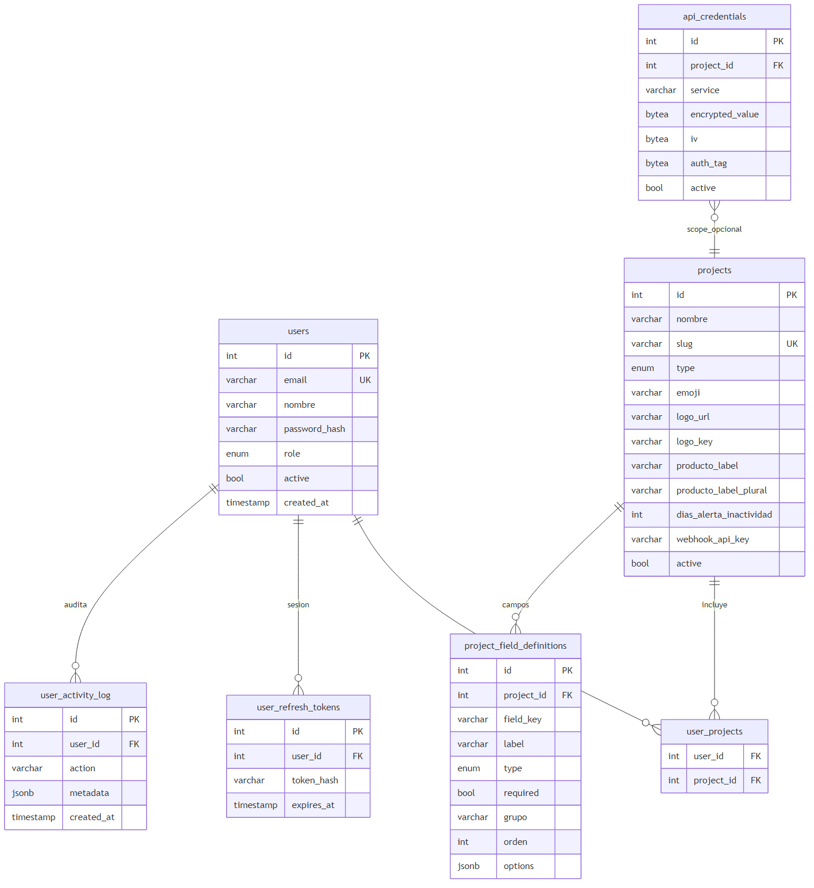

# Diagrama Entidad-Relacion (actualizado 2026-04-24)

23 tablas en produccion. Divido en 4 sub-diagramas por dominio para que se lea bien.

---

## 1. Leads + Interacciones + Cola round-robin

Nucleo del CRM. Cada lead pertenece a un proyecto, tiene responsable (gestor), puede referenciar un producto de interes y otro lead del que fue duplicado. Historial de status, interacciones, recordatorios y UTMs viven colgando del lead.

La tabla `project_queue_state` mantiene el cursor del round-robin para distribuir leads entre gestores activos de forma justa.

---

## 2. Productos + Categorias + Conversiones (ventas)

`product_categories` es auto-referencial (parent_id) para soportar categoria + subcategoria por proyecto. Cada producto puede llevar su PDF (`dossiers`) y vincularse como producto_contratado en una conversion.

`conversions` es la venta cerrada; `conversion_payments` permite llevar pagos parciales sin perder trazabilidad.

---

## 3. Contabilidad + Comisiones

`commission_rules` define el % que cobra cada gestor por cada producto (UNIQUE gestor + producto). Cuando se crea una conversion, el hook del backend busca si el gestor asignado tiene regla para ese producto y genera una fila en `commissions`.

`expenses` = gastos ya hechos. `accounts_payable` = facturas con proveedor pendientes de pagar (con sus pagos parciales en `accounts_payable_payments`).

---

## 4. Usuarios + Config global

Multi-proyecto via `user_projects`. Sesiones JWT rotadas en `user_refresh_tokens`. `project_field_definitions` permite a cada proyecto definir sus campos custom para leads (JSONB). `api_credentials` guarda tokens de Brevo/Meta/Google/Stripe/Claude encriptados AES-256-GCM, con scope global o por proyecto.

---

## Tablas por dominio (23 total)

| Dominio | Tablas |
|---|---|
| **Usuarios + auth** | users, user_projects, user_refresh_tokens, user_activity_log |
| **Proyectos + cola** | projects, project_queue_state, project_field_definitions, api_credentials |
| **Leads** | leads, lead_interactions, lead_reminders, lead_status_history, lead_utms |
| **Productos + dossiers** | products, product_categories, dossiers |
| **Conversiones + pagos** | conversions, conversion_payments |
| **Contabilidad** | expenses, accounts_payable, accounts_payable_payments |
| **Comisiones** | commission_rules, commissions |
