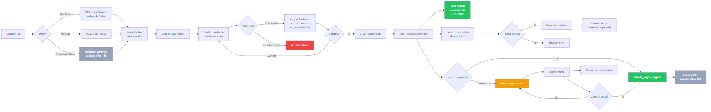
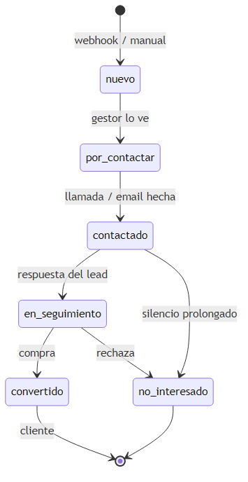
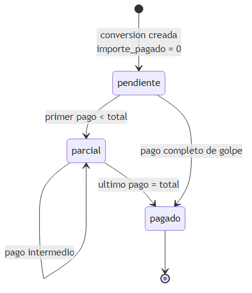
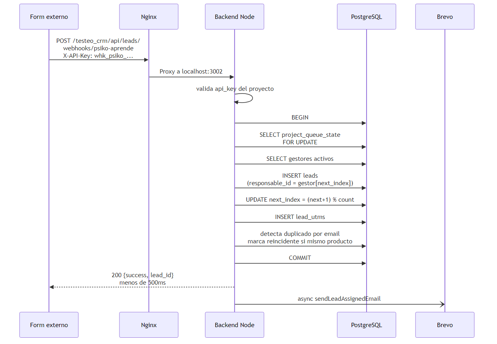

# Flujo principal: Lead → Conversion → Comision → Factura

## 1. Flujo macro end-to-end



De izquierda a derecha:
- **Entrada del lead** (webhook, manual o WhatsApp backlog) → round-robin asigna gestor
- **Ciclo del gestor**: nuevo → contactado → en seguimiento → convertido / no interesado
- **Conversion**: al cerrar venta, hook automatico calcula comision si hay regla
- **Pagos**: parcial → cuentas por cobrar; total → pagado → factura PDF (backlog CRM-132)

---

## 2. Ciclo de vida del lead



Cada transicion genera un row en `lead_status_history` con motivo. Cuando llega a `convertido` se crea su entrada en `/clients` y puede generar comision automatica.

---

## 3. Estados del pago (conversion_payments)



Pendiente (0€) → parcial (entre 0 y total) → pagado (= total). Una conversion puede alternar entre `pendiente` y `parcial` tantas veces como cuotas se cobren. En cada cambio el hook `recalculateCommission` actualiza `importe_base` y `importe_comision` proporcional.

---

## 4. Webhook de lead (sequence)



Transaccion PostgreSQL con `SELECT ... FOR UPDATE` en `project_queue_state` garantiza el round-robin correcto bajo concurrencia. La notificacion email via Brevo es asincrona para no bloquear la respuesta: la API responde en &lt;500ms al form externo.

---

## Archivos fuente Mermaid

Los `.mmd` viven en `img/`. Regenerar con:

```bash
cd Claude/documentacion/img
npx @mermaid-js/mermaid-cli mmdc -i flujo-macro.mmd -o flujo-macro.png -w 1600 -b white
```

Lista completa de diagramas:
- `er-1-leads.png` / `.mmd` — ER leads y auxiliares
- `er-2-productos-ventas.png` — ER productos + conversiones
- `er-3-contabilidad-comisiones.png` — ER egresos, por pagar, comisiones
- `er-4-usuarios-config.png` — ER usuarios, proyectos, credenciales
- `flujo-macro.png` — flowchart principal
- `estados-lead.png` — state diagram lead
- `estados-pago.png` — state diagram conversion/pagos
- `webhook-sequence.png` — sequence del webhook con round-robin
